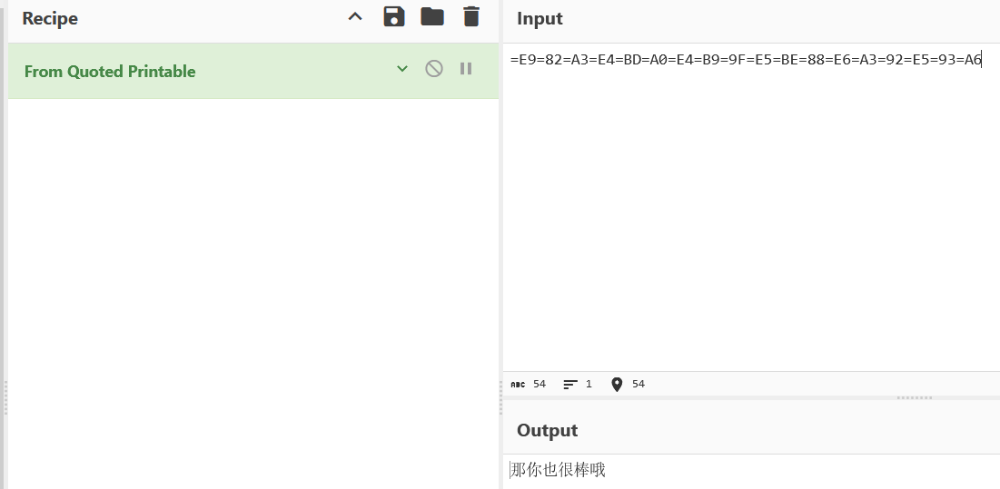

# 环境

来自[Quoted-printable](https://buuoj.cn/challenges#Quoted-printable)，Quoted-printable 是一种编码方法，用于在电子邮件和某些其他文本传输协议中

```
密文：=E9=82=A3=E4=BD=A0=E4=B9=9F=E5=BE=88=E6=A3=92=E5=93=A6
flag{那你也很棒哦}
```

# wp

## 在线

[Quoted-printable](http://www.hiencode.com/quoted.html)

## CyberChef

From Quoted Printable



## 随波逐流CTF