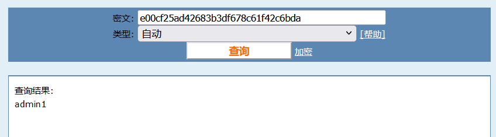

# 环境

来自[MD5](https://buuoj.cn/challenges#MD5)

```
密文：e00cf25ad42683b3df678c61f42c6bda
flag{admin1}
```

# wp

## 在线

[md5](https://www.cmd5.com/)



## John

```bash
hash-identifier e00cf25ad42683b3df678c61f42c6bda
echo 'md5:e00cf25ad42683b3df678c61f42c6bda' > hash.txt
john --format=raw-md5 hash.txt
```

