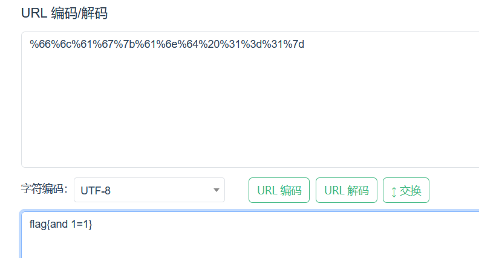

# 环境

来自[Url编码](https://buuoj.cn/challenges#Url%E7%BC%96%E7%A0%81)

```
密文：%66%6c%61%67%7b%61%6e%64%20%31%3d%31%7d
flag{and 1=1}
```

# wp

## 在线

[url解码](https://www.toolhelper.cn/EncodeDecode/Url)



## python

```python
from urllib.parse import unquote,quote

def input_data():
    return input("请输入:")
#编码
def url_encode(data):
		return quote(data)
#解码
def url_decode(data):
		return unquote(data)

def main():
    while True:
        print('请选择操作:\n1.编码\n2.解码\n3.退出')
        choice=input('请选择:')
        if choice == '1':
            data=input_data()
            print(url_encode(data))
        elif choice == '2':
            data=input_data()
            print(url_decode(data))
        elif choice == '3':
            break
        else:print("错误输入!")

if __name__=="__main__":
    main()
```

