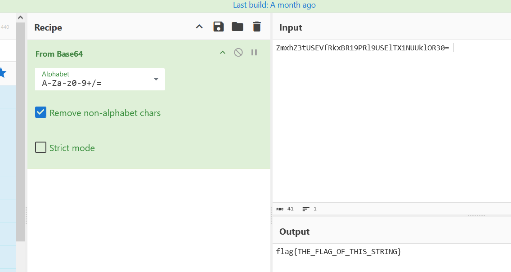
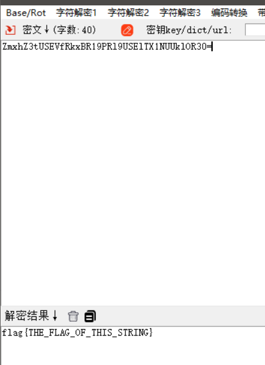

# 环境

来自[一眼解密](https://buuoj.cn/challenges#%E4%B8%80%E7%9C%BC%E5%B0%B1%E8%A7%A3%E5%AF%86)，base64

```
密文：ZmxhZ3tUSEVfRkxBR19PRl9USElTX1NUUklOR30=
flag{THE_FLAG_OF_THIS_STRING}
```

# wp

## 使用工具

### linux命令行

```bash
echo 'ZmxhZ3tUSEVfRkxBR19PRl9USElTX1NUUklOR30=' | base64 -d
```

### cyberChef

from base64模块



### [随波逐流]CTF编码工具



## 编程解密

### python

```python
# base64 是由‘A-Z,a-z,0-9,+,/’ 64个字符组成
import base64
def input_data():
    return input("请输入:")
# 编码
def base64_encode(data):
    return base64.b64encode(data.encode())
# 解码
def base64_decode(data):
    return base64.b64decode(data.encode())
def main():
    while True:
        print('请选择操作:\n1.编码\n2.解码\n3.退出')
        choice=input('请选择:')
        if choice == '1':
            data=input_data()
            print(base64_encode(data))
        elif choice == '2':
            data=input_data()
            print(base64_decode(data))
        elif choice == '3':
            break
        else:print("错误输入!")
if __name__=="__main__":
    main()
```

