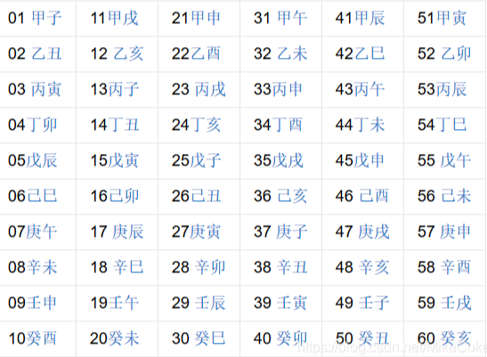

# 环境

来自[传统知识+古典密码](https://buuoj.cn/challenges#%E4%BC%A0%E7%BB%9F%E7%9F%A5%E8%AF%86+%E5%8F%A4%E5%85%B8%E5%AF%86%E7%A0%81)，60甲子表

```
小明某一天收到一封密信，信中写了几个不同的年份
  辛卯，癸巳，丙戌，辛未，庚辰，癸酉，己卯，癸巳。
  信的背面还写有“+甲子”，请解出这段密文。key值：flag{XXX}
flag{SHUANGYU}
```

# wp

## 60甲子表



[ASCII转字符](https://www.starrytool.com/zh-cn/ascii-converter.html)

```
辛卯，癸巳，丙戌，辛未，庚辰，癸酉，己卯，癸巳 +甲子60年
28,30,23,08,17,10,16,30  #背后+60甲子
88,90,83,68,77,70,76,90  #ASCII转字符
XZSDMFLZ
```

## 栅栏密码

两栏：XMZFSLDZ

四栏：XSMLZDFZ

## 凯撒密码

把两栏放到凯撒，得到显眼的字符串shuangyu