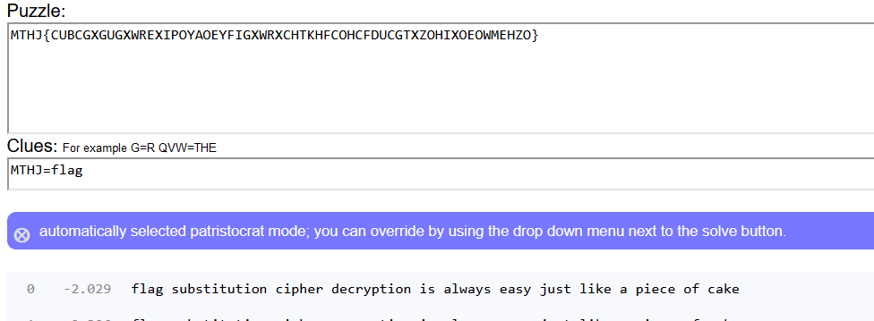

# 环境

来自[凯撒？替换？呵呵!](https://buuoj.cn/challenges#%E5%87%AF%E6%92%92%EF%BC%9F%E6%9B%BF%E6%8D%A2%EF%BC%9F%E5%91%B5%E5%91%B5!)，自定义顺序的凯撒

```
MTHJ{CUBCGXGUGXWREXIPOYAOEYFIGXWRXCHTKHFCOHCFDUCGTXZOHIXOEOWMEHZO}
需要MTHJ对应映射到flag，根据映射表来推断
flag{substitutioncipherdecryptionisalwayseasyjustlikeapieceofcake}
```

# wp

## 在线

[自定义顺序凯撒](https://quipqiup.com/)

