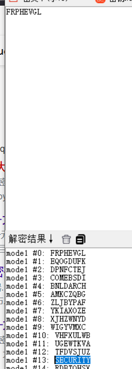

# 环境

来自[大帝的秘密武器](https://buuoj.cn/challenges#%E5%A4%A7%E5%B8%9D%E7%9A%84%E5%AF%86%E7%A0%81%E6%AD%A6%E5%99%A8)，凯撒密码

```
公元前一百年，在罗马出生了一位对世界影响巨大的人物，他生前是罗马三巨头之一。他率先使用了一种简单的加密函，因此这种加密方法以他的名字命名。以下密文被解开后可以获得一个有意义的单词：FRPHEVGL 你可以用这个相同的加密向量加密附件中的密文，作为答案进行提交。
密文：ComeChina

flag{PbzrPuvan}
```

# wp

## 随波逐流ctf

位移13


