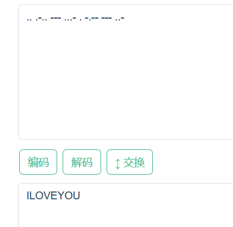
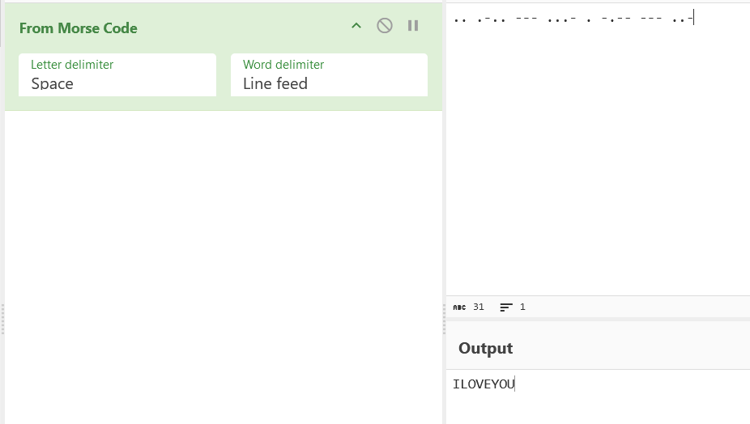

# 环境

来自[摩斯](https://buuoj.cn/challenges#%E6%91%A9%E4%B8%9D)

# wp

## 在线

[摩斯](https://www.toolhelper.cn/SymmetricEncryption/MorseCode)



## CyberChef

FromMorseCode



## 随波逐流CTF

## python

```python
# 定义莫斯密码的编码表
MORSE_CODE_DICT1 = {
    'A': '.-', 'B': '-...', 'C': '-.-.', 'D': '-..', 'E': '.', 'F': '..-.',
    'G': '--.', 'H': '....', 'I': '..', 'J': '.---', 'K': '-.-', 'L': '.-..',
    'M': '--', 'N': '-.', 'O': '---', 'P': '.--.', 'Q': '--.-', 'R': '.-.',
    'S': '...', 'T': '-', 'U': '..-', 'V': '...-', 'W': '.--', 'X': '-..-',
    'Y': '-.--', 'Z': '--..',
    '1': '.----', '2': '..---', '3': '...--', '4': '....-', '5': '.....',
    '6': '-....', '7': '--...', '8': '---..', '9': '----.', '0': '-----',
    ',': '--..--', '.': '.-.-.-', '?': '..--..', '/': '-..-.', '-': '-....-',
    '(': '-.--.', ')': '-.--.-', ' ': '/'
}
MORSE_CODE_DICT2 = {
    'A': '01', 'B': '1000', 'C': '1010', 'D': '100', 'E': '0', 'F': '0010',
    'G': '110', 'H': '0000', 'I': '00', 'J': '0111', 'K': '101', 'L': '0100',
    'M': '11', 'N': '10', 'O': '111', 'P': '0110', 'Q': '1101', 'R': '010',
    'S': '000', 'T': '1', 'U': '001', 'V': '0001', 'W': '011', 'X': '1001',
    'Y': '1011', 'Z': '1100',
    '1': '01111', '2': '00111', '3': '00011', '4': '00001', '5': '00000',
    '6': '10000', '7': '11000', '8': '11100', '9': '11110', '0': '11111',
    ',': '110011', '0': '010101', '?': '001100', '/': '10010', '1': '100001',
    '(': '10110', ')': '101101', ' ': '/'
}
# 将文本转换为莫斯密码
def text_to_morse(text):
    morse_code = ''
    for char in text.upper():
        if char in MORSE_CODE_DICT2:
            morse_code += MORSE_CODE_DICT2[char] + ' '
        else:
            morse_code += '??? '
    return morse_code.strip()
# 将莫斯密码解码为文本
def morse_to_text(morse_code):
    # 反转莫斯密码字典
    morse_code_dict_reverse = {v: k for k, v in MORSE_CODE_DICT2.items()}
    text = ''
    for code in morse_code.split(' '):
        if code in morse_code_dict_reverse:
            text += morse_code_dict_reverse[code]
        else:
            text += '??'
    return text

def main():
    print("请选择操作：\n1. 文本转莫斯密码\n2. 莫斯密码转文本\n3. 退出")
    choice = input("请输入选项：")
    if choice == '1':
        text = input("请输入要转换的文本：\n")
        print("莫斯密码:", text_to_morse(text))
    elif choice == '2':
        morse_code = input("请输入莫斯密码：\n")
        print("文本:", morse_to_text(morse_code))
    elif choice == '3':
        print("退出程序。")
    else:
        print("无效的选项，请重新输入。")

if __name__ == "__main__":
    main()
```

