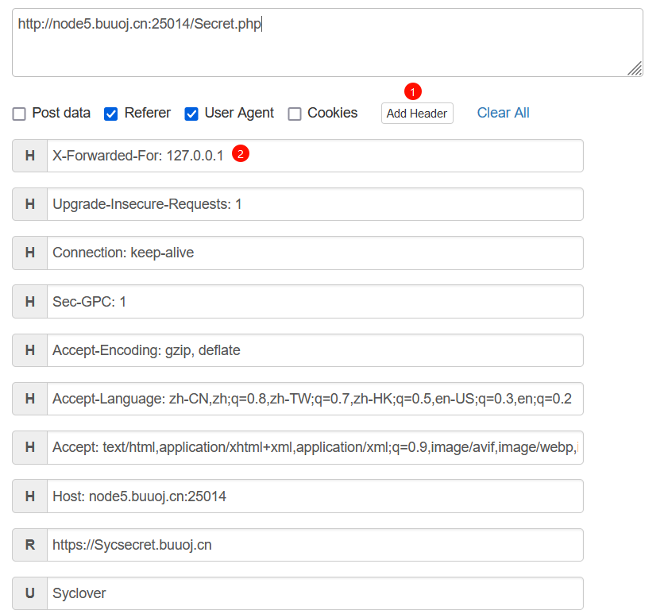

# 分析

来自[[极客大挑战 2019]Http](https://buuoj.cn/challenges#[%E6%9E%81%E5%AE%A2%E5%A4%A7%E6%8C%91%E6%88%98%202019]Http)，修改http头

查看源码发现

访问看到提示，我们需要通过这个网址来访问他

可以使用hackbar修改

访问发现新的提示，需要修改User Agent(UA)

hackbar添加UA

发现新的提示，需要添加而外的`X-Forwarded-For: 127.0.0.1`

