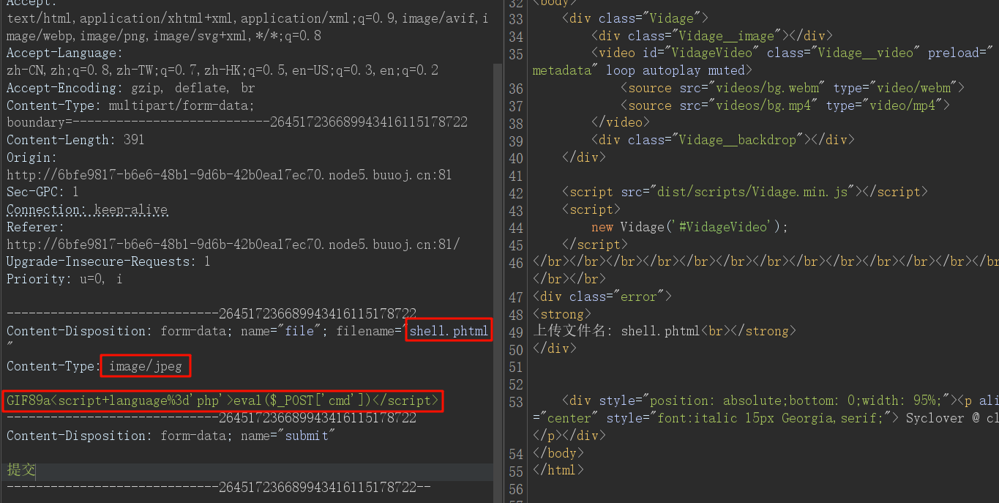
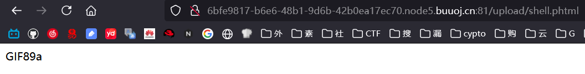
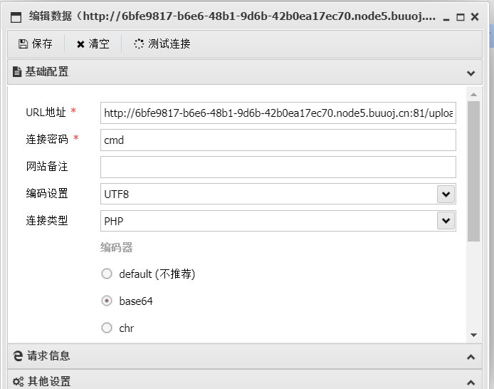

# 分析

来自[[极客大挑战 2019]Upload](https://buuoj.cn/challenges#[%E6%9E%81%E5%AE%A2%E5%A4%A7%E6%8C%91%E6%88%98%202019]Upload)，文件上传

发现是文件上传，上传一句话木马`shell.php`，并抓包判断检测，发现修改三处即可上传成功

访问成功，只显示GIF89a说明后面的代码成功执行，使用蚁剑连接，或者哥斯拉

