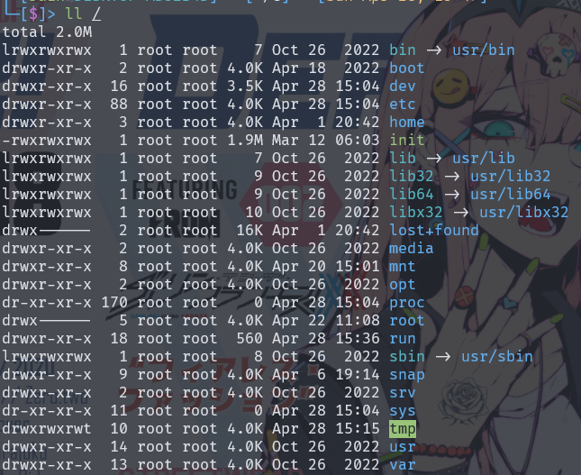

# linux介绍

Linux 是一个自由和开放源代码的类 UNIX 操作系统，它是基于 UNIX 设计原理和思想开发的。Linux 内核最初由芬兰计算机科学家 Linus Torvalds 在 1991 年创建，并随后发展成为一个庞大的开源项目，全球吸引了成千上万的开发者参与其中。以下是 Linux 的一些关键特点和特色：

- **开放源代码**：Linux 内核以及大多数与之关联的软件都是基于开放源代码发布的，这意味着任何人都可以查看、修改和分发代码。
- **多用户、多任务**：Linux 支持多用户同时登录，并且能够同时运行多个程序，每个程序都在自己的独立进程中运行。
- **多平台支持**：Linux 被移植到了多种不同的计算机硬件架构上，从个人计算机到服务器、嵌入式系统等。
- **稳定性和安全性**：Linux 内核以及大多数 Linux 发行版都以稳定性和安全性为优先考虑因素。这种稳定性使得 Linux 在服务器领域广受欢迎，许多大型互联网公司和企业都在其服务器端采用 Linux 操作系统。
- **自由度和灵活性**：Linux 提供了丰富的命令行工具和灵活的配置选项，使得用户能够自由地定制和控制系统的各个方面。
- **强大的社区支持**：Linux 拥有一个庞大而活跃的社区，包括开发者、用户、爱好者等，他们提供了丰富的文档、论坛、教程等资源，为用户提供了强大的支持和帮助。

## linux发行版

- **Ubuntu**：由 Canonical 公司开发，以易用性和广泛的社区支持而闻名，适合桌面和服务器用户。
- **Debian**：稳定性和可靠性为重点，是许多其他发行版的基础。
- **Fedora**：由 Red Hat 公司支持，专注于提供最新的软件和技术，适合开发者和技术爱好者。
- **CentOS**：基于 Red Hat Enterprise Linux (RHEL) 源代码编译而成的开源发行版，提供免费的企业级支持，适合企业和服务器环境。
- **openSUSE**：由 SUSE 公司支持，提供多种版本，包括桌面版和服务器版，以及适用于嵌入式和云环境的版本。
- **Arch Linux**：面向技术熟练的用户，提供简洁、轻量级的设计和灵活的软件管理系统。
- **Linux Mint**：基于 Ubuntu，旨在提供更加用户友好的桌面体验，附带了一些额外的自定义和易用性增强。
- **Manjaro**：基于 Arch Linux，提供易用性和用户友好的桌面环境，同时保留了 Arch Linux 的灵活性和自定义性。
- **Elementary OS**：以其精美的用户界面和易用性而闻名，适合桌面用户。
- **Gentoo**：面向高级用户，提供源代码安装和自定义编译的功能，适合那些需要最大灵活性和性能优化的用户。

# Linux文件结构

