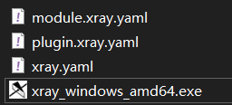
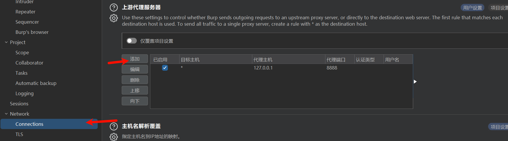

# 介绍

下载[xray](https://github.com/chaitin/xray)，[官网](https://xray.cool/)，[文档](https://docs.xray.cool)

# 使用

## 初始化

```bash
初次运行xray
xray genca  #生成证书
```

配置文件



## 命令

### 主动扫描

```bash
xray webscan --url http://123.com --html-output  #单个url扫描
xray webscan --url-file url.txt --html-output
xray webscan --basic-crawler http://123.com --html-output  #爬虫扫描
xray webscan --browser-crawler http://123.com --html-output  #模拟浏览器扫描

#输出格式
--html-output
--josn-output
--text-output
```

### 被动扫描

```bash
xray genca  #生成证书
xray webscan --listen 127.0.0.1:8888
```

burp需要添加上游代理



# 配置

## 限定ip和域名

配置config.yaml

