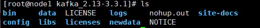

# 消息队列

消息队列系统是一种用于在不同的软件组件或系统之间传递消息的中间件。它允许发送者（生产者）将消息发送到队列中，然后接收者（消费者）从队列中接收并处理这些消息。消息队列系统通常用于解耦系统组件，提高系统的可伸缩性、可靠性和灵活性。


## 应用场景

消息队列系统在各种场景中广泛应用，包括分布式系统集成、异步任务处理、事件驱动架构、日志处理等。

## 类型

### 基于消息传递模式的分类

#### 	点对点模型（Point-to-Point）

​		在点对点模型中，消息被发送到一个队列，然后只有一个消费者可以接收和处理该消息。一旦消息被一个消费者接收，它就从队列中移除。这种模型通常用于一对一的通信。

#### 	发布-订阅模型（Publish-Subscribe）

​		在发布-订阅模型中，消息被发送到一个主题（或称为通道、主题），然后所有订阅该主题的消费者都会收到该消息的副本。这种模型通常用于一对多的通信。

### 基于实现方式的分类

#### 	基于内存的消息队列

​		消息队列系统使用内存存储消息，通常具有很高的性能，但消息可能会在系统故障时丢失。

#### 	基于磁盘的消息队列

​		消息队列系统将消息持久化到磁盘上，以确保即使系统故障，消息也不会丢失。这种模型通常会降低性能，但提供了更可靠的消息传递保证。

#### 	基于云的消息队列

​		消息队列作为一种云服务提供，例如 Amazon SQS（Simple Queue Service）、Google Cloud Pub/Sub 等。

### 基于传输协议的分类

#### 	AMQP（Advanced Message Queuing Protocol）

​		一种消息传递协议，支持高级的消息队列功能，例如消息持久化、事务、安全性等。

#### 	STOMP（Simple Text Oriented Messaging Protocol）：

​		一种简单的文本协议，用于与消息代理进行通信，通常用于跨语言和跨平台的消息传递。

#### 	MQTT（Message Queuing Telemetry Transport）：

​		一种轻量级的、发布-订阅模式的消息传递协议，通常用于物联网（IoT）和传感器数据传输。

### 按照用途的分类

任务队列：用于异步处理任务，例如处理后台任务、定时任务等。
日志队列：用于收集、处理和存储日志数据，例如用于日志聚合和监控。
事件驱动队列：用于处理事件流，例如用户行为事件、系统事件等。
数据管道：用于构建实时数据流处理应用程序，例如用于数据分析、实时监控等。


## 流行的消息队列系统

常见的消息队列系统包括

- Kafka

  ​	Kafka 的特点其实很明显，就是仅仅提供较少的核心功能，但是提供超高的吞吐量，ms 级的延迟，极高的可用性以及可靠性，而且分布式可以任意扩展。Kafka 唯一的一点劣势是有可能消息重复消费。

- RabbitMQ

  ​	RabbitMQ 在吞吐量方面虽然稍逊于 Kafka、RocketMQ 和 Pulsar，但是由于它基于 Erlang 开发，所以并发能力很强，性能极其好，延时很低，达到微秒级。但是也因为 RabbitMQ 基于 Erlang 开发，所以国内很少有公司有实力做 Erlang 源码级别的研究和定制。如果业务场景对并发量要求不是太高（十万级、百万级），那这几种消息队列中，RabbitMQ 或许是你的首选。

- RocketMQ

- Pulsar

- ActiveMQ（被淘汰了）

- Amazon SQS

# kafka介绍

Kafka 是一个分布式流处理平台和消息队列系统，最初由 LinkedIn 公司开发。它设计用于处理高吞吐量的数据流，可以用于构建实时数据管道和实时流应用程序。Kafka 的主要功能包括发布和订阅消息、存储消息、处理消息流、以及在多个系统和应用程序之间可靠地传输消息。Kafka是用scala开发的

## kafka安装

下载连接：[Apache Kafka](https://kafka.apache.org/downloads)

```shell
#解压
tar -zxvf kafka_2.13‐3.3.1.tgz -C /usr/local


```

### 配置文件

```shell
#旧版本需要修改配置文件
vim /usr/local/kafka_2.13-3.3.1/config/server.properties
=========================================
broker.id=0
log.dirs=/usr/local/kafka_2.13‐3.3.1/data
zookeeper.connect=node1:2818
=========================================
#新版本不需要zookeeper，修改配置文件

vim /usr/local/kafka_2.13-3.3.1/config/kraft/server.properties
=========================================
## data1‐vm1节点
node.id=1
process.roles=broker,controller
controller.quorum.voters=1@node1:9093
inter.broker.listener.name=PLAINTEXT
advertised.listeners=PLAINTEXT://node1:9092
#controller.quorum.voters=1@node1:9093,2@node2:9093,3@node3:9093
listeners=PLAINTEXT://node1:9092,CONTROLLER://node1:9093
log.dirs=/usr/local/kafka_2.13‐3.3.1/data
==========================================
```


## kafka目录结构



- config：配置文件，比如server.properties，zookeeper.properties等。
- libs：存放依赖库，包括卡夫卡自身的jar文件以及其它必要的依赖。
- bin：脚本文件，比如kafka-server-start.sh用于启动卡夫卡服务器。
- logs：日志文件，包括运行时产生的日志以及错误日志。
- data：存放数据，包括消息日志、偏移量（offset）等。

## kafka命令

### 启动

```shell
#启动
nohup /usr/local/kafka_2.13-3.3.1/bin/kafka-server-start.sh /usr/local/kafka_2.13-3.3.1/config/kraft/server.properties 2>1 & 

#创建主题
kafka-topics.sh --create --bootstrap-server node1:9092 --topic BD2
#查看主题列表
kafka-topics.sh --list --bootstrap-server node1:9092
#查看主题详情
kafka-topics.sh --describe --bootstrap-server node1:9092 --topic BD2
#删除主题
kafka-topics.sh --delete --bootstrap-server node1:9092 --topic BD2
```

### 生产者启动

```shell
kafka-console-producer.sh --bootstrap-server node1:9092 --topic BD2	#连接一台机器
kafka-console-producer.sh --broker-list node1:9092 --topic BD2	#连接多台机器
```

### 消费者启动

```shell
kafka-console-consumer.sh --bootstrap-server node1:9092 -topic BD2
kafka-console-consumer.sh --bootstrap-server node1:9092 -topic BD2 --from-beginning	#从历史开始消费
```

