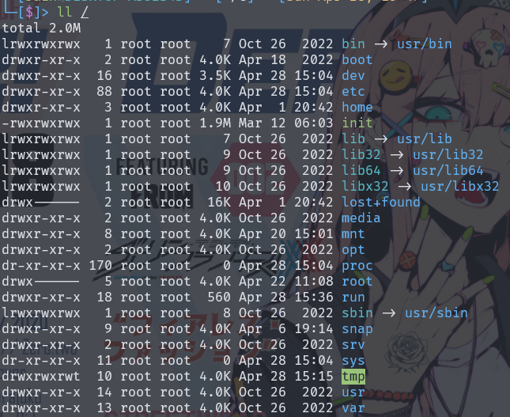

# linux介绍

Linux 是一个自由和开放源代码的类 UNIX 操作系统，它是基于 UNIX 设计原理和思想开发的。Linux 内核最初由芬兰计算机科学家 Linus Torvalds 在 1991 年创建，并随后发展成为一个庞大的开源项目，全球吸引了成千上万的开发者参与其中。以下是 Linux 的一些关键特点和特色：

- **开放源代码**：Linux 内核以及大多数与之关联的软件都是基于开放源代码发布的，这意味着任何人都可以查看、修改和分发代码。
- **多用户、多任务**：Linux 支持多用户同时登录，并且能够同时运行多个程序，每个程序都在自己的独立进程中运行。
- **多平台支持**：Linux 被移植到了多种不同的计算机硬件架构上，从个人计算机到服务器、嵌入式系统等。
- **稳定性和安全性**：Linux 内核以及大多数 Linux 发行版都以稳定性和安全性为优先考虑因素。这种稳定性使得 Linux 在服务器领域广受欢迎，许多大型互联网公司和企业都在其服务器端采用 Linux 操作系统。
- **自由度和灵活性**：Linux 提供了丰富的命令行工具和灵活的配置选项，使得用户能够自由地定制和控制系统的各个方面。
- **强大的社区支持**：Linux 拥有一个庞大而活跃的社区，包括开发者、用户、爱好者等，他们提供了丰富的文档、论坛、教程等资源，为用户提供了强大的支持和帮助。

## Linux组成

1. **Linux 内核（Linux Kernel）**

   Linux 内核是操作系统的核心，负责管理和调度系统硬件资源、提供系统调用接口等。内核组成部分：进程调度、内存管理、虚拟文件系统、网络接口、进程间通信

2. **Shell（命令行解释器）**

   Shell是用户与操作系统之间的交互界面，提供了命令行环境，使用户能够执行各种命令和脚本。如sh、bash、zsh、csh等

3. **文件系统**

   Linux采用分层的文件系统结构，所有的硬件设备、文件和目录都被组织成文件的形式。它支持多种文件系统类型，如EXT4、Btrfs、XFS、FAT等，用于组织和管理存储在硬盘或其他存储介质上的数据。

4. **应用程序**

   这包括了各种标准的命令行工具和图形界面应用程序，如文本编辑器（Vim, Emacs）、编程语言环境（GCC,  Python）、Web服务器（Apache, Nginx）、数据库管理系统（MySQL,  PostgreSQL）、办公套件以及大量的开源和专有软件，这些工具和服务构成了用户与系统交互的基础。

## linux发行家族

Linux 的发行版说简单点就是将 Linux 内核与应用软件做一个打包。

1. **基于Debian的发行版**

   Debian、Ubuntu、Linux Mint、elementary OS，这些发行版使用`.deb`包管理和APT软件包管理器。

2. **基于Fedora的发行版**

   Fedora、Red Hat Enterprise Linux (RHEL)、CentOS Stream、Rocky Linux、AlmaLinux，它们使用`.rpm`包格式和YUM/DNF包管理器。

3. **基于SUSE的发行版**

   openSUSE、SUSE Linux Enterprise，它们使用`.rpm`包格式和zypper包管理器。

4. **基于Arch的发行版**

   Arch Linux、Manjaro，这些发行版强调滚动更新和KISS（Keep It Simple, Stupid）原则，使用Pacman作为包管理器。

5. **独立或特殊用途发行版**

   Gentoo（源码编译）、Slackware（传统且极简）、Tails（注重隐私和匿名）、Kali Linux（渗透测试专用）等。

   

   

# Linux基础

## Linux系统目录结构

Linux的系统目录结构是层级形式的树状结构



### **/bin**：

bin 是 Binaries (二进制文件) 的缩写, 这个目录存放着最经常使用的命令。

### **/boot：**

这里存放的是启动 Linux 时使用的一些核心文件，包括一些连接文件以及镜像文件。

**vmlinuz**：这是压缩的Linux内核映像文件，通常以当前内核版本命名，如`vmlinuz-5.4.0-42-generic`。在启动过程中，引导加载程序会加载这个文件到内存中。

**initrd** 或 **initramfs**：初始内存盘或初始RAM文件系统，包含了启动系统所需的最小文件系统。`initrd.img-6.8.0-35-generic`允许内核在实际的根文件系统可用之前执行一些操作，如硬件检测和文件系统检查。

**grub**：包含GRUB引导加载程序的配置文件和相关文件。例如，`grub.cfg`是GRUB的主配置文件，包含了启动菜单和内核启动参数。

### **/dev ：**

dev 是 Device(设备) 的缩写, 该目录下存放的是 Linux 的外部设备，在 Linux 中访问设备的方式和访问文件的方式是相同的。

#### 控制台设备文件

`/dev/console`：系统控制台，用于系统消息和管理员消息。

`/dev/tty`：当前终端或控制台。

#### 串行端口设备文件

`/dev/ttyS0`、`/dev/ttyS1` 等：串行端口设备。

#### 并行端口设备文件

`/dev/lp0`、`/dev/lp1` 等：并行端口设备，用于打印机。

#### 磁盘设备文件

`/dev/sda`、`/dev/sdb` 等：SCSI硬盘设备。

`/dev/hda`、`/dev/hdb` 等：IDE硬盘设备（较旧的命名方式）。

`/dev/nvme0n1`、`/dev/nvme1n1` 等：NVMe设备。

`/dev/mmcblk0p1` 等：MMC/SD卡设备。

#### 网络接口设备文件

`/dev/eth0`、`/dev/wlan0` 等：以太网或无线网络接口。

#### 伪终端设备文件

`/dev/pts/0`、`/dev/pts/1` 等：伪终端slave设备，用于pty（pseudo-terminal）。

#### 随机数生成器设备文件

`/dev/urandom`、`/dev/random`：提供加密安全的随机数。

#### 内存设备文件

`/dev/mem`：系统的物理内存。

`/dev/kmem`：内核内存（在某些系统上可能不可用）。

### **/etc：**

etc 是 Etcetera(等等) 的缩写,这个目录用来存放所有的系统管理所需要的配置文件和子目录。

#### /etc/passwd

存储用户账户信息的文件，每个用户一行，包含用户名、密码哈希、用户ID、组ID、主目录、登录shell等信息。

#### /etc/shadow

存储用户密码信息的文件，通常只对root用户可读，包含加密密码、密码更改日期等。

**/etc/group**：定义系统中的组账户，每个组一行，包含组名、密码哈希、组ID和组成员列表。

**/etc/profile**：为所有用户定义环境变量和shell行为的脚本，当用户登录时执行。

**/etc/bash.bashrc**：为bash shell定义环境变量和shell行为的脚本，每次启动新的shell时执行。

**/etc/fstab**：文件系统表，定义了系统启动时自动挂载的文件系统。

**/etc/hosts**：定义本地DNS解析，将域名映射到IP地址。

**/etc/network/interfaces**（Debian系）或**/etc/sysconfig/network-scripts/ifcfg-***（Red Hat系）：定义网络接口的配置。

**/etc/resolv.conf**：定义DNS服务器地址，用于系统域名解析。

**/etc/hostname**：存储系统的主机名。

**/etc/sysctl.conf**：定义内核参数的配置文件。

#### /etc/systemd

 目录是在使用 systemd 作为其初始化系统和服务管理器的 Linux 发行版中使用的核心目录之一

##### /etc/systemd/system

这个目录包含系统级别的服务单元文件。这些服务在所有运行级别上都会启动，除非明确禁用。

##### /etc/systemd/user

这个目录用于存放用户级别的服务单元文件。这些服务通常由单个用户启动，并且只对该用户可见。

**/etc/crontab**：定义系统定时任务的cron配置文件。

### **/home**：

用户的主目录，在 Linux 中，每个用户都有一个自己的目录，一般该目录名是以用户的账号命名的，如上图中的 alice、bob 和 eve。

### **/lib或/lib64**：

lib 是 Library(库) 的缩写这个目录里存放着系统最基本的动态连接共享库，其作用类似于 Windows 里的 DLL 文件。几乎所有的应用程序都需要用到这些共享库。

### **/lost+found**：

这个目录一般情况下是空的，当系统非法关机后，这里就存放了一些文件。

### **/media**：

linux 系统会自动识别一些设备，例如U盘、光驱等等，当识别后，Linux 会把识别的设备挂载到这个目录下。

### **/mnt**：

系统提供该目录是为了让用户临时挂载别的文件系统的，我们可以将光驱挂载在 /mnt/ 上，然后进入该目录就可以查看光驱里的内容了。

### **/opt**：

opt 是 optional(可选) 的缩写，这是给主机额外安装软件所摆放的目录。比如你安装一个ORACLE数据库则就可以放到这个目录下。默认是空的。

### **/proc**：

proc 是 Processes(进程) 的缩写，/proc 是一种伪文件系统（也即虚拟文件系统），存储的是当前内核运行状态的一系列特殊文件，这个目录是一个虚拟的目录，它是系统内存的映射，我们可以通过直接访问这个目录来获取系统信息。
这个目录的内容不在硬盘上而是在内存里，我们也可以直接修改里面的某些文件，比如可以通过下面的命令来屏蔽主机的ping命令，使别人无法ping你的机器：

```
echo 1 > /proc/sys/net/ipv4/icmp_echo_ignore_all
```

`cpuinfo`：CPU的信息，包括型号、速度等。

`meminfo`：系统的内存使用情况。

`partitions`：系统上所有可用的块设备和它们的分区。

`sys`：包含系统级的配置选项和参数。

`uptime`：系统运行的时间和负载信息。

`version`：Linux内核的版本信息。

`cmdline`：进程启动时的命令行参数。

`cwd`：进程的当前工作目录，这是一个指向实际目录的符号链接。

`environ`：设置进程环境变量的内容。

`exe`：一个指向进程执行文件的符号链接。

`fd`：进程打开的文件描述符，每个文件描述符都有一个子目录。

`maps`：显示进程的内存映射，包括内存中的库和文件。

`mem`：进程的内存映像，通常只有root用户才能访问。

`status`：进程的状态信息，包括进程ID、父进程ID、CPU时间等。

`stat`：进程的统计信息，如进程启动以来的CPU时间等。

### **/root**：

该目录为系统管理员，也称作超级权限者的用户主目录。

### **/run**：

是一个临时文件系统，存储系统启动以来的信息。当系统重启时，这个目录下的文件应该被删掉或清除。如果你的系统上有 /var/run 目录，应该让它指向 run。

### **/sbin**：

s 就是 Super User 的意思，是 Superuser Binaries (超级用户的二进制文件) 的缩写，这里存放的是系统管理员使用的系统管理程序。

### **/selinux**：

这个目录是 Redhat/CentOS 所特有的目录，Selinux 是一个安全机制，类似于 windows 的防火墙，但是这套机制比较复杂，这个目录就是存放selinux相关的文件的。

### **/srv**：

该目录存放一些服务启动之后需要提取的数据。

### **/sys**：

这是 Linux2.6 内核的一个很大的变化。该目录下安装了 2.6 内核中新出现的一个文件系统 sysfs 。

sysfs 文件系统集成了下面3种文件系统的信息：针对进程信息的 proc 文件系统、针对设备的 devfs 文件系统以及针对伪终端的 devpts 文件系统。

该文件系统是内核设备树的一个直观反映。

当一个内核对象被创建的时候，对应的文件和目录也在内核对象子系统中被创建。

### **/tmp**：

tmp 是 temporary(临时) 的缩写这个目录是用来存放一些临时文件的。

### **/usr**：

usr 是 unix shared resources(共享资源) 的缩写，这是一个非常重要的目录，用户的很多应用程序和文件都放在这个目录下，类似于 windows 下的 program files 目录。

**/usr/bin**：存放系统命令的二进制文件，这些命令可以在任何用户的shell中使用。

**/usr/sbin**：存放系统管理员使用的命令的二进制文件，通常需要root权限才能执行。

**/usr/lib**：存放系统库文件，包括应用程序调用的动态链接库（.so文件）和静态库（.a文件）。

**/usr/share**：存放共享数据，如应用程序的资源文件、文档、图标等。

**/usr/share/man**：存放man手册页，提供命令和配置文件的使用说明。

**/usr/share/locale**：存放本地化文件，支持多语言环境。

**/usr/share/doc**：存放软件包的文档。

**/usr/share/zoneinfo**：存放时区数据。

**/usr/include**：存放C语言头文件，供编译时使用。

**/usr/src**：存放源代码文件，通常是系统软件包的源代码。

**/usr/local**：存放本地安装的软件，与系统软件包分开管理。

**/usr/games**：存放游戏程序。

**/usr/X11R6**：如果系统中安装了X Window系统，这个目录会存放X Window的文件。

### **/var**：

var 是 variable(变量) 的缩写，这个目录中存放着在不断扩充着的东西，我们习惯将那些经常被修改的目录放在这个目录下。包括各种日志文件。

## 用户管理

### 用户

用户账号是系统中标识和管理用户的基本单位，每个用户都有一个唯一的用户名（Username）。用户账号包括以下信息：

- 用户名：用于登录系统的名称。
- 用户ID（UID）：每个用户都有一个唯一的数值标识。
- 用户组ID（GID）：指定用户所属的主要用户组。
- 用户家目录（Home directory）：用户登录后所在的默认目录。
- 登录Shell（Login shell）：用户登录后启动的命令解释器。

### 用户组

用户组是一组用户的集合，用于简化用户管理和权限控制。每个用户可以属于一个或多个用户组，其中一个是主要用户组，其他是附加用户组。用户组包括以下信息：

- 组名：用于标识用户组的名称。
- 组ID（GID）：每个用户组都有一个唯一的数值标识。

用户账号、用户组、密码等信息通常存储在系统的配置文件中，如`/etc/passwd`、`/etc/group`、`/etc/shadow`等。

## 文件权限管理

  