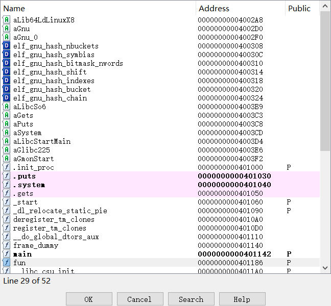
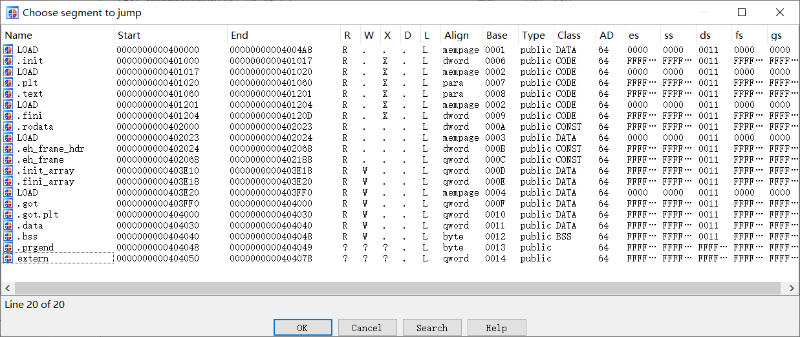
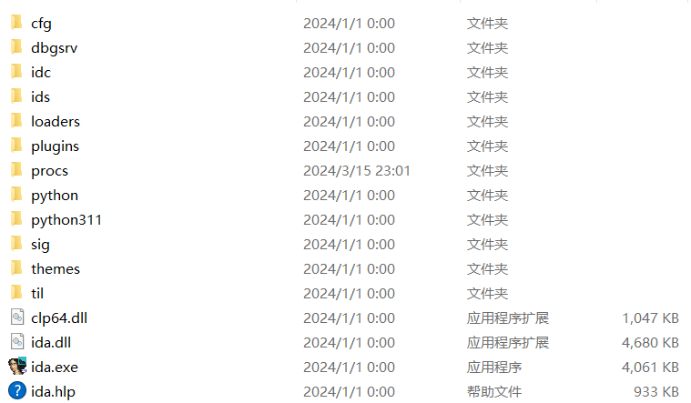
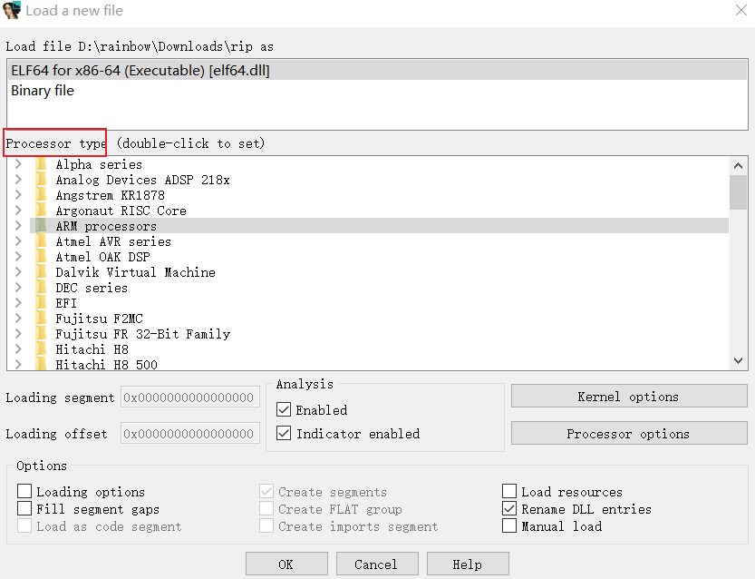
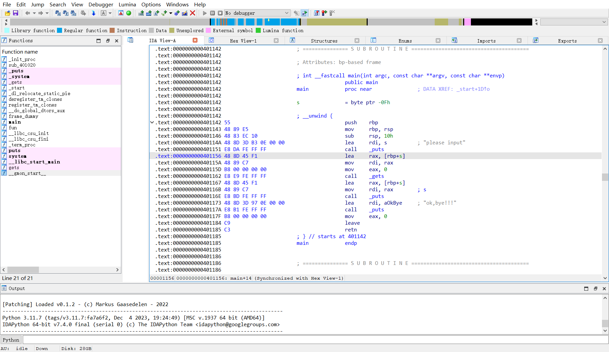
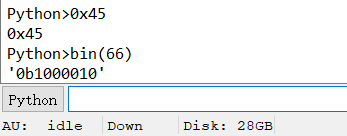

# 常用快捷键

```shell
/	写注释
ctrl + s	跳准到指定数据段
ctrl + l	函数选择器
x	查看某个函数的引用
g	跳转到指定地址
d	让某一个位置变成数据
c	让某一个位置变成指令
F5	执行反汇编
shift+F12	查找字符串
ctrl + shif	+ f	过滤器，查找函数
```



ctrl + l



ctrl + s

# 文件目录



比较重要的目录有

- cfg：包含了IDA的配置文件，包括UI配置、快捷键配置、主题配置等。
- dbgsrv：包含了IDA的调试服务器文件，用于与调试器进行通信，支持远程调试和本地调试。
- idc：包含 IDA 的内置脚本语言 IDC 所需的核心文件
- ids：包含一些符号文件（IDA语法中的IDS文件），这些文件用于描述可被加载到 IDA 的二进制文件引用的共享库的内容。这些 IDS 文件包含摘要信息，其中列出了由某一个指定库导出的所有项目。这些项目包含描述某个函数所需的参数类型和数量的信息、函数的返回类型以及该函数的调用约定有关的信息。
- loaders：包含了IDA用于加载不同二进制文件格式的加载器（loaders）。这些加载器允许IDA识别和分析各种不同的二进制文件，如可执行文件、动态链接库等。
- plugins：包含IDA的插件文件，这些插件可以扩展IDA的功能，例如添加新的反汇编器、导入器、导出器、脚本等。

- procs：包含了IDA用于不同处理器架构的处理器模块文件。每个处理器模块定义了特定处理器架构的反汇编规则、指令集信息等
- sig：目录包含 IDA 在各种模式匹配操作中利用的现有代码的签名。通过模式匹配，IDA 能够将代码序列确定为已知的库代码，从而节省大量的时间。
- til：目录包含一些类型库信息，IDA 通过这些信息记录特定于各种编译器库的数据结构的布局

# 加载界面



- Kernel options： 指的是*内核选项*，这些选项用于配置和设置操作系统内核的行为和功能。在操作系统内核的编译和配置过程中，可以通过设置这些选项来启用或禁用特定的功能、设备驱动程序或调试选项，以及调整内核的性能和行为。
- Processor options：指用于配置IDA逆向工具识别和分析特定处理器架构的选项。
- Processor type ：通常会被设置为与ELF文件中包含的机器架构相对应的处理器类型。ELF文件的机器架构信息通常存储在文件头部，用于指示该文件是为哪种处理器架构编译的。根据加载的ELF文件中包含的机器架构信息，IDA会自动识别并设置相应的处理器类型，以便正确地解析和分析文件中的指令集。

# 开始界面



## 头部导航条

界面中存在一项颜色各异的导航条。通过导航条可了解分析可执行文件各部分数据分布情况，各种颜色代表含义如下：

- 蓝色：表示常规的指令函数，绝大部分为用户编写的代码，上图中绝大部分数据属于蓝色数据。


- 黑色：表示间隙部分内容，可执行文件中包含多个节段，相邻节段之间存在空隙，红色表示空隙部分。

- 银白色：表示数据项部分内容，可执行文件中会包含大量数据，银白色表示数据项部分内容。


- 粉色：表示外部导入符号，通常可执行文件会导入外部的库函数。


- 暗黄色：表示IDA未识别的内容，需要用户根据需求自行分析。

## 底部output

交互栏可以执行 Python 命令，能够帮助我们快速进行进制转换。




```
ctrl + l :
```

​	

##### ctrl + l	所有名字的选择器

> "a"：通常表示这是一个自动生成的名称，由IDA根据程序的结构和上下文自动生成的名称。这些名称通常是基于函数名、变量名、常量值等信息生成的，用于帮助用户快速识别和理解程序。
>
> "d"：通常表示这是一个用户定义的名称，用户可以手动输入或编辑的名称。用户可以根据自己的需要为地址或者数据定义一个有意义的名称，以方便后续的分析和理解。
>
> "f"：通常表示这是一个函数名称。当你为一个地址定义一个名称并以"f"开头时，IDA会将这个名称识别为一个函数名称，并在函数窗口中显示该函数。这样可以帮助用户更好地组织和理解程序的结构。

##### 
