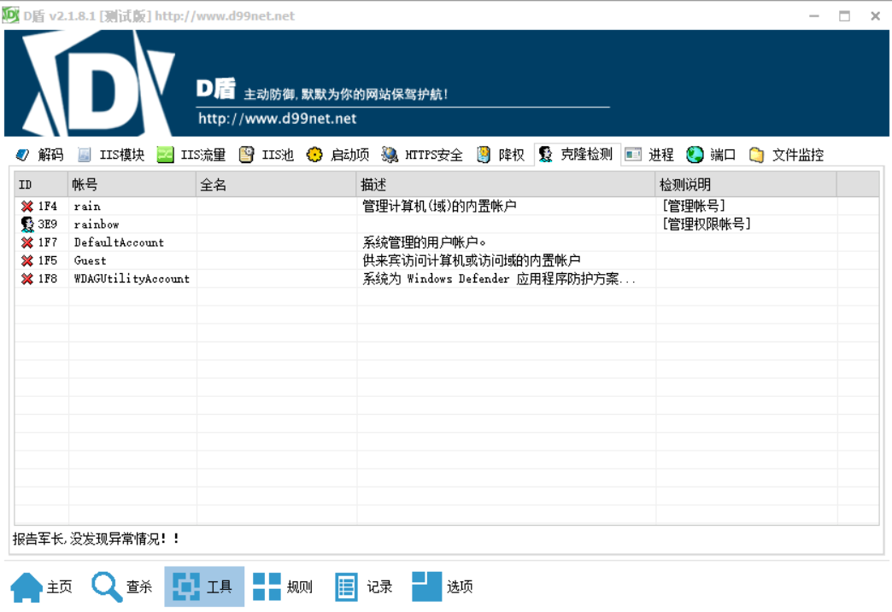

# Window入侵排查

## 检查系统账号安全

### windows

通过系统的本地和用户组查看是否存在恶意账号，win+r打开，输入lusrmgr.msc

```bash
reg query HKEY_LOCAL_MACHINE\SAM\SAM\Domains\Account\Users\Names #管理员
```

通过第三方工具，D盾



### linux

```bash
登录信息路径：/var/log/wtmp
						/var/log/btmp
						/var/log/lastlog
						/var/run/utmp
以下命令都是经过这个文件读取登录信息的
last -F -i  #查看登录信息
lastlog  #查看所以用户的最后一次登录时间
sudo lastb #查看登录失败信息
查看当前登录的所以用户
who -a
w
账号信息路径：/etc/passwd
						/etc/shadow
#格式：account:password:UID:GID:GECOS:directory:shell
#用户名：密码：用户ID：组ID：用户说明：家目录：登陆之后的 shell

#用户名：加密密码：密码最后一次修改日期：两次密码的修改时间间隔：密码有效期：密码修改到期到的警告天数：密码过期之后的宽限天数：账号失效时间：保留
root:$6$oGs1PqhL2p3ZetrE$X7o7bzoouHQVSEmSgsYN5UD4.kMHx6qgbTqwNVC5oOAouXvcjQSt.Ft7ql1WpkopY0UV9ajBwUt1DpYxTCVvI/:16809:0:99999:7:::
```

## 端口排查

### window

```bash
netstat -ano | findstr LIST  #正在监听的端口
tasklist ｜ findstr [PID]  #查看对应pid的进程
taskkill /f /pid [PID]  #终止pid进程
```

微软提供的查杀工具[MSRT](https://www.microsoft.com/zh-cn/download/details.aspx?id=9905)

[火绒剑](https://bbs.huorong.cn/thread-18575-1-1.html)

### Linux

```bash
top  #查看哪个pid占用高
ps -aux 8888 #查看进程
pstree -asp 8888 #查看父子进程
sudo netstat -anp | grep pid  #查看进程网络连接
sudo lsof -p 8888
kill 9 8888
```


# 日志分类

windows日志主要有

1. 应用程序日志：应用程序**崩溃**或其他**异常**事件

   路径：`C:\Windows\System32\winevt\Logs\Application.evtx`

2. 系统日志：驱动程序加载、系统服务启动和停止、系统崩溃等

   路径：`C:\Windows\System32\winevt\Logs\Security.evtx`

3. 安全日志：用户登录、账户权限更改和安全策略更改等

   路径：`C:\Windows\System32\winevt\Logs\System.evtx`

4. 其他日志

查看windows 日志，分析windows 日志时， 主要是查看**安全日志**，分析是否存通过暴力破解、横向传递等安全事件，定位恶意IP地址、事件发生时间等

# 日志属性

在事件日志中有5个事件级别：信息、警告、错误、成功审核、失败审核

事件ID是区分系统事件的一个重要字段

**Windows安全事件最常用的事件ID：**

```c
事件ID	说明	备注
1074	计算机开机、关机、重启的时间、原因、注释	查看异常关机情况
1102	清理审计日志	发现篡改事件日志的用户
4624	登录成功	检测异常的未经授权的登录
4625	登陆失败	检测可能的暴力密码攻击
4632	成员已添加到启用安全性的本地组	检测滥用授权用户行为
4634	注销用户	
4648	试图使用显式凭据登录	
4657	注册表值被修改	
4663	尝试访问对象	检测未经授权访问文件和文件夹的行为。
4672	administrator超级管理员登录（被赋予特权）	
4698	计划任务已创建	
4699	计划任务已删除	
4700	启用计划任务	
4702	更新计划任务	
4720	创建用户	
4726	删除用户	
4728	成员已添加到启用安全性的全局组	确保添加安全组成员的资格信息
4740	锁定用户账户	检测可能的暴力密码攻击
4756	成员已添加到启用安全性的通用组	
6005	表示日志服务已经启动（表明系统正常启动了）	查看系统启动情况
6006	表示日志服务已经停止（如果在某天没看到6006事件，说明出现关机异常事件了）	查看异常关机情况
6009	非正常关机（ctrl+alt+delete关机）	
4624	登陆成功
4625	登录失败
4634	用户注销
4647	用户启动了注销过程。
4648	用户已成功使用显式凭据登录到计算机，而该用户已以其他用户身份登录。
4779	用户在未注销的情况下断开了终端服务器会话的连接。
```

可查询事件具体ID的网站

[Windows 威胁防护 - Windows 安全中心 |Microsoft学习](https://learn.microsoft.com/en-us/windows/security/threat-protection/)

[Windows 安全日志百科全书 (ultimatewindowssecurity.com)](https://www.ultimatewindowssecurity.com/securitylog/encyclopedia/default.aspx?i=j)

# windows自带的工具

### 事件查看器

`Win+R`可输入`eventvwr.msc`可以打开日志查看器，进行筛选

### PowerShell

# 其他第三方工具

## Log Parser

## FullEventLogView

