# 暴力破解

## 基于表单的暴力破解

抓包使用Intruder模块，猜用户名是admin，使用字典爆破密码（字典自行解决）

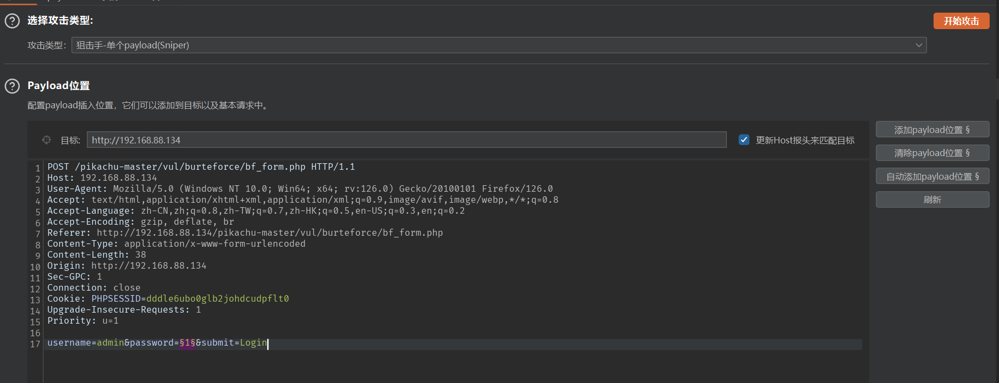

导入字典开始爆破

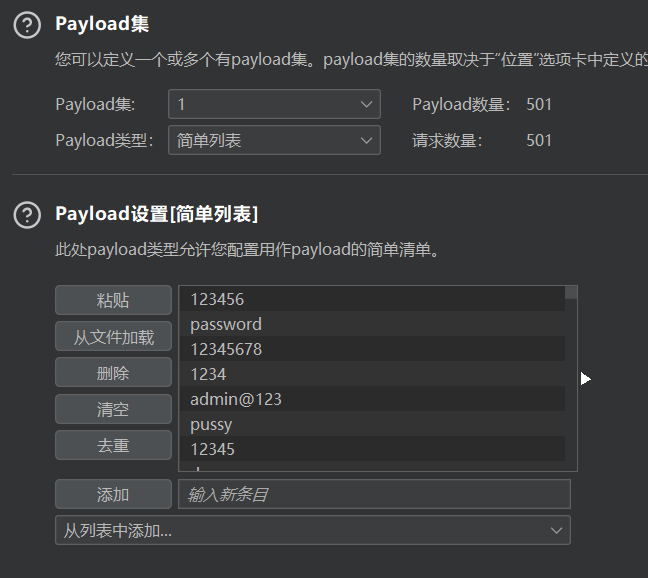

得到密码，密码为123456

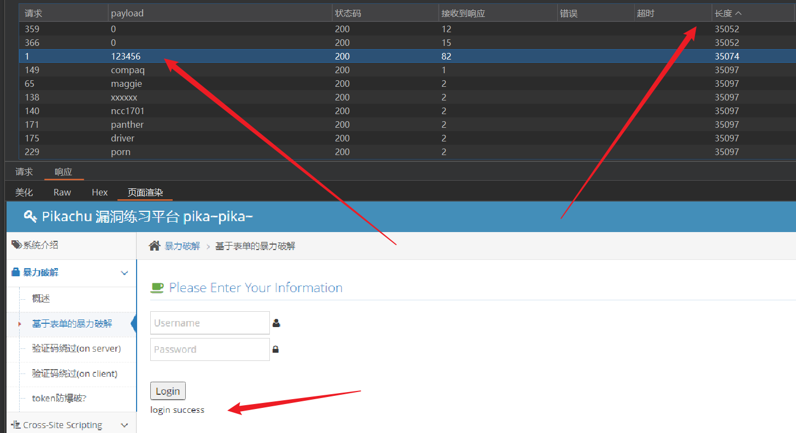

## 验证码绕过(on server)

由于验证码验证功能**后端**存在缺陷，验证码验证之后没有销毁，可继续用该验证码。我们输入正确的验证码进行密码爆破，如上题

细节：拦截必须一直开启，不能刷新，否则验证码就变了

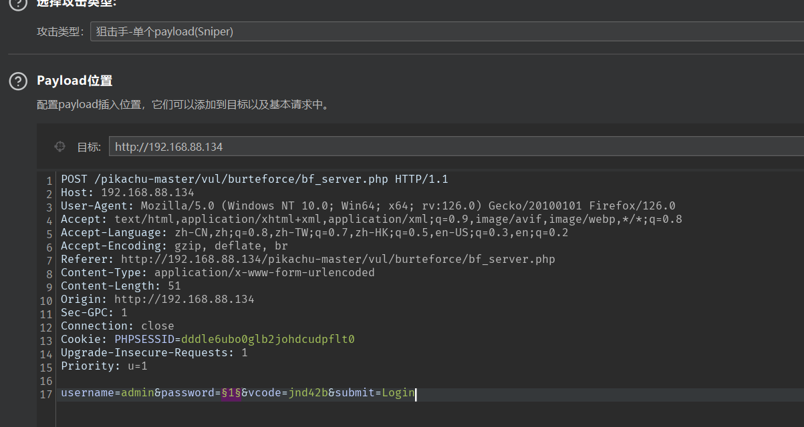

## 验证码绕过(on client)

由于验证码功能是在前端，几乎等于没有，直接爆破

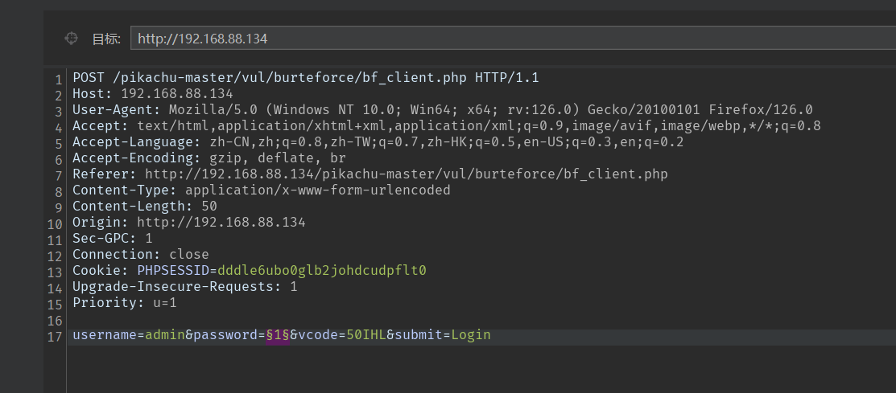

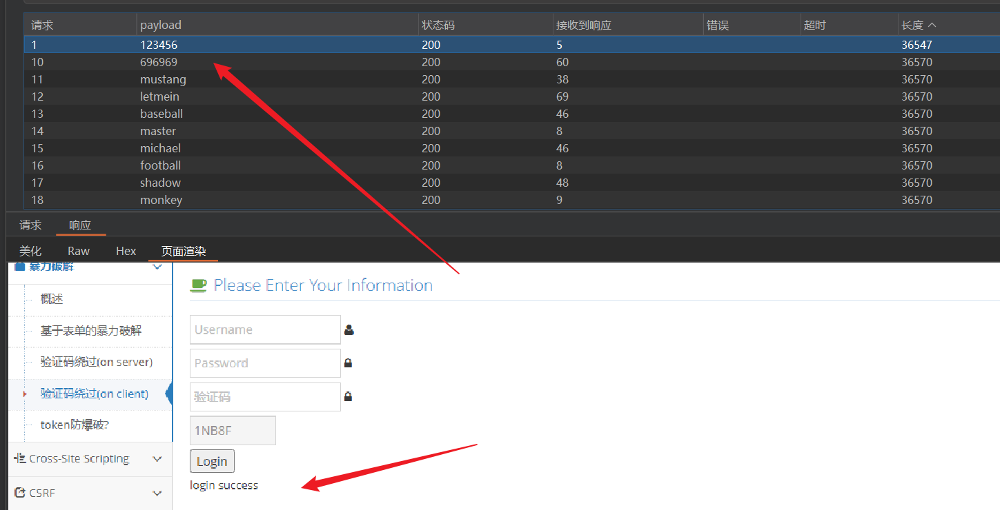

## token防爆破

当使用到token时，我们先了解token是干嘛的，token充当临时令牌的作用，服务器生成并返回给客户端，在客户端持久保存并在每次请求时发送给服务器，token其实说的更通俗点就是叫对暗号。

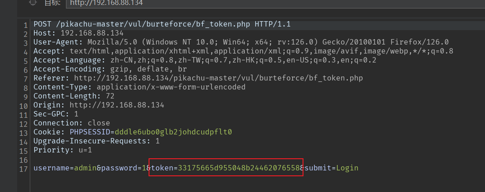

但是我们还是可以爆破，使用Pitchfork模式，

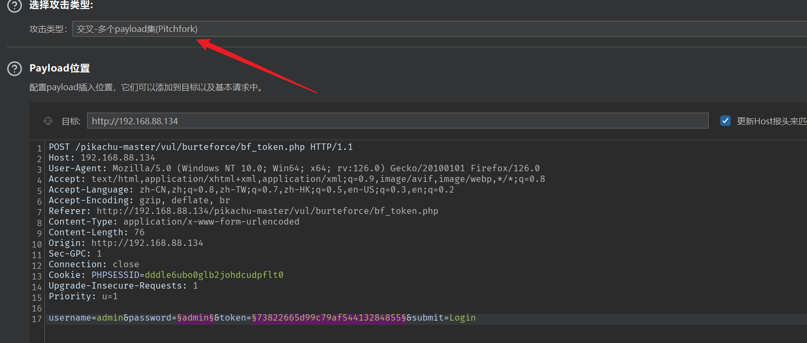

在设置选项中，提取配置token的payload，由于token前端可以查到

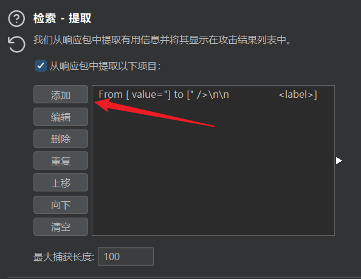

给payload2添加规则，从前端获取token

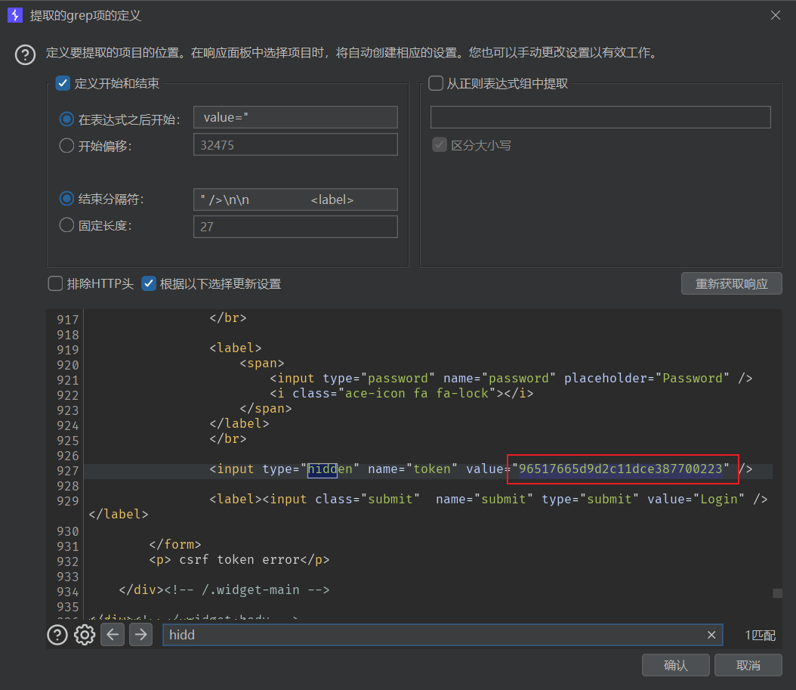

可以开始爆破了，结果如下，因为请求会多一个空行，所有会导致前面两个请求的token是错误的，

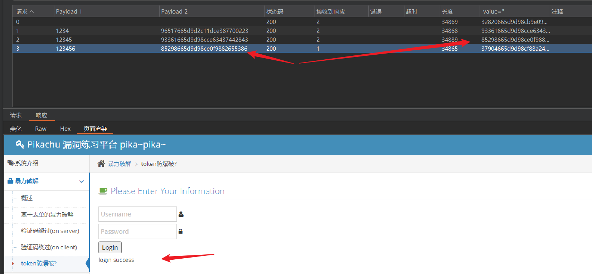

# xss

## 反射性xss(get)

## 反射性xss(post)