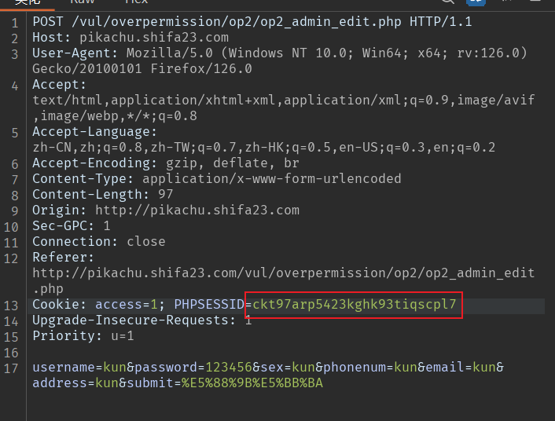

# 暴力破解

## 基于表单的暴力破解

抓包使用Intruder模块，猜用户名是admin，使用字典爆破密码（字典自行解决）


导入字典开始爆破


得到密码，密码为123456


## 验证码绕过(on server)

由于验证码验证功能**后端**存在缺陷，验证码验证之后没有销毁，可继续用该验证码。我们输入正确的验证码进行密码爆破，如上题

细节：拦截必须一直开启，不能刷新，否则验证码就变了


## 验证码绕过(on client)

由于验证码功能是在前端，几乎等于没有，直接爆破


## token防爆破

当使用到token时，我们先了解token是干嘛的，token充当临时令牌的作用，服务器生成并返回给客户端，在客户端持久保存并在每次请求时发送给服务器，token其实说的更通俗点就是叫对暗号。


但是我们还是可以爆破，使用Pitchfork模式，


在设置选项中，提取配置token的payload，由于token前端可以查到


给payload2添加规则，从前端获取token


可以开始爆破了，结果如下，因为请求会多一个空行，所有会导致前面两个请求的token是错误的，


# xss

## 反射性xss(get)

xss是跨站脚本攻击

由于后端没有对输入进行检查，我们输入js代码，返回到前端能够进行解析渲染


修改长度限制，输入`<script>alert('123')</script>`，即可出现弹窗，则证明存在xss漏洞


## 反射性xss(post)

先登录，账号admin，密码123456，过程如上


## 存储型xss

过程如上，原理是这个留言是存储在后端数据库里面的，所有每次打开都会有弹窗


## DOM型xss

DOM是一种用于表示和操作HTML、XML等文档结构的编程接口，通过它可以使用代码来访问、修改和操作Web页面的内容和结构。查看源码，发现


闭合掉这个语句`' onclick=alert('xss')>`或者`javascript:alert(1)`


## DOM型xss-x

也是和上题一样


## xss之盲打

输入测试payload，按照提示进入后台http://192.168.88.134/vul/xss/xssblind/admin_login.php，登录就会看到有俩个弹窗


## xss之过滤

大小绕过`<SCript>alert(1)</SCript>`


使用其他标签``，还有很多绕过方法


## xss之htmlspecialchars


## xss之href输出

可以使用`javascript:alert(1)`


## xss之js输出

查看源代码，发现


# CSRF

## CSRF(get)

CSRF是跨站请求伪造，抓包使用工具生成一个伪造的url


给其他人访问，就能达到修改性别的目的


## CSRF(post)

只是请求方式不同，所有操作如上

## CSRF Token

台会对我们在url中提交的token和服务器中生成的token进行比较，这里我们就无法通过伪造url进行修改个人信息了

# SQL-Inject

## 数字型注入(post)

## 字符型注入(get)

## 搜索型注入

## xx型注入

## "insert/update"注入

## "delete"注入

## "http header"注入

## 盲注(base on boolian)

## 盲注(base on time)

# RCE

## exec "ping"

```bash
Windows系统：
|：只执行后面的语句。
||：如果前面的语句执行失败，则执行后面的语句。
&：两条语句都执行，如果前面的语句为假则执行后面的语句，如果前面的语句为真则不执行后面的语句。
&&：如果前面的语句为假，则直接出错，也不再执行后面的语句；前面的语句为真则两条命令都执行，前面的语句只能为真。
Linux系统：
;：执行完前面的语句再执行后面的语句，当有一条命令执行失败时，不会影响其它语句的执行。
|（管道符）：只执行后面的语句。
||（逻辑或）：只有前面的语句执行出错时，执行后面的语句。
&（后台任务符）：两条语句都执行，如果前面的语句为假则执行后面的语句，如果前面的语句为真则不执行后面的语句。
&&（逻辑与）：如果前面的语句为假则直接出错，也不再执行后面的语句；前面的语句为真则两条命令都执行，前面的语句只能为真。
``（命令替换）：当一个命令被解析时，它首先会执行反引号之间的操作。例 echo whoami
```


## exec "evel"

eval这个函数使程序能够在运行时动态执行字符串中的代码，将接收到的字符串参数解析为编程语言的有效代码，并尝试执行该代码


# File Inclusion(文件包含)

## File Inclusion(local)

大多数情况下，文件包含函数中包含的代码文件是固定的，因此也不会出现安全问题。但是，有些时候，文件包含的代码文件被写成了一个变量，且这个变量可以由前端用户传进来，这种情况下，如果没有做足够的安全考虑，则可能会引发文件包含漏洞。

`http://192.168.88.134/pikachu-master/vul/fileinclude/fi_local.phpfilename=../../../../../../../etc/passwd&submit=提交查询`


## File Inclusion(remote)

远程文件包含漏洞形式和本地文件包含漏洞差不多，在远程包含漏洞中，攻击者可以通过访问外部地址来加载远程代码。远程包含漏洞前提，如果使用的是include和require函数，则需要php.ini配置如下（php5.4.34）：
allow_url_fopen=on //默认打开
allow_url_include=on //默认关闭

payload:

`http://192.168.88.134/pikachu-master/vul/fileinclude/fi_local.phpfilename=https://www.baidu.com&submit=提交查询`

这里的网址可以换成自己服务器的木马文件

# Unsafe Filedownload

可以看到这个图片不是服务器上的绝对路径，而是有后端传递参数传递，那么是不是存在任意文件下载呢？

http://192.168.88.134/pikachu-master/vul/unsafedownload/execdownload.php?filename=kb.png

payload

`http://192.168.88.134/pikachu-master/vul/unsafedownload/execdownload.php?filename=../../../../../../../etc/passwd`

# Unsafe Fileupload

## client check

上传文件格式的检查是由前端完成，我们直接禁用javascript，就能绕过


## MIME type

MIME（多用途互联网邮件扩展类型），是设定某种扩展名的文件用一种应用程序来打开的方式类型，当该扩展文件被访问的时候，浏览器会自动使用指定应用程序来打开。多用于指定一些客户端自定义的文件名，以及一些媒体文件打开方式。
每个MIME类型由两部分组成，前面是数据的大类别，例如声音audio、图像image等，后面定义具体的种类，常见的MIME类型，比如：
超文本标记语言文本`text/html`
普通文本`text/plain`
RTF文本`application/rtf`
GIF图形`image/gif`
JPEG图形`image/jpeg`

当我们上传抓包改Content-type


## getimagesize

getimagesize()：它是php提供的，通过对目标文件的16进制进行读取，通过该文件的前面几个字符串，来判断文件类型。我们可以伪造文件的头文件类型，制作图片马即可，但有时候拿shell还要结合文件包含执行shell脚本

```cmd
copy copy /b 图片.jpg + 木马.php 合成的文件名.jpg
```

# Over Permission

## 水平越权

根据提示登录测试账号，我们可以看到username=kobe

http://192.168.88.134/pikachu-master/vul/overpermission/op1/op1_mem.php?username=kobe&submit=%E7%82%B9%E5%87%BB%E6%9F%A5%E7%9C%8B%E4%B8%AA%E4%BA%BA%E4%BF%A1%E6%81%AF#

我把username改成其他用户，可以发现一样可以查看个人信息

## 垂直越权

根据提示登录测试账号，发现只有查看权限


登录admin账号，权限很多


垂直越权就是，普通账号能够执行超级管理员的操作，先执行添加用户操作并抓包，然后把admin的Cookie，改成普通用户的Cookie，普通用户就可以执行超级管理的操作




# ../../

## 目录遍历

在web功能设计中,很多时候我们会要将需要访问的文件定义成变量，从而让前端的功能便的更加灵活。

http://pikachu.shifa23.com/vul/dir/dir_list.php?title=../dir.php

即可访问同级目录的文件，/etc/passwd好像不行

# 敏感信息泄露

## IcanseeyourABC

查看源代码，有泄露信息


# PHP反序列化漏洞

在理解这个漏洞前,你需要先搞清楚php中serialize()，unserialize()这两个函数。

```php
class S{
    public $test="pikachu";
}
$s=new S(); //创建一个对象
serialize($s); //把这个对象进行序列化
序列化后得到的结果是这个样子的:O:1:"S":1:{s:4:"test";s:7:"pikachu";}
    O:代表object
    1:代表对象名字长度为一个字符
    S:对象的名称
    1:代表对象里面有一个变量
    s:数据类型
    4:变量名称的长度
    test:变量名称
    s:数据类型
    7:变量值的长度
    pikachu:变量值

$u=unserialize("O:1:"S":1:{s:4:"test";s:7:"pikachu";}"); //反序列化
echo $u->test; //得到的结果为pikachu
//此题的测试payload
<?php
class S{var $test="<script>alert(document.cookie)</script>";}
$a=new S();
echo serialize($a)
?>
```

已经序列化的payload：`O:1:"S":1:{s:4:"test";s:39:"<script>alert(document.cookie)</script>";}`


# XXE漏洞

XML（可扩展标记语言）是一种常用于Web应用程序的数据格式。XML文档可以定义实体，它们是存储文档中其他地方重复使用的数据的方式。外部实体是一种特殊类型的实体，它们的内容被定义在XML文档外部。

XML外部实体注入漏洞发生在当应用程序解析含有外部实体引用的XML文档时，没有正确地限制或禁止这些外部实体的使用。攻击者可以利用这一点，通过构造包含恶意外部实体的XML文档，来实现攻击目的。

```

```

# URL重定向

不安全的url跳转问题可能发生在一切执行了url地址跳转的地方。如果后端采用了前端传进来的(可能是用户传参,或者之前预埋在前端页面的url地址)参数作为了跳转的目的地,而又没有做判断的话就可能发生"跳错对象"的问题。 

url跳转比较直接的危害是:

> 钓鱼,既攻击者使用漏洞方的域名(比如一个比较出名的公司域名往往会让用户放心的点击)做掩盖,而最终跳转的确实钓鱼网站   

来到题目，点击这些超链接，会有出现这样的，有参数，我们把参数改成`?url=https://www.baid.com`

http://pikachu.shifa23.com/vul/urlredirect/urlredirect.php?url=i 即会跳转到对应的网站

# SSRF

## SSRF(curl)

**服务器端请求伪造**

其形成的原因大都是由于服务端提供了从其他服务器应用获取数据的功能,但又没有对目标地址做严格过滤与限制导致攻击者可以传入任意的地址来让后端服务器对其发起请求,并返回对该目标地址请求的数据

来到题目，我们发现是通过url参数进行传递请求的


我们可以让他访问我们服务器上的木马文件，或者目标服务器的webshell文件

## SSRF(file_get_content)

PHP中下面函数的使用不当会导致SSRF:

- file_get_contents()
- fsockopen()
- curl_exec()

回到题目，我们可以使用php伪协议`?file=php://filter/read=convert.base64-encode/resource=../../../../../../../etc/passwd`
