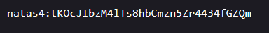

## Level初始关

```
URL：http://natas0.natas.labs.overthewire.org/
账号：natas0
密码：natas0
查看源码得flag
g9D9cREhslqBKtcA2uocGHPfMZVzeFK6 
```


## Level0

```
URL：http://natas1.natas.labs.overthewire.org/
账号：natas1
密码：g9D9cREhslqBKtcA2uocGHPfMZVzeFK6
查看源码得flag
h4ubbcXrWqsTo7GGnnUMLppXbOogfBZ7 
```


## Level1

```
URL：http://natas2.natas.labs.overthewire.org/
账号：natas2
密码：h4ubbcXrWqsTo7GGnnUMLppXbOogfBZ7
源码没有，源码暴露了其他目录有css、js、files，简单翻一下，找到flag
```


http://natas2.natas.labs.overthewire.org/files/


## Level2

```
URL：http://natas3.natas.labs.overthewire.org/
账号：natas3
密码：G6ctbMJ5Nb4cbFwhpMPSvxGHhQ7I6W8Q
先不目录扫描，看一下提示，寻找robot.txt，访问/s3cr3t/，找到flag
tKOcJIbzM4lTs8hbCmzn5Zr4434fGZQm
```


不允许搜索引擎访问`/s3cr3t/`目录




## Level3

```
URL：http://natas4.natas.labs.overthewire.org/
账号：natas4
密码：tKOcJIbzM4lTs8hbCmzn5Zr4434fGZQm
根据提示，natas4没有权限访问该站，而natas5有，抓包改Referer头，得到flag
Z0NsrtIkJoKALBCLi5eqFfcRN82Au2oD
```


## Level4

```
URL：http://natas5.natas.labs.overthewire.org/
账号：natas5
密码：Z0NsrtIkJoKALBCLi5eqFfcRN82Au2oD
明明登陆成功，却说没有登陆，想到可能是cookie认证出问题，burp抓个包，发现cookie中的loggedin字段值loggedin=0，修改为loggedin=10，拿到flag
fOIvE0MDtPTgRhqmmvvAOt2EfXR6uQgR
```


## Level5

```
URL：http://natas6.natas.labs.overthewire.org/
账号：natas6
密码：fOIvE0MDtPTgRhqmmvvAOt2EfXR6uQgR
```

