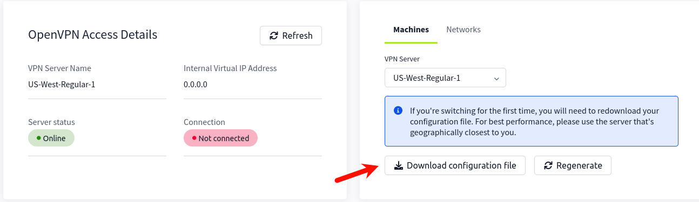
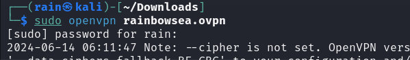
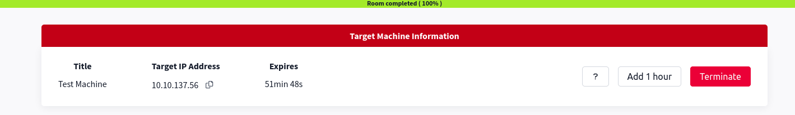
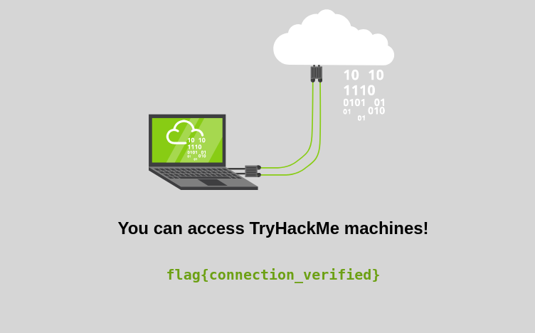

# 完整的初始者介绍

（Complete Beginner Introduction）

## 教程

(Tutorial)

测试openvpn连接，下载一个可以连接的vpn配置



kali安装和运行

```bash
sudo apt install openvpn
sudo openvpn [].ovpn
```

正常运行，挂置后台即可，`ctrl+c`即可断开连接



拿到IP



访问，拿到答案`flag{connection_verified}`



## 网络安全起步

(Starting Out In Cyber Sec)

### Task1

(Welcome To TryHackMe)

欢迎来到tryhackme，介绍职业

无需作答

### Task2

(Offensive Security)

攻击是网络安全的一个大领域，最常见就是进攻性安全工作角色渗透测试员，是合法受雇于组织的个人

合法受雇来查找应用程序中的漏洞的职业角色的名称是什么?（What is the name of the career role that is legally employed to find vulnerabilities in applications?）

```
penetration tester
```

### Task3

(Defensive Security)

安全是第二大领域，职业轨道分

安全分析师，监控组织中的各种系统，检测是否受到攻击，Splunk检测

安全应急员，了解攻击者采取了什么行动，以及会产生什么影响

恶意分析，分析攻击者使用的任何恶意软件(维持系统访问权限)，防止进一步滥用

负责识别针对组织的攻击的角色的名称是什么?（What is the name of the role who's job is to identify attacks against an organisation?）

```
security analyst
```

## 介绍性研究

(Introductory Researching)

### Task1

(Introduction)

说明一下研究能力是hacker的最重要素质，说了一堆有的没的

无需作答

### Task2

(Example Rsearch Question)

介绍了tryhackme的ctf中的图片隐写，教你如何利用google搜索与相关图片隐写的内容

1.在Kali Linux附带的Burp Suite Program中，您将使用什么模式来手动发送请求(通常会多次重复捕获的请求)?（In the Burp Suite Program that ships with Kali Linux, what mode would you use to manually send a request (often repeating a captured request numerous times)?）

```
Repeater
```

2.现代Windows登录密码以什么哈希格式存储?(What hash format are modern Windows login passwords stored in?)

```
NTLM
```

3.在Linux中，什么是自动任务?(What are automated tasks called in Linux?)

```
Cron Jobs
```

4.你可以用什么数字作为2进制(二进制)的简写?(What number base could you use as a shorthand for base 2 (binary)?)

```
Base 16
```

5.如果密码散列以`$6$`开头，它是什么格式(Unix变体)?(If a password hash starts with` $6$`, what format is it (Unix variant)?)

```
sha512crypt
```

### Task3

(Vulnerability Searching)

在攻击过程中，会遇到可被利用的点，我们可以利用公开的ExploitDB、NVD、CVE Mitre等

例如当知道一个FuelCMS内容管理系统，可以使用`searchsploit fuel cms`搜索exploits

1.在WPForms中发现的2020跨站脚本(XSS)漏洞的CVE是什么?(What is the CVE for the 2020 Cross-Site Scripting (XSS) vulnerability found in WPForms?)

```
CVE-2020-10385
```

2.早在2016年，在Debian版本的Apache Tomcat中就发现了一个本地特权升级漏洞。此漏洞的CVE是什么?(There was a Local Privilege Escalation vulnerability found in the Debian version of Apache Tomcat, back in 2016. What's the CVE for this vulnerability?)

```
CVE-2016-1240
```

3.在VLC媒体播放器中发现的第一个CVE是什么?(What is the very first CVE found in the VLC media player?)

```
CVE-2007-0017
```

4.如果您想在sudo程序中利用2020缓冲区溢出，您将使用哪个CVE ?(If you wanted to exploit a 2020 buffer overflow in the sudo program, which CVE would you use?)

```
CVE-2019-18634
```

### Task4

(Manual Pages)

介绍Linux，学习`man`，使用`ssh -v`和`man ssh | grep -e "version number"`等

1.SCP是用于将文件从一台计算机复制到另一台计算机的工具。你会用什么开关来复制整个目录?(SCP is a tool used to copy files from one computer to another.What switch would you use to copy an entire directory?)

```bash
-r
```

2.Fdisk是一个用于查看和更改硬盘上使用的分区方案的命令。您将使用哪个开关来列出当前分区?(fdisk is a command used to view and alter the partitioning scheme used on your hard drive.What switch would you use to list the current partitions?)

```bash
-l
```

3.nano是一个易于使用的Linux文本编辑器。当然还有更好的编辑器(Vim是最明显的选择);然而，nano是一个很好的开始。使用nano打开文件时，您会使用哪个开关来进行备份?(nano is an easy-to-use text editor for Linux. There are arguably better editors (Vim, being the obvious choice); however, nano is a great one to start with.What switch would you use to make a backup when opening a file with nano?)

```bash
-B
```

4.Netcat是一个用于手动发送和接收网络请求的基本工具。您将使用什么命令在监听模式下启动netcat，使用端口12345?(Netcat is a basic tool used to manually send and receive network requests. What command would you use to start netcat in listen mode, using port 12345?)

```bash
nc -l -p 12345
```

### Task5

(Final Thoughts)

学会研究，搜索

无需作答

# Linux基础

(Linux Fundamentals)

## 基础1

(Linux Fundamentals Part 1)

### Task1

(Introduction)

介绍Linux

无需作答

### Task2

(A Bit of Background on Linux)

Linux的使用常见，和版本等，常作为服务器

研究:Linux操作系统第一次发布是哪一年?(Research: What year was the first release of a Linux operating system?)

```
1991
```

### Task3

(Interacting With Your First Linux Machine (In-Browser))

开启容器，使用linux

无需作答

### Task4

(Running Your First few Commands)

学会命令行终端，使用基础命令

1.如果我们想输出文本“TryHackMe”，我们的命令是什么?(If we wanted to output the text "TryHackMe", what would our command be?)

```bash
echo TryHackMe
```

2.您在部署的Linux机器上登录的用户名是什么?(What is the username of who you're logged in as on your deployed Linux machine?)

```bash
tryhackme
```

### Task5

(Interacting With the Filesystem!)

学习ls ,cd ,cat ,pwd等

1.在您部署的Linux机器上，有多少个文件夹?(On the Linux machine that you deploy, how many folders are there?)

```
4
```

2.哪个目录包含文件?(Which directory contains a file? )

```
folder4
```

3.这个文件的内容是什么?(What is the contents of this file?)

```
Hello World
```

4.使用cd命令导航到该文件并找出新的当前工作目录。路径是什么?(Use the cd command to navigate to this file and find out the new current working directory. What is the path?)

```
/home/tryhackme/folder4
```

### Task6

(Searching for Files)

学会find，grep

1.在“access.log”上使用grep来查找前缀为“THM”的标志。国旗是什么?(Use grep on "access.log" to find the flag that has a prefix of "THM". What is the flag?)

```
THM{ACCESS}
```

### Task7

(An Introduction to Shell Operators)

学会&，&&，>，>>

1.如果我们想在后台运行一个命令，我们想使用什么操作符?(If we wanted to run a command in the background, what operator would we want to use?)

```bash
$
```

2.如果我想将一个名为“密码”的文件的内容替换为单词“password123”，我的命令是什么?(If I wanted to replace the contents of a file named "passwords" with the word "password123", what would my command be?)

```bash
echo password123 > passwords
```

3.现在，如果我想在这个名为“密码”的文件中添加“tryhackme”，但同时保留“password123”，我的命令是什么(Now if I wanted to add "tryhackme" to this file named "passwords" but also keep "passwords123", what would my command be)

```bash
echo tryhackme >> passwords
```

### Task8和Task9

(Conclusions & Summaries) 无需作答

## 基础2

(Linux Fundamentals Part 2)

## 基础3

(Linux Fundamentals Part 3)

# 网络开发基础

(Network Exploitation Basics)

## Introductory Networking

### Task1

(Introduction)

介绍网络基础

### Task2

(The OSI Model: An Overview)

介绍网络OSI七层模型

1.哪一层会选择通过TCP或UDP发送数据?(Which layer would choose to send data over TCP or UDP?)

```
4
```

2.哪一层检查接收到的信息以确保它没有被损坏?(Which layer checks received information to make sure that it hasn't been corrupted?)

```
2
```

3.数据在哪一层被格式化以准备传输?(In which layer would data be formatted in preparation for transmission?)

```
2
```

4.哪一层传输和接收数据?(Which layer transmits and receives data?)

```
1
```

5.哪一层对初始数据进行加密、压缩或转换以使其具有标准化格式?(Which layer encrypts, compresses, or otherwise transforms the initial data to give it a standardised format?)

```
6
```

6.哪一层跟踪主机和接收计算机之间的通信?(Which layer tracks communications between the host and receiving computers?)

```
5
```

7.哪一层接受来自应用程序的通信请求?(Which layer accepts communication requests from applications?)

```
7
```

8.哪一层处理逻辑寻址?(Which layer handles logical addressing?)

```
3
```

9.当通过TCP发送数据时，您将什么称为“小块大小”的数据块?(When sending data over TCP, what would you call the "bite-sized" pieces of data? )

```
segments
```

10.[研究]FTP协议与哪一层进行通信?([Research] Which layer would the FTP protocol communicate with?)

```
7
```

11.哪种传输层协议最适合传输实时视频?(Which transport layer protocol would be best suited to transmit a live video?)

```
udp
```

### Task3

(Encapsulation)

各层传输的封装和解封装

1.你如何在封装过程的第2层引用数据(使用OSI模型)?(How would you refer to data at layer 2 of the encapsulation process (with the OSI model)?)

```
Frames
```

2.如果选择了UDP协议，您将如何引用封装过程的第4层数据(使用OSI模型)?(How would you refer to data at layer 4 of the encapsulation process (with the OSI model), if the UDP protocol has been selected?)

```
Datagrams
```

3.计算机对接收到的消息执行什么过程?(What process would a computer perform on a received message?)

```
De-encapsulation
```

4.哪一层是OSI模型中唯一在封装期间添加预告片的层?(Which is the only layer of the OSI model to add a trailer during encapsulation?)

```
Data Link
```

5.封装是否提供了额外的安全层(是/否)?(Does encapsulation provide an extra layer of security (Aye/Nay)?)

```
Aye
```

### Task4

(The TCP/IP Model)

介绍TCP/IP协议，三次握手等

1.OSI和TCP/IP，哪个模型最先被引入?(Which model was introduced first, OSI or TCP/IP?)

```
TCP/IP
```

2.TCP/IP模型的哪一层覆盖了OSI模型(全称)的传输层的功能?(Which layer of the TCP/IP model covers the functionality of the Transport layer of the OSI model (Full Name)?)

```
Transport
```

3.TCP/IP模型的哪一层覆盖了OSI模型(全称)的会话层的功能?(Which layer of the TCP/IP model covers the functionality of the Session layer of the OSI model (Full Name)?)

```
Application
```

4.TCP/IP模型的网络接口层涵盖了OSI模型中两层的功能。这些层是Data Link，和?(全名)?(The Network Interface layer of the TCP/IP model covers the functionality of two layers in the OSI model. These layers are Data Link, and?.. (Full Name)?)

```
Physical
```

5.TCP/IP模型的哪一层处理OSI网络层的功能?(Which layer of the TCP/IP model handles the functionality of the OSI network layer?)

```
Internet
```

6.TCP是一种什么样的协议?(What kind of protocol is TCP?)

```
Connection-based
```

7.SYN是什么缩写?(What is SYN short for?)

```
Synchronise
```

8.三次握手的第二步是什么?(What is the second step of the three way handshake?)

```
SYN/ACK
```

9.三次握手中“确认”部分的简称是什么?(What is the short name for the "Acknowledgement" segment in the three-way handshake?)

```
ACK
```

### Task5

(Ping)

介绍ping 

1.你会用什么命令来ping bbc.co.uk网站?(What command would you use to ping the bbc.co.uk website?)

```
ping bbc.co.uk
```

2.IPv4地址是多少？(Ping muirlandoracle.co.uk，What is the IPv4 address?) 国内ping是解析不到这个ip的

```
217.160.0.152
```

3.什么开关允许您更改发送ping请求的间隔?(What switch lets you change the interval of sent ping requests?)

```
-i
```

4.什么开关允许您将请求限制为IPv4?(What switch would allow you to restrict requests to IPv4?)

```
-4
```

5.什么样的开关可以提供更详细的输出?(What switch would give you a more verbose output?)

```
-v
```

### Task6

(Traceroute)

介绍tracertoute命令

1.在使用Traceroute时，您将使用哪个开关来指定接口?(What switch would you use to specify an interface when using Traceroute?)

```
-i
```

2.如果您想在跟踪路由时使用TCP SYN请求，您将使用哪个开关?(What switch would you use if you wanted to use TCP SYN requests when tracing the route?)

```
-T
```

3.[横向思考]traceroute默认运行在TCP/IP模型的哪一层(Windows)?([Lateral Thinking] Which layer of the TCP/IP model will traceroute run on by default (Windows)?)

```
Internet
```

### Task7

(WHOIS)

介绍域名查询服务，whois命令

1.facebook.com的注册人邮政编码是什么?(What is the registrant postal code for facebook.com?)

```
94025
```

2.facebook.com域名最早是什么时候注册的(格式:DD/MM/YYYY)?(When was the facebook.com domain first registered (Format: DD/MM/YYYY)?)

```
29/03/1997
```

3.注册人在哪个城市?(Which city is the registrant based in?),测试microsoft.com

```
Redmond
```

4.microsoft.com注册地址附近的高尔夫球场的名称是什么?([OSINT] What is the name of the golf course that is near the registrant address for microsoft.com?)

```
Bellevue Golf Course
```

5.microsoft.com的注册技术邮箱是什么?(What is the registered Tech Email for microsoft.com?)

```
msnhst@microsoft.com
```

### Task8

(Dig)

介绍域名解析

1.DNS是什么缩写?(What is DNS short for?)

```
Domain Name System
```

2.当你搜索一个域名时，你的计算机首先查询的DNS服务器类型是什么?(What is the first type of DNS server your computer would query when you search for a domain?)

```
Recursive
```

3.什么类型的DNS服务器包含特定于域扩展((i.e. .com, .co.uk*, etc)*?)使用长版本的名称。(What type of DNS server contains records specific to domain extensions (i.e. .com, .co.uk*, etc)*? Use the long version of the name.)

```
Top-level Domain
```

4.你的电脑首先会在哪里寻找一个域名的IP地址(Where is the very first place your computer would look to find the IP address of a domain?)

```
Hosts File
```

5.Google运行两个公共DNS服务器。其中一个可以用IP 8.8.8.8查询，另一个的IP地址是什么?([Research] Google runs two public DNS servers. One of them can be queried with the IP 8.8.8.8, what is the IP address of the other one?)

```
8.8.4.4
```

6.如果DNS查询的TTL为24小时，那么dig查询显示的数字是多少?(If a DNS query has a TTL of 24 hours, what number would the dig query show?)

```
86400
```

### Task9

(Further Reading) 无需作答

## Nmap

### Task1

(Deploy) 无需作答，开启机器

### Task2

(Introduction)

1.使用什么网络结构将流量引导到服务器上正确的应用程序?(What networking constructs are used to direct traffic to the right application on a server?)

```
Ports
```

2.在任何支持网络的计算机上有多少端口可用?(How many of these are available on any network-enabled computer?)

```
65535
```

3.其中有多少被认为是“众所周知的”?(这些是任务中提到的“标准”数字)(How many of these are considered "well-known"? (These are the "standard" numbers mentioned in the task))

```
1024
```

### Task3

(Nmap Switches)

介绍学习nmap

1.“Syn扫描”的帮助菜单中列出的第一个开关是什么((What is the first switch listed in the help menu for a 'Syn Scan' (more on this later!)?)

```
-sS
```

2.您将使用哪个参数进行“UDP扫描”?(Which switch would you use for a "UDP scan"?)

```
-sU
```

3.如果您想检测目标运行在哪个操作系统上，您将使用哪个参数?(If you wanted to detect which operating system the target is running on, which switch would you use?)

```
-O
```

4.Nmap提供了一个开关，用于检测目标上运行的服务的版本。这个开关是什么?(Nmap provides a switch to detect the version of the services running on the target. What is this switch?)

```
-sV
```

5.nmap提供的默认输出通常不能为渗透测试器提供足够的信息。如何增加篇幅?(The default output provided by nmap often does not provide enough information for a pentester. How would you increase the verbosity?)

```
-v
```

6.第一层次的冗长是好的，但第二层次的冗长更好!如何将冗长级别设置为二级?(Verbosity level one is good, but verbosity level two is better! How would you set the verbosity level to two?(Note: it's highly advisable to always use at least this option))

```
-vv
```

7.我们应该始终保存扫描的输出——这意味着我们只需要运行一次扫描(减少网络流量，从而减少被检测到的机会)，并为我们在为客户端编写报告时提供参考。您会使用什么开关来将nmap结果保存为三种主要格式(We should always save the output of our scans -- this means that we only need to run the scan once (reducing network traffic and thus chance of detection), and gives us a reference to use when writing reports for clients.What switch would you use to save the nmap results in three major formats)

```
-oA
```

8.您会使用什么开关将nmap结果保存为“正常”格式?(What switch would you use to save the nmap results in a "normal" format?)

```
-oN
```

9.一个非常有用的输出格式:如何将结果保存为“可移动”格式?(A very useful output format: how would you save results in a "grepable" format?)

```
-oG
```

10.有时候我们得到的结果是不够的。如果我们不在乎自己的声音有多大，我们就可以开启“攻击性”模式。这是一个快捷开关，可以激活服务检测、操作系统检测、跟踪路由和通用脚本扫描。如何激活这个设置?(Sometimes the results we're getting just aren't enough. If we don't care about how loud we are, we can enable "aggressive" mode. This is a shorthand switch that activates service detection, operating system detection, a traceroute and common script scanning.How would you activate this setting?)

```
-A
```

11.Nmap提供了五个级别的“定时”模板。这些基本上是用来提高你的扫描运行速度。不过要小心:更高的速度会产生噪音，并可能导致错误!如何将定时模板设置为第5级?(Nmap offers five levels of "timing" template. These are essentially used to increase the speed your scan runs at. Be careful though: higher speeds are noisier, and can incur errors!How would you set the timing template to level 5?)

```
-T5
```

12.我们还可以选择扫描哪个端口。如何告诉nmap只扫描端口80?(We can also choose which port(s) to scan.How would you tell nmap to only scan port 80?)

```
-p 80
```

13.如何告诉nmap扫描端口1000-1500?(How would you tell nmap to scan ports 1000-1500?)

```
-p 1000-1500
```

14.一个不容忽视的非常有用的选项:如何告诉nmap扫描所有端口?(A very useful option that should not be ignored:How would you tell nmap to scan all ports?)

```
-p-
```

15.如何激活nmap脚本库中的脚本(稍后会详细介绍!)?(How would you activate a script from the nmap scripting library (lots more on this later!)?)

```
--script
```

16.如何激活“vuln”类别中的所有脚本?(How would you activate all of the scripts in the "vuln" category?)

```
--script=vuln
```

### Task4

(Overview)

介绍端口扫描参数-sT,-sS,-sU,-sN,-sF,-sX

无需作答

### Task5

(TCP Connect Scans)

介绍-sT 的TCP connect连接

1.哪个RFC定义了TCP协议的适当行为?(Which RFC defines the appropriate behaviour for the TCP protocol?)

```
RFC 9293 
```

2.如果一个端口被关闭，服务器应该发送回哪个标志来表示这一点?(If a port is closed, which flag should the server send back to indicate this?)

```
RST
```

### Task6

(SYN Scans)

介绍-sS 的TCP

1.SYN扫描还有另外两个名称，它们是什么?(There are two other names for a SYN scan, what are they?)

```
Half-open, Stealth
```

2.Nmap是否可以在没有Sudo权限的情况下使用SYN扫描(Y/N)?(Can Nmap use a SYN scan without Sudo permissions (Y/N)?)

```
N
```

### Task7

(UDP Scans)

介绍-sU	

1.如果UDP端口没有响应Nmap扫描，它将被标记为什么?(If a UDP port doesn't respond to an Nmap scan, what will it be marked as?)

```
open|filtered
```

2.当UDP端口关闭时，按照惯例目标应该发送回一个“端口不可达”消息。(When a UDP port is closed, by convention the target should send back a "port unreachable" message. Which protocol would it use to do so?)

```
ICMP
```

### Task8

(NULL,FIN and Xmas)

介绍-sN，-sX

1.所示的三种扫描类型中，哪一种使用URG标志?(Which of the three shown scan types uses the URG flag?)

```
xmas
```

2.为什么通常使用NULL, FIN和Xmas扫描?(Why are NULL, FIN and Xmas scans generally used?)

```
firewall evasion
```

3.哪个常见的操作系统可以响应NULL, FIN或每个端口的RST扫描?(Which common OS may respond to a NULL, FIN or Xmas scan with a RST for every port?)

```
Microsoft Windows 
```

### Task9

(ICMP Network Scanning)

介绍-sn

1.如何在172.16.x.x上执行ping扫描?使用Nmap?(CIDR标记)(How would you perform a ping sweep on the 172.16.x.x network (Netmask: 255.255.0.0) using Nmap? (CIDR notation))

```
nmap -sn 172.16.0.0/16
```

### Task10

(Overview)

介绍nmap脚本引擎(NSE)，由Lua编写，可以扫描漏洞到自动利用漏洞

`safe`:- Won't affect the target
`intrusive`:- Not safe: likely to affect the target
`vuln`:- Scan for vulnerabilities
`exploit`:- Attempt to exploit a vulnerability
`auth`:- Attempt to bypass authentication for running services (e.g. Log into an FTP server anonymously)
`brute`:- Attempt to bruteforce credentials for running services
`discovery`:- Attempt to query running services for further information about the network (e.g. query an SNMP server).

1.NSE脚本是用什么语言编写的?(What language are NSE scripts written in?)

```
Lua
```

2.在生产环境中运行哪一类脚本是一个非常糟糕的主意?(Which category of scripts would be a very bad idea to run in a production environment?)

```
intrusive
```

### Task11

(Working with the NSE)

1.ftp-anon有什么可选参数?Nse脚本?(What optional argument can the ftp-anon.nse script take?)

```
maxlist
```

### Task12

(Searching for Scripts)

1.在/usr/share/nmap/scripts/目录下使用上述两种方法中的任意一种搜索“smb”脚本。决定SMB服务器底层操作系统的脚本文件名是什么?(Search for "smb" scripts in the /usr/share/nmap/scripts/ directory using either of the demonstrated methods.What is the filename of the script which determines the underlying OS of the SMB server?)

```
smb-os-discovery.nse
```

2.通读这个脚本。它取决于什么?(Read through this script. What does it depend on?)

```
smb-brute
```

### Task13

(Firewall Evasion)

1.哪个简单的(经常依赖的)协议经常被阻塞，需要使用-Pn开关?(Which simple (and frequently relied upon) protocol is often blocked, requiring the use of the -Pn switch?)

```
ICMP
```

2.哪个Nmap开关允许您将任意长度的随机数据附加到数据包的末尾?(Which Nmap switch allows you to append an arbitrary length of random data to the end of packets?)

```
--data-length
```

### Task14

1.目标ip是否响应ICMP ping请求(Y/N)?(Does the target ip respond to ICMP echo (ping) requests (Y/N)?)

```
N
```

2.对目标的前999个端口执行一次圣诞扫描——显示有多少端口是打开的或被过滤的?(Perform an Xmas scan on the first 999 ports of the target -- how many ports are shown to be open or filtered?)

```
999
```

3.这是有原因的，是什么原因?(There is a reason given for this -- what is it?)

```
No Response
```

4.对目标的前5000个端口执行TCP SYN扫描——显示有多少端口是打开的?(Perform a TCP SYN scan on the first 5000 ports of the target -- how many ports are shown to be open?)

```
5
```

5.打开Wireshark(参见Cryillic的Wireshark Room)，针对目标的80端口执行TCP Connect扫描，监控结果。确保你明白发生了什么。在机器上部署ftp-anon脚本。Nmap能成功登录21端口的FTP服务器吗?(Y / N)(Open Wireshark (see Cryillic's Wireshark Room for instructions) and perform a TCP Connect scan against port 80 on the target, monitoring the results. Make sure you understand what's going on. Deploy the ftp-anon script against the box. Can Nmap login successfully to the FTP server on port 21? (Y/N))

```
Y
```

## Network Services


## Network Services2