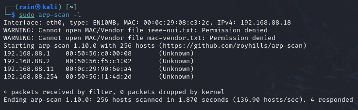

# 环境

来自[Kioptrix Level 1](https://www.vulnhub.com/entry/kioptrix-level-1-1,22/)

解压之后，`Kioptix Level 1.vmx`修改启动配置，`ethernet0.connectionType = "Bridged"`改成`nat`

# 信息收集

## 发现主机

工具nmap、arp-scan

```bash
nmap -sn 192.168.88.0/24
sudo arp-scan -l  #可以用这个，可以获取ip和mac
```



发现`192.168.88.11`是我们的目标靶机

## 端口扫描

工具nmap、masscan

```bash
sudo nmap -p- -sS 192.168.88.11
```


## 服务详细扫描

```bash
sudo nmap -p22,80,111,139,443,1024 -sV 192.168.88.11
```


# 进行测试

## getshell_1

## getshell_2

## getshell_3

