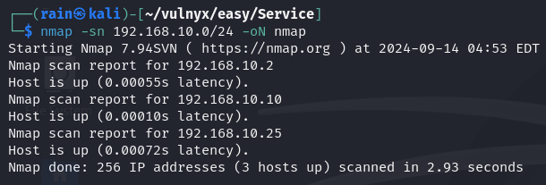
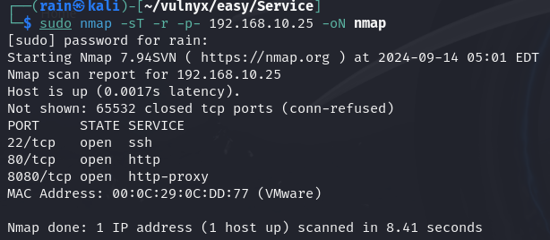
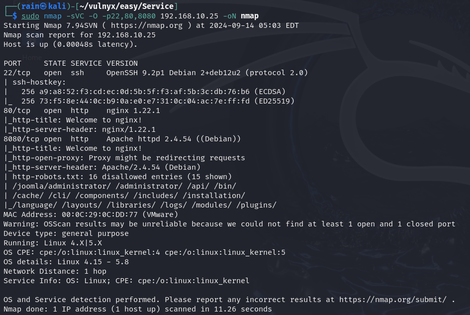

# 环境

来自[Vulny_Service](https://vulnyx.com/#Service)，

# 信息收集

## 主机发现

```bash
nmap -sn 192.168.10.0/24
```



## 端口扫描

```bash
sudo nmap -sT -r -p- 192.168.10.25
```



## 详情扫描

```bash
sudo nmap -sVC -O -p22,80,8080 192.168.10.25
```



# web渗透

## joomla